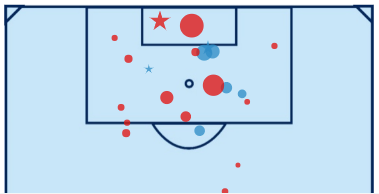

<h1 align="center"> Football Analytics </h1>
<h3 align="center"> A public space for football analytics projects by <a href="https://twitter.com/eddwebster">Edd Webster</a>, including a curated list of publicly available resources published by the football analytics community.</h3>  

 

 
  

<!-- ABOUT THE REPOSITORY AND AUTHOR -->
<h2 id="about-the-repository-and-author"> :wave: About This Repository and Author</h2>

Please note, all the code and analysis produced in this repository is mine and/or credited to the publicly produced code, data, and/or libraries used, and is in no way related to the work and analysis I produce for my employers.

I recently rewrote this README to include links not only to my own work, but also to include a concise list of learning resources, data sources, libraries, papers, blogs, podcasts, etc., created by all those that have made contributions to the football analytics community. This will be a constant work in progress so if you can think of any resources that I've missed, or you yourself have created something that you believe should be added and is currently not available, please feel free to create a pull request or send me a message.

Credits to the [Soccer Analytics Handbook](https://github.com/devinpleuler/analytics-handbook) by [Devin Pleuler](https://twitter.com/devinpleuler), [Awesome Soccer Analytics](https://github.com/matiasmascioto/awesome-soccer-analytics) by [Matias Mascioto](https://twitter.com/matiasmascioto), and [Jan Van Haaren](https://twitter.com/janvanhaaren)'s [Soccer Analytics 2020 Review](https://janvanhaaren.be/2020/12/30/soccer-analytics-review-2020.html) and [`soccer-analytics-resources`](https://github.com/JanVanHaaren/soccer-analytics-resources) Github repo, which were all used to plug gaps in the list once it was published. Credit also to [Matias Singers](https://twitter.com/matiassingers) for his [`awesome-readme`](https://github.com/matiassingers/awesome-readme) repository used to restyle this README.

If you like the repo, please feel free to give it a :star:  (top right). Cheers!

For more information about this repository and the author, I am available through all the following channels:

<!-- TABLE OF CONTENTS -->
<h2 id="table-of-contents"> :book: Table of Contents</h2>

  
Table of Contents

  <ol>
    <li><a href="#about-the-repository-and-author"> ➤ About This Repository and Author</a></li>
    <li><a href="#table-of-contents"> ➤ Table of Contents</a></li>
    <li><a href="#prerequisites"> ➤ Prerequisites</a></li>
    <li><a href="#repository-structure"> ➤ Repository Structure</a></li>
    <li><a href="#notebooks"> ➤ Notebooks</a></li>
    <li><a href="#data-visualisation-and-tableau-dashboards"> ➤ Data Visualisation and Tableau</a></li>
    <li><a href="#data"> ➤ Data Sources</a></li>
    <li>
      <a href="#Resources"> ➤ Resources</a>
      <ul>
        <li><a href="#getting-started">Getting Started with Football Analytics</a></li>
        <li><a href="#tutorials">Tutorials</a></li>
          <ul>
            <li><a href="#tutorials-python">Python</a></li>
            <li><a href="#tutorials-r">R</a></li>
            <li><a href="#tutorials-tableau">Tableau</a></li>
            <li><a href="#tutorials-sql">SQL</a></li>
            <li><a href="#tutorials-excel">Excel</a></li>
            <li><a href="#tutorials-powerpoint">PowerPoint</a></li>
          </ul>
        </li>
        <li><a href="#data-all">Data Sources</a></li>
        <li><a href="#libraries">Libraries</a></li>
        <li><a href="#github-repos">GitHub Repositories</a></li>
        <li><a href="#apps">Apps</a></li>
        <li><a href="#data-visualisation-resources-and-tools">Data Visualisation Resources and Tools</a></li>
        <li>
          <a href="#written-pieces">Written Pieces</a></li>
          <ul>
            <li><a href="#blogs">Blogs</a></li>
            <li><a href="#papers">Papers</a></li>
            <li><a href="#newsletters">Newsletters</a></li>
            <li><a href="#news-articles">News Articles</a></li>
            <li><a href="#books">Books</a></li>
            <li><a href="#magazines">Magazines</a></li>
          </ul>
        </li>
        <li>
          <a href="#video">Video</a></li>
          <ul>
            <li><a href="#youtube-playlists">YouTube Playlists</a></li>
            <li><a href="#youtube-channels">YouTube Channels</a></li>
            <li><a href="#video-analysis">Video Analysis</a></li>
            <li><a href="#webinars-and-lectures">Webinars and Lectures</a></li>
            <li><a href="#ted-talks">Ted Talks</a></li>
            <li><a href="#documentaries">Documentaries</a></li>
            <li><a href="#match-highlights">Match Highlights</a></li>
            <li><a href="#video-other">Other</a></li>
          </ul>
        </li>
        <li><a href="#podcasts">Podcasts</a></li>
        <li><a href="#notable-figures-and-twitter-accounts">Notable Figures and Twitter Accounts</a></li>
        <li><a href="#career-advice">Career Advice</a></li>
        <li><a href="#events-and-conferences">Events and Conferences</a></li>
        <li><a href="#competitions">Competitions</a></li>
        <li><a href="#courses">Courses</a></li>
        <li><a href="#jobs">Jobs</a></li>
        <li><a href="#discord-slack-groups">Discord / Slack Groups</a></li>
        <li>
          <a href="#key-concepts">Key Concepts</a></li>
          <ul>
            <li><a href="#history-of-football-analytics">History of Football Analytics</a></li>
            <li><a href="#xg-modeling">Expected Goals (xG) Modeling</a></li>
            <li><a href="#tracking-data">Tracking Data</a></li>
            <li><a href="#pitch-control-modeling">Pitch Control Modeling</a></li>
            <li><a href="#pv-frameworks">Possession Value (PV) Frameworks</a></li>
            <li><a href="#dixon-coles">Dixon Coles Modeling</a></li>
            <li><a href="#player-similarity-analysis">Player Similarity Analysis</a></li>
            <li><a href="#rl-for-football-simulation">Reinforcement Learning for Football Simulation</a></li>
            <li><a href="#set-pieces">Set Pieces</a></li>
          </ul>
        </li>
        <li><a href="#miscellaneous">Miscellaneous</a></li>
      </ul>
    </li>
    <li><a href="#contributing"> ➤ Contributing</a></li>
    <li><a href="#acknowledgements"> ➤ Acknowledgements</a></li>
  </ol>

<!-- PREREQUISITES -->
<h2 id="prerequisites"> :fork_and_knife: Prerequisites</h2>

<!--This project is written in Python programming language.  -->
The only prerequisites for using this GitHub repo is that you have a computer, internet connection and the desire to learn more about football analytics. 

The following open-source [Python](https://www.python.org/) libraries listed below are some of the most commonly used in Data Science that feature in the the notebooks in this repository. Most of these libraries can be obtained by downloading and installing [Anaconda](https://anaconda.org/anaconda/conda). Step-by-step guides to do this can be found for Windows [here](https://medium.com/@GalarnykMichael/install-python-on-windows-anaconda-c63c7c3d1444) and Mac [here](https://medium.com/@GalarnykMichael/install-python-on-mac-anaconda-ccd9f2014072), as well as in the Anaconda documentation itself [here](https://docs.anaconda.com/anaconda/install/).

*    [NumPy](https://numpy.org/doc/stable/contents.html);
*    [pandas](http://pandas.pydata.org/);
*    [matplotlib](https://matplotlib.org/contents.html?v=20200411155018);
*    [Plotly](https://plotly.com/);
*    [record linkage](https://recordlinkage.readthedocs.io/en/latest/about.html);
*    [scikit-learn](https://scikit-learn.org/stable/);
*    [SciPy](https://www.scipy.org/);
*    [XGBoost](https://xgboost.readthedocs.io/en/latest/); and
*    [SHAP](https://github.com/slundberg/shap).

<!-- REPOSITORY STRUCTURE -->
<h2 id="repository-structure"> :cactus: Repository Structure</h2>

The contents of this GitHub repository is organised as the following:

    football analytics github repository
    .
    │
    ├── dashboards
    │
    ├── data
    │
    ├── documentation
    │
    ├── gif
    │
    ├── img
    │
    ├── notebooks
    │   ├── 1_data_scraping
    │   │
    │   ├── 2_data_parsing
    │   │
    │   ├── 3_data_engineering
    │   │
    │   ├── 4_machine_learning
    │   │
    │   ├── 5_data_analysis_and_projects
    │   │
    │   ├── 6_data_visualisation
    │   │
    │
    ├── research
    │
    ├── scripts
    │
    ├── spreadsheets
    │
    ├── video
    │ 

<!-- NOTEBOOKS -->
<h2 id="notebooks"> :notebook_with_decorative_cover: Notebooks</h2>

Nearly all code in this repository is in Jupyter notebooks, organised in the following workflow:

1.    [Webscraping](https://github.com/eddwebster/football_analytics/tree/master/notebooks/1_data_scraping);
2.    [Data Parsing](https://github.com/eddwebster/football_analytics/tree/master/notebooks/2_data_parsing);
3.    [Data Engineering](https://github.com/eddwebster/football_analytics/tree/master/notebooks/3_data_engineering);
4.    [Machine Learning](https://github.com/eddwebster/football_analytics/tree/master/notebooks/4_machine_learning);
5.    [Data Analysis](https://github.com/eddwebster/football_analytics/tree/master/notebooks/5_data_analysis_and_projects) - projects include working with [Tracking data](https://github.com/eddwebster/football_analytics/tree/master/notebooks/5_data_analysis_and_projects/tracking_data), constructing [VAEP models](https://github.com/eddwebster/football_analytics/tree/master/notebooks/5_data_analysis_and_projects/vaep) (as introduced by SciSports), building [xG models](https://github.com/eddwebster/football_analytics/tree/master/notebooks/5_data_analysis_and_projects/xg_modeling) using [Logistic Regression](https://nbviewer.jupyter.org/github/eddwebster/football_analytics/blob/master/notebooks/5_data_analysis_and_projects/xg_modeling/shots_dataset/chance_quality_modelling/1%29%20Logistic%20Regression%20Expected%20Goals%20Model.ipynb), Random Forests and Gradient Booested Decision Tree algorithms such as [XGBoost](https://nbviewer.jupyter.org/github/eddwebster/football_analytics/blob/master/notebooks/5_data_analysis_and_projects/xg_modeling/shots_dataset/chance_quality_modelling/2%29%20XGBoost%20Expected%20Goals%20Model.ipynb) and [CatBoost](https://nbviewer.jupyter.org/github/eddwebster/football_analytics/blob/master/notebooks/5_data_analysis_and_projects/xg_modeling/shots_dataset/chance_quality_modelling/3%29%20CatBoost%20Expected%20Goals%20Model.ipynb), and analysing [player similarity](https://github.com/eddwebster/football_analytics/tree/master/notebooks/5_data_analysis_and_projects/player_similarity) using PCA and Factor Analysis (TBA);
6.    [Data Visualisation](https://github.com/eddwebster/football_analytics/tree/master/notebooks/6_data_visualisation) - examples of how to create some of the most visualisations using Python and Tableau.

I am in the process of giving this a quick tidy up, but the notebooks are clearly labeled and include a lot of useful code and analysis.

<!-- DATA VISUALISATION AND TABLEAU DASHBOARDS -->
<h2 id="data-visualisation-and-tableau-dashboards"> :bar_chart: Data Visualisation and Tableau Dashboards</h2>

For Tableau dashboards produced using the data engineered in the notebooks in this repository, please see my Tableau Public profile: [public.tableau.com/profile/edd.webster](https://public.tableau.com/profile/edd.webster).

Example Tableau dashboards:
*    [WSL](https://public.tableau.com/views/EddWebsterFAWSLAnalysisandDashboard/WSLxGAnalysisDashboard?:language=es&:display_count=y&:origin=viz_share_link);
*    [‘Big 5’ European leagues](https://public.tableau.com/views/EddWebsterBig5EuropeanLeagueAnalysisandDashboards/Big5WaffleChart?:language=es&:display_count=y&:origin=viz_share_link);
*    [EFL](https://public.tableau.com/views/EddWebsterEFLAnalysisandDashboards/EFLFullBackRadarDashboard?:language=es&:display_count=y&:origin=viz_share_link);
*    [StrataBet Chance creation](https://public.tableau.com/views/EddWebsterStrataBetChanceAnalysisandDashboards/StrataBetChanceShotMapDashboard?:language=es&:display_count=y&:origin=viz_share_link); and
*    [Opta #mcfcanalytics](https://public.tableau.com/views/EddWebsterOptaMCFCAnalyticsPL1112AnalysisandDashboards/OptaPlayerDemographicsDashboard?:language=es&:display_count=y&:origin=viz_share_link) (see [#mcfcanalytics](https://twitter.com/search?q=%23mcfcanalytics)).

<!-- DATA SOURCES -->
<h2 id="data"> :floppy_disk: Data </h2>

The following data sources have been used in this repository. Due to the 100mb file size limitation in GitHub, all engineered datasets prepared in this repository have been exported and made publicly available to view and download in Google Drive. Please see the following [[link](https://drive.google.com/drive/folders/1r2Rf3CPsKnxyxtmDRIHQ2eoW5WwCzBa0?usp=sharing)]. However, all code in this repository should enable you to scrape, parse, and engineer the datasets to the format in which I have analysed and visualised the data in this repo.

Data sources featured in this repository include:
*    [DAVIES](https://samgoldberg1882.shinyapps.io/ShinyAlph/) estimated player evaluation data by [Sam Goldberg](https://twitter.com/SamGoldberg1882) and [Mike Imburgio](https://twitter.com/mimburgio) for [American Soccer Analysis](https://www.americansocceranalysis.com/);
*    [ELO club rankings](http://clubelo.com/). See their API [[link](http://clubelo.com/API)];
*    [FIFA 15-21 player rating data](https://www.kaggle.com/stefanoleone992/fifa-21-complete-player-dataset) scraped from [SoFIFA](https://sofifa.com/) by Stefano Leone;
*    [KPMG Football Benchmark](https://footballbenchmark.com/home) player valuation data;
*    [Last Row Tracking-like data](https://github.com/Friends-of-Tracking-Data-FoTD/Last-Row) by [Ricardo Tavares](https://twitter.com/rjtavares). See the [Liverpool Analytics Challenge](https://soccermatics.medium.com/entries-for-the-liverpool-analytics-challenge-807f5eee12fd) for which this data was used (winners discussed on [Friends of Tracking](https://www.youtube.com/channel/UCUBFJYcag8j2rm_9HkrrA7w) [[link](https://www.youtube.com/watch?v=AFm3JNPu9Jw)]);
*    [Metrica Sports Sample Tracking and corresponding Event data](https://github.com/metrica-sports/sample-data). For code to work with this data, see the  [`LaurieOnTracking`](https://github.com/Friends-of-Tracking-Data-FoTD/LaurieOnTracking) GitHub repo by [Laurie Shaw](https://twitter.com/EightyFivePoint) and the corresponding [Friends of Tracking](https://www.youtube.com/channel/UCUBFJYcag8j2rm_9HkrrA7w) tutorials;
*    [Opta Sports](https://www.optasports.com/) match-by-match aggregated player performance data for the 11/12 season and F24 Event data for a 11/12 match of Manchester City vs. Bolton Wanders [[link](#mcfcanalytics)] as part of the [#mcfcanalytics](https://twitter.com/search?q=%23mcfcanalytics) initiative;
*    [Signality Tracking data](https://github.com/Friends-of-Tracking-Data-FoTD/SoccermaticsForPython/blob/master/12GetSignalityAPI.py). The password to download the data is not publicly available, but can be found in the Uppsala Mathematical Modelling of Football Slack group [[link](http://mathematicalm-fhj6138.slack.com)]. For access, contact Novosom Salvador [Twitter](@novosomsalvador) and rsalvadords@gmail.com, or feel free to contact myself. Note, that the 2nd half of the Hammarby-Örebro match is incomplete;
*    [SkillCorner broadcast Tracking Open data](https://github.com/SkillCorner/opendata);
*    [StatsBomb Open Event data](https://github.com/statsbomb/open-data);
*    [StatsBomb](https://statsbomb.com/) season-on-season aggregated player performance data scraped via [FBref](https://fbref.com/en/) using [Parth Athale](https://twitter.com/ParthAthale)'s [`Scrape-FBref-data`](https://github.com/parth1902/Scrape-FBref-data) scraper, which in turn was written using code from [Christopher Martin](https://github.com/chmartin)'s [repository](https://github.com/chmartin/FBref_EPL). A good package to scrape this data in R is using the [`worldfootballR`](https://github.com/JaseZiv/worldfootballR) package by [Jason Zivkovic](https://twitter.com/jaseziv) (see guide [[link](https://www.dontblamethedata.com/blog/extract-data-using-worldfootballr/)]);
*    [Stats Perform](https://www.statsperform.com/) and [Centre Circle](https://canpl.ca/centre-circle-data/) [Canadian Premiere League Event data](https://canpl.ca/centre-circle-data/). See Google Drive [[link](https://drive.google.com/drive/u/0/folders/1ktlkt6f6Ujami53YCS-Lbc9BGGL8BaYA)];
*    [StrataData]() from [StrataBet](http://www.stratagem.co/) Chance shooting data;
*    [TransferMarket](https://www.transfermarkt.com/) player bio and fiscal data scraped using the [`Tyrone Mings`](https://github.com/FCrSTATS/tyrone_mings) Python TransferMarkt webscraper by [FCrSTATS](https://twitter.com/FC_rstats) (I've currently submitted a pull request to fix issues with this library to scrape bio-status data, see my [TransferMarkt scraping notebook](https://nbviewer.jupyter.org/github/eddwebster/football_analytics/blob/master/notebooks/1_data_scraping/TransferMarkt%20Web%20Scraping.ipynb) for code with minor fixes to enable code to run). A good package to scrape this data in R is using the [`worldfootballR`](https://github.com/JaseZiv/worldfootballR) package by [Jason Zivkovic](https://twitter.com/jaseziv) (see guide [[link](https://www.dontblamethedata.com/blog/extract-data-using-worldfootballr/)]);
*    [Understat](https://understat.com/) shooting and meta data including player xG values, scraped using the [`understatr`](https://github.com/ewenme/understatr) R package. Another good package to scrape this data in R is using the [`worldfootballR`](https://github.com/JaseZiv/worldfootballR) package by [Jason Zivkovic](https://twitter.com/jaseziv) (see guide [[link](https://www.dontblamethedata.com/blog/extract-data-using-worldfootballr/)]). This data also also regularly made available by [@NdyStats](https://twitter.com/NdyStats) (see pinned tweet of his Twitter account for the latest version) using code created by both him and [Mark Wilkins](https://twitter.com/biscuitchaser) (see Tweet [[link](https://twitter.com/biscuitchaser/status/1294608904647839744)]); 
*    [Wyscout Event data](https://wyscout.com/) Event data for the 17/18 season for the 'Big 5' European leagues, Euro 2016 Championship, and 2018 World Cup made available by [Luca Pappalardo](https://twitter.com/lucpappalard?), Alessio Rossi, and Paolo Cintia. See their  paper [A public data set of spatio-temporal match events in soccer competitions](https://www.nature.com/articles/s41597-019-0247-7) and the GitHub repo of code made available through [Friends of Tracking](https://www.youtube.com/channel/UCUBFJYcag8j2rm_9HkrrA7w) [[link](https://github.com/Friends-of-Tracking-Data-FoTD/mapping-match-events-in-Python)];
*    Reference data:
     -    League-wide xT values from the 2017-18 Premier League season (12x8 grid) by [Karun Singh](https://twitter.com/karun1710/) [[link](https://karun.in/blog/data/open_xt_12x8_v1.json)]
     -    EPV grid by [Laurie Shaw](https://twitter.com/EightyFivePoint) [[link](https://github.com/Friends-of-Tracking-Data-FoTD/LaurieOnTracking/blob/master/EPV_grid.csv)]
     -    Zones on a pitch for Tableau visualisation by [Rob Carroll](https://twitter.com/thevideoanalyst) [[link](https://drive.google.com/drive/folders/1Se0DFtsjQWmnt-G9Ihn_w8EQE4EZiblD)]
     -    Alphabetic country codes [[link](https://en.wikipedia.org/wiki/Comparison_of_alphabetic_country_codes)]

<!-- RESOURCES -->
<h2 id="resources"> :bookmark_tabs: Resources</h2>

<h3 id="getting-started"> :bookmark_tabs: Getting Started with Football Analytics</h3>
Good resources for those new for the use of data in football:

*    [An Introduction to Soccer Analytics](https://spacespacespaceletter.com/an-introduction-to-soccer-analytics/) by [John Muller](https://twitter.com/johnspacemuller) - check out his Newsletter [space space space](https://spacespacespaceletter.com/author/johnmuller/);
*    [Introduction to Analytics in...Soccer](http://sportsanalytics.sa.utoronto.ca/2015/02/20/introduction-to-analytics-in-soccer/) by [Valentin Stolbunov](https://twitter.com/vstolbunov);
*    [Getting into Sports Analytics](https://medium.com/@GregorydSam/getting-into-sports-analytics-ddf0e90c4cce) and [Getting into Sports Analytics 2.0](https://medium.com/@GregorydSam/getting-into-sports-analytics-2-0-129dfb87f5be) by [Sam Gregory](https://twitter.com/GregorydSam);
*    [Soccer Analytics 101](https://web.archive.org/web/20201101011408/https://www.mlssoccer.com/soccer-analytics-guide/2020/soccer-analytics-101) by [Kevin Minkus](https://twitter.com/kevinminkus);
*    [Sports Analytics 101](https://brendankent.com/sports-analytics-101/) by [Measureables](https://twitter.com/MeasurablesPod) ([Brendan Kent](https://twitter.com/brendankent));
*    [What do data analysts and data scientists do at a football club?](https://www.youtube.com/watch?v=GLcGf-8oqO4) talk for [Friends of Tracking](https://www.youtube.com/channel/UCUBFJYcag8j2rm_9HkrrA7w) with [David Sumpter](https://twitter.com/Soccermatics), [Ashwin Raman](https://twitter.com/AshwinRaman_), Hannah Roberts, [Sam Gregory](https://twitter.com/GregorydSam), and [Rob Suddaby](https://twitter.com/robsuddaby);
*    [Tools for getting started in football analytics.](https://www.youtube.com/watch?v=moFkcpsIKz4) talk for [Friends of Tracking](https://www.youtube.com/channel/UCUBFJYcag8j2rm_9HkrrA7w) with [David Sumpter](https://twitter.com/Soccermatics), [Laurie Shaw](https://twitter.com/EightyFivePoint), [Pascal Bauer](https://twitter.com/pascal_bauer), [Sudarshan 'Suds' Gopaladesikan](https://twitter.com/suds_g) and [Fran Peralta](https://twitter.com/PeraltaFran23);
*    [Some of the useful resources in Football Analytics](https://footytistics.com/2020-12-19-useful-resources-football-analytics/) by [@VenkyReddevil](https://twitter.com/VenkyReddevil);
*    [Stat Glossary](https://thefutebolist.wordpress.com/stat-glossary/) by [Ashwin Raman](https://twitter.com/AshwinRaman_);
*    [Football Analytics Glossary](https://footballstatsglossary.home.blog/) by [Ashwin Raman](https://twitter.com/AshwinRaman_) and [Mark Thompson](https://twitter.com/EveryTeam_Mark);
*    [What is sports analytics?](https://open.spotify.com/episode/3gIkGxJOmKkFRHoGAqRimB?si=6pPOVLfgTjuynfho6b4SPA&dl_branch=1) episode of the [Measureables](https://open.spotify.com/show/1B2KCrfMM6sDfNICsyVDlW?si=YAU9RS7sTGSyITF6OhgW9A&dl_branch=1) podcast by [Measureables](https://twitter.com/MeasurablesPod) ([Brendan Kent](https://twitter.com/brendankent));
*    [Languages and Tools to Learn for Sports Analytics](https://brendankent.com/2020/12/16/languages-and-tools-to-learn-for-sports-analytics/) by [Measureables](https://twitter.com/MeasurablesPod) ([Brendan Kent](https://twitter.com/brendankent));
*    [Measureables](https://twitter.com/MeasurablesPod) ([Brendan Kent](https://twitter.com/brendankent))'s Twitter thread for resources for learning to code in the context of sports analytics [[link](https://twitter.com/MeasurablesPod/status/1217499777245622278)];
*    [Ninad Barbadikar](https://twitter.com/NinadB_06)'s 'big football analytics' Twitter thread for getting started with football analytics [[link](https://twitter.com/NinadB_06/status/1409817891126452226)];
*    [McKay John](https://twitter.com/mckayjohns)'s Twitter threads for the best resources in football analytics [[link](https://twitter.com/mckayjohns/status/1369147457536335878)] and [[link](https://twitter.com/mckayjohns/status/1382405468585295873)];
*    [Joe Gallagher](https://twitter.com/joedgallagher)'s Twitter thread for the best resources to get started [[link](https://twitter.com/joedgallagher/status/1399461951386828805)].

<h3 id="tutorials"> :student: Tutorials</h3>

<h4 id="tutorials-python"> Python</h4>

*    [Friends of Tracking](https://www.youtube.com/channel/UCUBFJYcag8j2rm_9HkrrA7w) YouTube channel [[link](https://www.youtube.com/channel/UCUBFJYcag8j2rm_9HkrrA7w)] and Mathematical Modelling of Football course by Uppsala University [[link](https://uppsala.instructure.com/courses/28112)]. The GitHub repo with all code featured can be found at the following [[link](https://github.com/Friends-of-Tracking-Data-FoTD)]. Lectures of note include:
     +    [Laurie Shaw](https://twitter.com/EightyFivePoint)'s Metrica Sports Tracking data series for [Friends of Tracking](https://www.youtube.com/channel/UCUBFJYcag8j2rm_9HkrrA7w) - [Introduction](https://www.youtube.com/watch?v=8TrleFklEsE), [Measuring Physical Performance](https://www.youtube.com/watch?v=VX3T-4lB2o0), [Pitch Control modelling](https://www.youtube.com/watch?v=5X1cSehLg6s), and [Valuing Actions](https://www.youtube.com/watch?v=KXSLKwADXKI). See the following for code [[link](https://github.com/Friends-of-Tracking-Data-FoTD/LaurieOnTracking)];
     +    [Lotte Bransen](https://twitter.com/LotteBransen) and [Jan Van Haaren](https://twitter.com/JanVanHaaren)'s 'Valuating Actions in Football' series - [Valuing Actions in Football: Introduction](https://www.youtube.com/watch?v=xyyZLs_N1F0), [Valuing Actions in Football 1: From Wyscout Data to Rating Players](https://www.youtube.com/watch?v=0ol_eLLEQ64), [Valuing Actions in Football 2: Generating Features](https://www.youtube.com/watch?v=Ep9wXQgAFaE&t=42s), [Valuing Actions in Football 3: Training Machine Learning Models](https://www.youtube.com/watch?v=WlORqYIb-Gg), and [Valuing Actions in Football 4: Analyzing Models and Results](https://www.youtube.com/watch?v=w9G0z3eGCj8). See the following for code [[link](https://github.com/SciSports-Labs/fot-valuing-actions)];
     +    [David Sumpter](https://twitter.com/Soccermatics)'s Expected Goals webinars - [How to Build An Expected Goals Model 1: Data and Model](https://www.youtube.com/watch?v=bpjLyFyLlXs), [How to Build An Expected Goals Model 2: Statistical fitting](https://www.youtube.com/watch?v=wHOgINJ5g54), and [The Ultimate Guide to Expected Goals](https://www.youtube.com/watch?v=310_eW0hUqQ). See the following for code [3xGModel](https://github.com/Friends-of-Tracking-Data-FoTD/SoccermaticsForPython/blob/master/3xGModel.py), [4LinearRegression](https://github.com/Friends-of-Tracking-Data-FoTD/SoccermaticsForPython/blob/master/4LinearRegression.py), [5xGModelFit.py](https://github.com/Friends-of-Tracking-Data-FoTD/SoccermaticsForPython/blob/master/5xGModelFit.py), and [6MeasuresOfFit](https://github.com/Friends-of-Tracking-Data-FoTD/SoccermaticsForPython/blob/master/6MeasuresOfFit.py);
     +    [Peter McKeever](https://twitter.com/petermckeever)'s ['Good practice in data visualisation'](https://www.youtube.com/watch?v=md0pdsWtq_o) webinar. See the following for code [[link](https://github.com/petermckeeverPerform/friends-of-tracking-viz-lecture)];
     +    [Serio Llana](https://twitter.com/SergioMinuto90)'s step-by-step guide for creating Passing Networks [[link](https://www.youtube.com/watch?v=JZ6Jc-cvKX8)];
     +    [Luca Pappalardo](https://twitter.com/lucpappalard?) and Paolo Cintia's step-by-step guide to exploring the Wyscout Event data - [Video 1](https://www.youtube.com/watch?v=ZXEHPKmx410) and [Video 2](https://www.youtube.com/watch?v=TCyahs5HRMM). See their paper [A public data set of spatio-temporal match events in soccer competitions](https://www.nature.com/articles/s41597-019-0247-7).
*    [Soccer Analytics Handbook](https://github.com/devinpleuler/analytics-handbook) by [Devin Pleuler](https://twitter.com/devinpleuler). See tutorial notebooks (also available in Google Colab): [1. Data Extraction & Transformation](https://github.com/devinpleuler/analytics-handbook/blob/master/notebooks/data_extraction_and_transformation.ipynb), [2. Linear Regression](https://github.com/devinpleuler/analytics-handbook/blob/master/notebooks/linear_regression.ipynb), [3. Logistic Regression](https://github.com/devinpleuler/analytics-handbook/blob/master/notebooks/logistic_regression.ipynb), [4. Clustering](https://github.com/devinpleuler/analytics-handbook/blob/master/notebooks/clustering.ipynb), [5. Database Population & Querying](https://github.com/devinpleuler/analytics-handbook/blob/master/notebooks/database_population_and_querying.ipynb), [7. Data Visualization](https://github.com/devinpleuler/analytics-handbook/blob/master/notebooks/data_visualization.ipynb), [8. Non-Negative Matrix](https://github.com/devinpleuler/analytics-handbook/blob/master/notebooks/non_neg_matrix_factorization.ipynb), [9. Pitch Dominance](https://github.com/devinpleuler/analytics-handbook/blob/master/notebooks/pitch_dominance.ipynb), [10. Convolutional Neural Networks](https://github.com/devinpleuler/analytics-handbook/blob/master/notebooks/nn_pass_difficulty.ipynb);
*    [FC Python](https://twitter.com/fc_python) tutorials [[link](https://fcpython.com/)];
*    DataViz, Python, and matplotlib tutorials by Peter McKeever [[link](http://petermckeever.com/)] - I think his website is currently in redevelopment, with many of the old tutorials not currently available (28/02/2021). Check out his revamped [How to Draw a Football Pitch](http://petermckeever.com/2020/10/how-to-draw-a-football-pitch/) tutorial;
*    [McKay Johns YouTube channel](https://www.youtube.com/channel/UCmqincDKps3syxvD4hbODSg);
*    [soccer_analytics GitHub repo](https://github.com/CleKraus/soccer_analytics) by CleKraus - a Python project that facilitates the starting point for analytics 
*    [Python for Fantasy Football series](http://www.fantasyfutopia.com/python-for-fantasy-football-introduction/) by [Fantasy Futopia](https://twitter.com/FantasyFutopia) ([Thomas Whelan](https://twitter.com/tom_whelan)). This series covers the basics of working with data in Python, working with APIs and parsing StatsBomb JSON data, scraping data using Beautifulsoup and Selenium, and Machine Learning with scikit-learn and XGBoost,  See GitHub repo for all code [[link](https://github.com/twhelan22/python-for-fantasy-football)];
*    [Tech how-to: build your own Expected Goals model](https://www.scisports.com/tech-how-to-build-your-own-expected-goals-model/) by [Jan Van Haaren](https://twitter.com/JanVanHaaren) and [SciSports](https://twitter.com/SciSportsNL). See the Bitbucket repository for all code [[link](https://bitbucket.org/scisports/ssda-how-to-expected-goals/src)]; and
*    [`Football-Analytics-With-Python`](https://github.com/Slothfulwave612/Football-Analytics-With-Python) by [Anmol Durgapal](https://twitter.com/slothfulwave612).

<h4 id="tutorials-r"> R</h4>

*    [FCrSTATS](https://github.com/FCrSTATS) tutorials [[link](http://fcrstats.com/tutorials.html)];
*    [Mark Wilkins](https://twitter.com/biscuitchaser)'s [BiscuitChaserFC](https://biscuitchaserfc.blogspot.com/) blog. See his Twitter thread of R tutorials [[link](https://twitter.com/biscuitchaser/status/1275726269058093057)];
*    [Sudarshan 'Suds' Golaladesikan](https://twitter.com/suds_g)'s R series for [Friends of Tracking](https://www.youtube.com/channel/UCUBFJYcag8j2rm_9HkrrA7w) - [Getting Started with R + StatsBomb | Analyzing Squad Rotation & Clustering Passes](https://www.youtube.com/watch?v=ilIIjqfstfQ) and creating interactive shot maps - [Part 1/3)](https://www.youtube.com/watch?v=-a4NC65x_qQ), [Part 2/3](https://www.youtube.com/watch?v=yWXD7xi1f30), (I believe no part 3 currently). See the following for code [[link](https://github.com/Friends-of-Tracking-Data-FoTD/FoundationsInR)]; and
*    [Creating a pass flow graph in R](https://www.youtube.com/watch?v=uOE2_UIRniE) by [Abhishek Mishra](https://twitter.com/MishraAbhiA).

<h4 id="tutorials-tableau"> Tableau</h4>

For a YouTube playlist of Tableau-football videos and tutorials that I have collated from various sources including the Tableau Football User Group, [Rob Carroll](https://twitter.com/thevideoanalyst), and [Tom Goodall](https://twitter.com/TomG26), see the following [[link](https://www.youtube.com/watch?v=Rx7FWugmBC4&list=PL38nJNjpNpH__B0QzZ3BA0B3AxGzt0FAl&ab_channel=TableauSoftware)].

*    [Tableau Football User Group](https://usergroups.tableau.com/footballtableauusergroup)] - featuring [Eva Murray](https://twitter.com/TriMyData), Oscar Hall, [James Smith](https://twitter.com/sportschord), [Rob Carroll](https://twitter.com/thevideoanalyst), [Tom Goodall](https://twitter.com/TomG26), [Ravi Mistry](https://twitter.com/Scribblr_42),  Adam Cook, Hannah Roberts, [Chris Baker](https://twitter.com/chrisbaker108), Rusty Parker, Ruud van Elk, Johannes Riegger, and Sebastien Coustou;
*    [Tableau for Sport](https://thevideoanalyst.com/tableau-sport/) by [Rob Carroll](https://twitter.com/thevideoanalyst) - completely free tutorials for using football data in Tableau, including creating shot maps, pass maps, pass matrxces, xG race-chart timelines. See also his YouTube playlist [[link](https://www.youtube.com/playlist?list=PLchE8bhmmIxK94imJ4QZncXrbld_NGoiW)];
*    [Tom Goodall's Tactics, Training & Tableau: Football Tableau User Group](https://www.youtube.com/watch?v=Hy0tHU7yYHs&t=1702s). Check out his Football Tableau training courses [[link](https://www.touchlineanalytics.co.uk/). Check out also as an unrolled Twitter thread, how he uses Tableau to create an opposition report for Burton vs. Gillingham on 9th January 2021 [[link](https://threadreaderapp.com/thread/1346186082510110720.html)];
*    [Visually Analysing Direct Set Pieces in Football using StatsBomb Data, R and Tableau](https://www.biztory.com/blog/visually-analysing-direct-set-pieces-in-football-using-statsbomb-data-r-and-tableau) by [James Smith](https://twitter.com/sportschord);
*    [CJ Mayes](https://cj-mayes.com/)'s Tableau blog, with posts including how to make a [Radial Tournament Bracket](https://cj-mayes.com/2021/02/24/radial-tournament-bracket-2/);
*    [Tableau Tunnel series](https://ninad06.medium.com/welcome-to-thetableau-tunnel-4cd6f564ab48) by [Ninad Barbadikar](https://twitter.com/ninadb_06). Check out his Twitter thread [[link](https://twitter.com/NinadB_06/status/1348738404989558787)] and his YouTube channel [[link](https://www.youtube.com/channel/UCggSBYROL0h_B2sGoEEPvWA)];
*    Medium blog posts by [Sagnik Das](https://twitter.com/nandy_sd) - [Tableau Guide #1: Making Shot Maps](https://sagnikdas1.medium.com/tabguide-1-making-shot-maps-1c030f08393e), [Tableau Guide #2: Making Pass Maps](https://sagnikdas1.medium.com/tabguide-2-making-pass-maps-bad2d541b8ed), [Tableau Guide #3: Convex Hulls](https://sagnikdas1.medium.com/tableau-guide-3-convex-hulls-c7edc31a9921), [Tableau Guide #4 : Football Radars](https://sagnikdas1.medium.com/tableau-guide-4-football-radars-8cdac85ba1fc);
*    Medium blog posts by [Rahul Iyer](https://twitter.com/RahulIyer32) - [Guide to Creating Passing Networks in Tableau
](https://raahulbi103.medium.com/guide-to-creating-passing-networks-in-tableau-be8847420297), [Guide to Creating Pass Sonars in Tableau](https://raahulbi103.medium.com/guide-to-creating-pass-sonars-in-tableau-3361801d65aa);
*    [Creating a Shop Map](https://jamesvaughan1905.medium.com/creating-a-shot-map-343a03ef5270) by [James Vaughan](https://twitter.com/Advt_played);
*    [How to create Football Pitches/Goals as Backgrounds in Tableau](https://medium.com/analytics-vidhya/how-to-create-football-pitches-goals-as-backgrounds-in-tableau-7b1a7800ae1c) by [James Smith](https://twitter.com/sportschord);
*    [Creating Waffle Charts in Tableau](https://harshkrishna.substack.com/p/creating-waffle-charts-in-tableau?r=ixily&utm_campaign=post&utm_medium=web&utm_source=copy) by [Harsh Krishna](https://twitter.com/ftblhk);
*    [Exporting your pass flow map to Tableau](https://www.youtube.com/watch?v=aibBF0BuzBU) by [Abhishek Mishra](https://twitter.com/MishraAbhiA).
*    Tableau Public profiles of note (not exhaustive by any means):
     +    [Ashwin Raman](https://public.tableau.com/profile/ashwin.raman1303)
     +    [Brian Prestidge](https://public.tableau.com/profile/brian.prestidge)
     +    [Carlon Carpenter](https://public.tableau.com/profile/carlon.carpenter)
     +    [CJ Mayes](https://public.tableau.com/profile/cj.mayes)
     +    [Eva Murray](https://public.tableau.com/profile/eva.murray)
     +    [Foot en Stats](https://public.tableau.com/profile/julien.demeaux)
     +    [James Smith](https://public.tableau.com/profile/sports.chord)
     +    [James Vaughan](https://public.tableau.com/profile/james.vaughan1697#!/) - see his Twitter thread of projects [[link](https://twitter.com/Advt_played/status/1360656812870107141)]
     +    [Mark Carey](https://public.tableau.com/profile/mark.carey)
     +    [Matt Trevillion](https://public.tableau.com/profile/matt.trevillion)
     +    [Ninad Barbadikar](https://public.tableau.com/profile/ninad.barbadikar#!/) - see his [Tableau Tunnel](https://ninad06.medium.com/welcome-to-thetableau-tunnel-4cd6f564ab48) series
     +    [Oscar Hall](https://public.tableau.com/profile/oscar.hall)
     +    [Paul Riley](https://public.tableau.com/profile/paul.riley)
     +    [Peter McKeever](https://public.tableau.com/profile/peter.mckeever)
     +    [Rahul Iyer](https://public.tableau.com/profile/rahul.iyer)
     +    [Ravi Mistry](https://public.tableau.com/profile/scribblr.42)
     +    [Rob Carroll](https://public.tableau.com/profile/the.video.analyst)
     +    [Rob Suddaby](https://public.tableau.com/profile/rob.suddaby)
     +    [Sathish Prasad V.T](https://public.tableau.com/profile/sathish.prasad.v.t)
     +    [Sancho Quinn](https://public.tableau.com/profile/sancho.quinn)
     +    [Sushruta Nandy](https://public.tableau.com/profile/sushruta)
     +    [Tom Worville](https://public.tableau.com/profile/tom.worville#!/)

<h4 id="tutorials-sql"> SQL</h4>

*   [SQL for Sport - Online Course](https://thevideoanalyst.com/product/sql-for-sport-online-course/) by [Rob Carroll](https://twitter.com/thevideoanalyst)

<h4 id="tutorials-excel"> Excel</h4>

*    [Marius Fischer](https://twitter.com/Gegenpressing91)'s Patreon [[link](https://www.patreon.com/Gegenpressing91)]

<h4 id="tutorials-powerpoint"> PowerPoint</h4>

*    [@maramperninety](https://twitter.com/maramperninety)'s Medium post - [Yes, Powerpoint: xG Trend Line](https://maramperninety.medium.com/yes-powerpoint-e0e1fc6bbd3f).

<h3 id="data-all"> :floppy_disk: Data</h3>

<h4 id="data-sources"> :information_source: Data Sources </h4>

All publicly available data sources and datasets relating to football, from Tracking data, Event data, aggregated player performance data, detailed match statistics, injury records and transfer values, and more.

To learn more about the different types of data available, such as Event and Tracking data, please see [Devin Pleuler](https://twitter.com/devinpleuler)'s [`soccer_analytics_handbook`](https://github.com/devinpleuler/analytics-handbook). 

*    [Awesome Football](https://github.com/planetopendata/awesome-football): A collection of awesome football (national teams, clubs, match schedules, players, stadiums, etc.) datasets;
*    [BetExplorer](https://www.betexplorer.com/) - odds data;
*    [Bundesliga physical data](https://www.bundesliga.com/en/bundesliga/stats/players);
*    [Capology](https://www.capology.com/) - a sports salaries platform [requires an expensive licence, 7 day free trials available].;
*    [Club Elo](http://clubelo.com/) - European club rankings;
*    [Data Hub Football data](https://datahub.io/collections/football);
*    [DAVIES](https://samgoldberg1882.shinyapps.io/ShinyAlph/) estimated player evaluation data by [Sam Goldberg](https://twitter.com/SamGoldberg1882) and Mike Imburgio for [American Soccer Analysis](https://www.americansocceranalysis.com/);
*    [European Soccer Database](https://www.kaggle.com/hugomathien/soccer/version/10) - 25k+ matches, players & teams attributes for European Professional Football
*    [engsoccerdata](https://github.com/jalapic/engsoccerdata) - English and European soccer results 1871-2017;
*    [FBref](https://fbref.com/en/) (data provided by [StatsBomb](https://statsbomb.com/data/));
*    [FIFA 15-21 player rating data](https://www.kaggle.com/stefanoleone992/fifa-21-complete-player-dataset) scraped from [SoFIFA](https://sofifa.com/) by Stefano Leone;
*    [FiveThirtyEight Club Ranking](https://projects.fivethirtyeight.com/global-club-soccer-rankings/) - Global Club Soccer Rankings. How 637 international club teams compare by Soccer Power Index;
*    [FiveThirtyEight Soccer Predictions database](https://projects.fivethirtyeight.com/soccer-predictions/) - football prediction data;
*    [`FootballData`](https://github.com/jokecamp/FootballData) - "A hodgepodge of JSON and CSV Football data"
*    [Football-Data.co.uk](https://www.football-data.co.uk/) - free bets and football betting, historical football results and a betting odds archive, live scores, odds comparison, betting advice and betting articles;
*    [`footballcsv`](https://footballcsv.github.io/) - Historical soccer results in CSV format;
*    [football.db](http://openfootball.github.io/) - A free and open public domain football database & schema for use in any (programming) language (e.g. uses plain datasets);
*    [Football Geek](https://www.footballgeek.io/) by Dinesh Vatvani (site now on hiatus);
*    [Football Lineups](http://www.football-lineups.com);
*    [Football xG](https://footballxg.com/);
*    [Guide to Football/Soccer data and APIs](https://www.jokecamp.com/blog/guide-to-football-and-soccer-data-and-apis/) by Joe Kampschmidt;
*    [International football results from 1872 to 2020](https://www.kaggle.com/martj42/international-football-results-from-1872-to-2017) - an up-to-date dataset of over 40,000 international football results by Mart Jürisoo;
*    [KPMG Football Benchmark](https://footballbenchmark.com/home) player valuation data;
*    [Metrica Sports Tracking data](https://github.com/metrica-sports/sample-data);
*    [My Football Facts](http://www.myfootballfacts.com/);
*    [Physio Room](http://physioroom.com/);
*    [PlusMinusData](https://github.com/fmatano/PlusMinusData) - play by play data from espn.com and sofifa.com;
*    [The Price of Football Master Spreadsheet](https://t.co/c1DYrIB14C?amp=1) - data from the finance/business aspect of football by Kieren Maguire
*    [Rec.Sport.Soccer Statistics Foundation](http://www.rsssf.com/nersssf.html) - Historical league tables and football results;
*    [RoboCup Soccer Simulator](http://oliver.obst.eu/data/RoboCupSimData/overview.html) - RoboCup Soccer Simulator Data;
*    [SkillCorner broadcast Tracking data](https://github.com/SkillCorner/opendata);
*    [SofaScore](https://www.sofascore.com/) - live scores, lineups, standings and basic teams, coaches and players data;
*    [Soccerway](https://uk.soccerway.com/) - matchsheet data;
*    [Soccer Video and Player Position Dataset](http://home.ifi.uio.no/paalh/dataset/alfheim/) - dataset of elite soccer player movements and corresponding videos. See the accompanying paper [[link](http://home.ifi.uio.no/paalh/publications/files/mmsys2014-dataset.pdf)];
*    [Spotrac](https://www.spotrac.com/) team contracts and payrolls for the Premier League, MLS, and NWSL;
*    [Squawka](http://www.squawka.com);
*    [StatsBomb Open Data](https://github.com/statsbomb/open-data) - Competitions and matches (with events);
*    [Stat Bunker](https://www.statbunker.com);
*    [Stats Perform](https://www.statsperform.com/) and [Centre Circle](https://canpl.ca/centre-circle-data/) [Canadian Premiere League Event data](https://canpl.ca/centre-circle-data/). See Google Drive [[link](https://drive.google.com/drive/u/0/folders/1ktlkt6f6Ujami53YCS-Lbc9BGGL8BaYA)];
*    [Transfer League](http://www.transferleague.co.uk);
*    [TransferMarkt](http://www.transfermarkt.co.uk) - financial data;
*    [Twelve Football](https://twelve.football/);
*    [wosostats](https://github.com/amj2012/wosostats) - Data about women's soccer from around the world;
*    [Understat](https://understat.com/) shooting and meta data including player xG values. Data can be scraped using the [`understatr`](https://github.com/ewenme/understatr) R package or from [@NdyStats](https://twitter.com/NdyStats) who makes this publicly available (see pinned tweet of his Twitter account for the latest version of this data); 
*    [WhoScored?](https://www.whoscored.com/) (data provided by Opta); and
*    [Wyscout](https://wyscout.com/) Event data for the 17/18 season for the 'Big 5' European leagues, Euro 2016 Chanpionship, and 2018 World Cup made available by [Luca Pappalardo](https://twitter.com/lucpappalard?), Alessio Rossi, and Paolo Cintia. See their  paper [A public data set of spatio-temporal match events in soccer competitions](https://www.nature.com/articles/s41597-019-0247-7).
*    Tools to plot your own data - see [Mark Wilkin](https://twitter.com/biscuitchaser)'s Twitter thread [[link](https://twitter.com/biscuitchaser/status/1256267836730867714)]:
     -    [Football (soccer) pitch tracker](https://johnburnmurdoch.github.io/football-pitch-tracker/) by [John Burn-Murdoch](https://twitter.com/jburnmurdoch)
     -    [Expected Goals Event Logger](https://torvaney.github.io/projects/xG.html) by [Ben Torvaney](https://twitter.com/Torvaney)
     -    [Chalkboard](http://apps.hilltop-analytics.com/chalkboard/) by [Neil Charles](https://twitter.com/neilcharles_uk)
*    Reference data:
     -    League-wide xT values from the 2017-18 Premier League season (12x8 grid) by [Karun Singh](https://twitter.com/karun1710/) [[link](https://karun.in/blog/data/open_xt_12x8_v1.json)]
     -    EPV grid by [Laurie Shaw](https://twitter.com/EightyFivePoint) [[link](https://github.com/Friends-of-Tracking-Data-FoTD/LaurieOnTracking/blob/master/EPV_grid.csv)]
     -    Zones on a pitch for Tableau visualisation by [Rob Carroll](https://twitter.com/thevideoanalyst) [[link](https://drive.google.com/drive/folders/1Se0DFtsjQWmnt-G9Ihn_w8EQE4EZiblD)]
     -    Alphabetic country codes [[link](https://en.wikipedia.org/wiki/Comparison_of_alphabetic_country_codes)]

<h4 id="documentation"> :page_facing_up: Documentation</h4>

All documentation saved locally in the [documentation](https://github.com/eddwebster/mcfc_submission/tree/master/documentation) subfolder, including:
*    [Metrica Sports event definitions](https://github.com/metrica-sports/sample-data/blob/master/documentation/events-definitions.pdf);
*    [SkillCorner](https://github.com/SkillCorner/opendata#documentation);
*    [StatsBomb](https://github.com/statsbomb/open-data/tree/master/doc); and
*    [Wyscout](https://apidocs.wyscout.com/_).

  
<h4 id="data-companies"> Data Companies</h4>

<h5 id="data-providers"> Data Providers</h5>

*    [DataFactory](http://www.datafactory.la/)
*    [InStat](https://instatsport.com/)
*    [K-Sport](http://www.k-sport.tech/)
*    [Opta Sports](https://www.optasports.com/)
*    [smarterscout](https://smarterscout.com/)
*    [Sportlogiq](https://sportlogiq.com/en/)
*    [Sport radar](https://www.sportradar.com/)
*    [STATS PERFORM](https://www.statsperform.com/)
*    [StatsBomb](https://statsbomb.com/data/)
*    [StrataBet](http://www.stratagem.co/) (now defunct)
*    [TransferMarket](https://www.transfermarkt.com/)
*    [understat](https://understat.com/)
*    [WhoScored?](https://www.whoscored.com/) (data provided by [Opta Sports](https://www.optasports.com/) data)
*    [Wyscout](https://wyscout.com/es/)

<h5 id="tracking"> Tracking</h5>

*    [Catapult](https://www.catapultsports.com/)
*    [ChyronHego](https://chyronhego.com/)
*    [Metrica Sports](https://metrica-sports.com/)
*    [Second Spectrum](https://www.secondspectrum.com/index.html)
*    [Signality](https://www.signality.com/)
*    [SkillCorner](https://www.skillcorner.com/)
*    [STATS SportVU](https://www.stats.com/sportvu-football/)
*    [Kinexon](https://kinexon-sports.com/)
*    [Oliver](https://tryoliver.com/)

<h5 id="video-performance-analysis"> Videos / Performances Analysis</h5>

*    [Analytics FC](http://analyticsfc.co.uk/)
*    [dataFootball](https://www.bdatafutbol.com/)
*    [ERIC Sports](http://www.ericsports.net/)
*    [Futbolytics](https://futbolytics.cl/)
*    [hudl](https://www.hudl.com/)
*    [LBi Dynasty](http://www.lbidynasty.com/)
*    [LongoMatch](https://longomatch.com/es/)
*    [MEDIACOACH](https://portal.mediacoach.es/)
*    [nacsport](https://nacsport.com/)
*    [Olocip](http://www.olocip.com/)
*    [SICO](https://www.sicostats.com/)
*    [Wise](http://app.wise4sports.com/home/)

<h3 id="libraries"> :classical_building: Libaries</h3>

#### Python
*    [`codeball`](https://github.com/metrica-sports/codeball/) - data driven tactical and video analysis of soccer games;
*    [`Football Packing`](https://github.com/samirak93/Football-packing) - a Python package to calculate packing rate for a given pass in football by Samira Kumar. This is a variation of the metric created by Impect;
*    [`kloppy`](https://github.com/PySport/kloppy) - a Python package providing (de)serializers for soccer tracking- and event data, standardized data models, filters, and transformers designed to make working with different tracking- and event data like a breeze. See the YouTube tutorial [[link](https://www.youtube.com/watch?v=JQbxpzNvGO8)];
*    [`matplotsoccer`](https://github.com/TomDecroos/matplotsoccer) - a Python library for visualising soccer event data by [Tom Decroos](https://twitter.com/TomDecroos);
*    [`mplsoccer`](https://github.com/andrewRowlinson/mplsoccer) - a Python library for drawing soccer/football pitches in Matplotlib and loading StatsBomb open-data by [Andrew Rowlinson](https://twitter.com/numberstorm);
*    [`nayra`](https://github.com/DonsetPG/narya) - API that allows you track soccer player from camera inputs, and evaluate them with an Expected Discounted Goal (EDG) Agent. See the [Evaluating Soccer Player](https://arxiv.org/pdf/2101.05388.pdf) paper by Paul Garnier and [Théophane Gregoir](https://twitter.com/_TheoGreg);
*    [`northpitch`](https://github.com/devinpleuler/northpitch) - a Python football plotting library that sits on top of Matplotlib by [Devin Pleuler](https://twitter.com/devinpleuler);
*    [`PCA_Player_Finder`](https://github.com/parth1902/PCA_Player_Finder) by [Parth Athale](https://twitter.com/ParthAthale);
*    [`PySport`](https://opensource.pysport.org/) including [`PySport Soccer`](https://opensource.pysport.org/?sports=Soccer) - collection of open-source sport packages including many of those mentioned in this section, by [Koen Vossen](https://twitter.com/mr_le_fox);
*    [`PyWaffle`](https://github.com/petermckeeverPerform/PyWaffle) - an open source, MIT-licensed Python package for plotting waffle charts by Peter McKeever;
*    [`ScraperFC`](https://github.com/oseymour/ScraperFC) - a Python package to scrape data from FBRef, Understat and FiveThirtyEight by [Owen Seymour](https://twitter.com/owen_seymour);
*    [`Scrape-FBref-data`](https://github.com/parth1902/Scrape-FBref-data) - Python library to scrape StatsBomb data via FBref by [Parthe Athale](https://twitter.com/ParthAthale), which in turn was updated from [Christopher Martin](https://github.com/chmartin)'s [repository](https://github.com/chmartin/FBref_EPL);
*    [`statsbombapi`](https://github.com/Torvaney/statsbombapi) - a Python API wrapper and dataclasses for Statsbomb data;
*    [`statsbombpy`](https://github.com/statsbomb/statsbombpy) - a Python library written by Francisco Goitia to access StatsBomb data;
*    [`statsbomb-parser`](https://github.com/imrankhan17/statsbomb-parser) - Python library to convert StatsBomb's JSON data into easy-to-use CSV format;
*    [`socceraction`](https://github.com/ML-KULeuven/socceraction) - a Python library for valuing the individual actions performed by soccer players. Includes an Expected Threat (xT) implementation by [Tom Decroos](https://twitter.com/TomDecroos) et. al.;
*    [`soccermix`](https://github.com/ML-KULeuven/soccermix) - a soft clustering technique based on mixture models that decomposes event stream data into a number of prototypical actions of a specific type, location, and direction by Tom Deccoos and ML-KULeuven;
*    [`soccer_xg`](https://github.com/ML-KULeuven/soccer_xg) - a Python package for training and analyzing expected goals (xG) models in football;
*    [`soccerplots`](https://github.com/Slothfulwave612/soccerplots) -  a Python package that can be used for making visualizations for football analytics by [Anmol Durgapal](https://twitter.com/slothfulwave612);
*    [`sync.soccer`](https://github.com/huffyhenry/sync.soccer) - a Python package to synchronise football datasets, so that an event in one dataset is matched to the corresponding event or snapshot in the other by Marek Kwiatkowski. This repository contains an implementation that aligns Opta's (now STATS Perform's) F24 feeds to ChyronHego's Tracab files. More formats may be added in the future. See the following blog post for methodology [[link](https://kwiatkowski.io/sync.soccer)];
*    [`tmscrape`](https://github.com/znstrider/tmscrape) - a Python TransferMarkt webscraper by [danzn1](https://twitter.com/danzn1);
*    [`Tyrone Mings`](https://github.com/FCrSTATS/tyrone_mings) - a Python TransferMarkt webscraper by [FCrSTATS](https://twitter.com/FC_rstats);
*    [`understat`](https://github.com/amosbastian/understat) - a Python webscraper by [Amos Bastian](https://github.com/amosbastian).

#### R
*    [`ggsoccer`](https://github.com/Torvaney/ggsoccer) - a soccer visualisation library in R from [Ben Torvaney](https://twitter.com/Torvaney);
*    [`soccerAnimate`](https://github.com/Dato-Futbol/soccerAnimate) - an R package to create 2D animations of soccer tracking data;
*    [`soccermatics`](https://github.com/JoGall/soccermatics) - an R package for the visualisation and analysis of soccer tracking and event data by [Joe Gallagher](https://twitter.com/joedgallagher);
*    [soccer_ggplots](https://github.com/Ryo-N7/soccer_ggplots) by [Ryo Nakagawara](https://twitter.com/R_by_Ryo);
*    [`worldfootballR`](https://github.com/JaseZiv/worldfootballR) - a R package to allow users to extract various world football results and player statistics data from FBref and valuations and transfer data from TransferMarkt.com by [Jason Zivkovic](https://twitter.com/jaseziv) (see guide on how to use this package [[link](https://www.dontblamethedata.com/blog/extract-data-using-worldfootballr/)]); and
*    [`understatr`](https://github.com/ewenme/understatr) - a R package to scrape data from Understat.

<h3 id="github-repos"> GitHub Repositories</h3>

<h4 id="python"> Python</h4>

*    [`analytics-handbook`](https://github.com/devinpleuler/analytics-handbook) by [Devin Pleuler](https://twitter.com/devinpleuler)
*    [`Exploring spatio-temporal soccer events using public event data`](https://github.com/Friends-of-Tracking-Data-FoTD/mapping-match-events-in-Python) by [Luca Pappalardo](https://twitter.com/lucpappalard?), Alessio Rossi, and Paolo Cintia. See the paper: [A public data set of spatio-temporal match events in soccer competitions](https://doi.org/10.1038/s41597-019-0247-7);
*    [`expected_goals_deep_dive`](https://github.com/andrewsimplebet/expected_goals_deep_dive) by [Andrew Puopolo](https://twitter.com/andrew_puopolo);
*    [`Expected Goals Thesis`](https://github.com/andrewRowlinson/expected-goals-thesis) by [Andrew Rowlinson](https://twitter.com/numberstorm)
*    [`Friends-of-Tracking-Data-FoTD`](https://github.com/Friends-of-Tracking-Data-FoTD);
*    [`footballcsv`](https://footballcsv.github.io/) - Historical soccer results in CSV format;
*    [`football-crunching`](https://github.com/rjtavares/football-crunching) by Ricardo Tavares. Accompanying Medium posts [[link](https://medium.com/football-crunching)];
*    [`Google Research Football`](https://github.com/google-research/football);
*    [`LaurieOnTracking`](https://github.com/Friends-of-Tracking-Data-FoTD/LaurieOnTracking) by [Laurie Shaw](https://twitter.com/EightyFivePoint) - Python code for working with Metrica tracking data;
*    [`Metrica-pitch-control`](https://github.com/anenglishgoat/Metrica-pitch-control) by [Will Thompson](https://twitter.com/AnEnglishGoat) - a Python implementation of [Javier Fernández](https://twitter.com/JaviOnData) and [Luke Bornn](https://twitter.com/LukeBornn)'s Pitch Control model from their paper [Wide Open Spaces: A statistical technique for measuring space creation in professional soccer](https://www.researchgate.net/publication/324942294_Wide_Open_Spaces_A_statistical_technique_for_measuring_space_creation_in_professional_soccer) (2018) and [Will Spearman](https://twitter.com/the_spearman)'s Pitch Control model from his paper [Beyond Expected Goals](https://www.researchgate.net/profile/William_Spearman/publication/327139841_Beyond_Expected_Goals/links/5b7c3023a6fdcc5f8b5932f7/Beyond-Expected-Goals.pdf) (2018). The respectively Google Colab notebooks are available  [[link](https://colab.research.google.com/drive/18HcpBywUTKpgxxwrkx15g6skrWuKBQB7?usp=sharing)] and [[link](https://colab.research.google.com/drive/1GPjXYEmDHxE6GPHNS3nN3mAjWRFEd-Z_?usp=sharing)];
*    [`Pass-Flow`](https://github.com/opengoalapp/Pass-Flow) - create animated flow velocity fields using passing data by Open Goal App;
*    [`passing-networks-in-python`](https://github.com/Friends-of-Tracking-Data-FoTD/passing-networks-in-python) - repository for building customizable passing networks with matplotlib for [Friends of Tracking](https://www.youtube.com/channel/UCUBFJYcag8j2rm_9HkrrA7w). The code is prepared to use both eventing (StatsBomb) and tracking data (Metrica Sports);
*    [`penaltyblog`](https://github.com/martineastwood/penaltyblog) - a package tbat contains code from http://pena.lt/y/blog for working with footbal data by Martin Eastwood;
*    [`pitchly`](https://github.com/opunsoars/pitchly)  - Python Plotly wrapper for simple football plots by [Vinay Warrier](https://twitter.com/opunsoars);
*    [`SoccermaticsForPython`](https://github.com/Friends-of-Tracking-Data-FoTD/SoccermaticsForPython) - repo by David Sumpter dedicated for people getting started with Python using the concepts derived from the book Soccermatics 
*    [`soccer_analytics`](https://github.com/CleKraus/soccer_analytics) by CleKraus - a Python project trying to facilitate and being a starting point for analytics projects in soccer including EDA of Event data, goal kick analysis, passing analysis, xG modelling, and an introduction to Tracking data; and
*    [`tracking_tagger`](https://github.com/znstrider/tracking_tagger) by [@danzn1](https://twitter.com/danzn1). See app [[[link](http://tracking-tagger.herokuapp.com/tracking_tagger)];
*    [`understat-db`](https://github.com/Torvaney/understat-db) - a project to scrape data from [Understat](https://understat.com/) and store it in a Postgres database by [Ben Torvaney](https://twitter.com/Torvaney).
*    [`Valuing actions in football`](https://github.com/SciSports-Labs/fot-valuing-actions) by [Lotte Bransen](https://twitter.com/LotteBransen) and [Jan Van Haaren](https://twitter.com/JanVanHaaren) of [SciSports](https://www.scisports.com/).

<h4 id="r"> R</h4>

*    [`FoundationsInR`](https://github.com/Friends-of-Tracking-Data-FoTD/FoundationsInR) by [Sudarshan Golaladesikan](https://twitter.com/suds_g) - getting started with R using the StatsBomb dataset.

<h3 id="apps"> Apps</h3>

*    [Twelve Football](https://twelve.football/);
*    [YouTubeCoder](https://fcpythonvideocoder.netlify.app/) Event video tagging by [FC Python](https://twitter.com/fc_python);
*    [Statsbomb-Json-Parse](https://gallery.alteryx.com/#!app/Statsbomb-Json-Parse/6074ad450462d70960925e72) by [Rob Carroll](https://twitter.com/thevideoanalyst). A small app that lets you input a 
StatsBomb  JSON file and get a CSV file back (you need to create a free account to run it. For a video explainer, see the following [[link](https://www.youtube.com/watch?v=miM21I-oTf0)];
*    [ALPHONSO 2.0](https://samgoldberg1882.shinyapps.io/ShinyAlph/) by Sam Goldberg and Mike Imburgio for American Soccer Analysis; and
*    [Soccer Analytics Library](https://larsmaurath.shinyapps.io/soccer-analytics-library/) by [Lars Maurath](https://twitter.com/thesignigame); and
*    [Tracking Tagger](http://tracking-tagger.herokuapp.com/tracking_tagger) by [@danzn1](https://twitter.com/danzn1). See GitHub repo [[[link](https://github.com/znstrider/tracking_tagger)].

<h3 id="data-visualisation-resources-and-tools"> :bar_chart: Data Visualisation Resources and Tools</h3>

Resources to aid data visualisation:

*    [Club crests](https://drive.google.com/drive/folders/1R22tOjU-gjJ3QDzwUZ8JlXGjtO4O_XaJ) available to download, put together by [Ninad Barbadikar](https://twitter.com/NinadB_06);
*    [Team colour codes](https://teamcolorcodes.com/), for the HEX, RGB, and HSL colours of top flight football teams; and
*    [Pitch templates](https://www.dropbox.com/sh/y4gg8koaedi659r/AACBw3rEIbnLp7Zi91SUtwaFa?dl=0), put together by [Tony Bambrick](https://twitter.com/TonyBambrick) (see tweet [[link](https://twitter.com/TonyBambrick/status/1382314456131198976)]);
*    [Peter McKeever](https://twitter.com/petermckeever)'s ['Good practice in data visualisation'](https://www.youtube.com/watch?v=md0pdsWtq_o) webinar for [Friends of Tracking](https://www.youtube.com/channel/UCUBFJYcag8j2rm_9HkrrA7w). See the following for code [[link](https://github.com/petermckeeverPerform/friends-of-tracking-viz-lecture)]; and
*    [John Burn-Murdoch](https://twitter.com/jburnmurdoch)'s [Data visualisation is about words](https://www.youtube.com/watch?v=uoFN3nxeMco) webinar for [Friends of Tracking](https://www.youtube.com/channel/UCUBFJYcag8j2rm_9HkrrA7w).

<h3 id="written-pieces"> :black_nib: Written Pieces</h3>

<h4 id="blogs"> Blogs</h4>

<h5 id="blogs-highly-rated-and-recommended-pieces"> Highly Rated and Recommended Pieces</h5>
  
Many of these blog posts are recommended in [Sam Gregory](https://twitter.com/GregorydSam)'s [Best Football Analytics Pieces](https://medium.com/@GregorydSam/best-football-analytics-pieces-e532844b12e) piece and [Tom Worville](https://twitter.com/Worville)'s [“What’s the best Football Analytics piece you’ve ever read?”](https://medium.com/@worville/whats-the-best-football-analytics-piece-you-ve-ever-read-815c0bf50ccf), both articles now a few years old. This section is very subjective so if I've missed anything obvious, apologies.

*    [Assessing	The	Performance	of Premier League Goalscorers](https://opta.kota.co.uk/news-analysis/assessing-the-performance-of-premier-league-goalscorers/) by [Sam Green](https://twitter.com/aSamGreen);
*    [Counting Across Borders](https://www.statsperform.com/resource/counting-across-borders/) by [Ben Torvaney](https://twitter.com/Torvaney);
*    [Is Soccer Wrong About Long Shots?](https://fivethirtyeight.com/features/is-soccer-wrong-about-long-shots/) by [John Muller](https://twitter.com/johnspacemuller);
*    [Defending Your Patch](https://deepxg.com/2016/02/07/defending-your-patch/) by [Thom Lawrence](https://twitter.com/lemonwatcher);
*    [The DePO Models: Bringing Moneyball to Professional Soccer](https://www.americansocceranalysis.com/home/2020/10/26/the-depo-models-bringing-moneyball-to-professional-soccer) by Sam Goldberg and Mike Imburgio;
*    [Using Data to Analyse Team Formations](https://eightyfivepoints.blogspot.com/2019/11/using-data-to-analyse-team-formations.html) by [Laurie Shaw](https://twitter.com/EightyFivePoint);
*    [Structure in football: putting formations into context](https://eightyfivepoints.blogspot.com/2020/12/structure-in-football-putting.html) by [Laurie Shaw](https://twitter.com/EightyFivePoint);
*    [Inside Arsenal’s Attack: In-Depth Analysis Of Arteta’s Problems & Possible Solutions](https://worldfootballindex.com/2021/01/arsenal-attack-in-depth-analysis-arteta-tactics-problems-solutions/) by Ashwin Raman;
*    [Premier League Projections and New Expected Goals](https://cartilagefreecaptain.sbnation.com/2015/10/19/9295905/premier-league-projections-and-new-expected-goals) by [Michael Caley](https://twitter.com/MC_of_A);
*    [Introducing Passing Combinations](https://wawrzynow.wordpress.com/2021/01/06/introducing-passing-combinations/) by [Piotr Wawrzynów](https://twitter.com/pwawrzynow);
*    [Pass Footedness in the Premier League](https://statsbomb.com/2019/04/pass-footedness-in-the-premier-league/) by [James Yorke](https://twitter.com/jair1970);
*    [Messi Walks Better Than Most Players Run](https://fivethirtyeight.com/features/messi-walks-better-than-most-players-run/) by [Bobby Gardiner](https://twitter.com/BobbyGardiner);
*    [Introduction Expected Goals on Target (xGoT)](https://www.statsperform.com/resource/introducing-expected-goals-on-target-xgot/) by [Jonny Whitmore](https://twitter.com/JonnyWhitmore14);
*    [Tools for tiny teams](https://ryo-n7.github.io/) by [Ben Torvaney](https://twitter.com/Torvaney):
*    [Anatomy of a Shot](https://deepxg.com/2015/10/21/anatomy-of-a-shot/) by [Thom Lawrence](https://twitter.com/lemonwatcher);
*    [Soccer Analytics 101](https://web.archive.org/web/20201101011408/https://www.mlssoccer.com/soccer-analytics-guide/2020/soccer-analytics-101) by [Kevin Minkus](https://twitter.com/kevinminkus);
*    [An Introduction to Soccer Analytics](https://spacespacespaceletter.com/an-introduction-to-soccer-analytics/) by [John Muller](https://twitter.com/johnspacemuller);
*    [Valuing On-the-Ball Actions in Soccer: A Critical Comparison of xT and VAEP](https://dtai.cs.kuleuven.be/sports/blog/valuing-on-the-ball-actions-in-soccer-a-critical-comparison-of-xt-and-vaep) by [Jesse Davis](https://twitter.com/jessejdavis1), [Tom Decroos](https://twitter.com/TomDecroos), [Pieter Robberechts](https://twitter.com/p_robberechts), [Maaike Van Roy](https://twitter.com/MaaikeVanRoy);
*    [Game of Throw-Ins](https://www.americansocceranalysis.com/home/2018/11/27/game-of-throw-ins) by [Eliot McKinley](https://twitter.com/etmckinley);
*    [Expected Threat](https://karun.in/blog/expected-threat.html) by [Karun Singh](https://twitter.com/karun1710). Check out also as an unrolled Twitter thread [[link](https://threadreaderapp.com/thread/1361695899131387909.html)] Karun's Twitter thread for the many resources out there around this topic, including: [Episode 19 of The Football Fanalytics Podcast](https://open.spotify.com/episode/0HvcNPxg8Ux6zJB2nGp3VK?si=AOkxcH3KTue4jeEIA6kpWw&nd=1), Karun's StatsBomb conference presentation [[link](https://www.youtube.com/watch?v=mE3sUVCIwfA)] and slides [[link](https://docs.google.com/presentation/d/1tu603CdONhI17AZTrd3mdf1UAf7k-rHwwCLSU_tCx6g/edit#slide=id.p)], [Rob Hickman](https://twitter.com/robwhickman)'s StatsBomb conference presentation where he extended xT to take defensive risk into account [[link](https://twitter.com/robwhickman)], [Last Row View](https://twitter.com/lastrowview) ([Ricardo Tavares](https://twitter.com/rjtavares))'s blog post for evaluating off-the-ball player movements by combining xT and tracking data, and Karun's xT values as a 12x8 grid to download as a JSON file [[link](https://t.co/IoZdCa2BbX?amp=1)];
*    [Lionel Messi’s ten stages of greatness](https://theathletic.co.uk/1880554/2020/08/07/lionel-messi-barcelona-la-liga-champions-league/) by Michael Cox and [Tom Worville](https://twitter.com/Worville);
*    [Passing Out at the Back](https://www.statsperform.com/resource/passing-out-at-the-back/) by [Will Gürpinar-Morgan](https://twitter.com/WillTGM);
*    [The 10 Commandments of Football Analytics](https://theathletic.co.uk/1692489/2020/03/23/the-10-commandments-of-football-analytics/) by [Tom Worville](https://twitter.com/Worville);
*    [Borussia Dortmund - What's gone wrong?](https://statsbomb.com/2014/12/borussia-dortmund-whats-gone-wrong/) by [Colin Trainor](https://twitter.com/colintrainor) for StatsBomb;
*    [Breaking Down Set Pieces: Picks, Packs, Stacks and More](https://statsbomb.com/2019/05/breaking-down-set-pieces-picks-packs-stacks-and-more/) by [Euan Dewar](https://twitter.com/EuanDewar);
*    [Data Based Coaching: How to Incorporate Data-Driven Decision into Your Coaching Workflow](https://www.americansocceranalysis.com/home/2020/3/19/data-based-coaching-how-to-incorporate-data-driven-decisions-into-your-coaching-workflow) by [Kieran Doyle](https://twitter.com/KierDoyle); and
*    [Coaches Reward Goalscorers. But Should They?](https://www.americansocceranalysis.com/home/2020/3/30/coaches-reward-goalscorers-they-shouldnt) by [Eliot McKinley](https://twitter.com/etmckinley) and [John Muller](https://twitter.com/johnspacemuller).

<h5 id="blogs-and-data-analytics-websites"> Blogs and Data Analytics Websites</h5>

*    [11tegen11](https://11tegen11.com/) by [11tegen](https://twitter.com/11tegen11) ([Sander IJtsma](https://twitter.com/IJtsma));
*    [21st Club](https://www.21stclub.com/insight/) - blog posts available in hard-copy form in their [Changing the Conversation](https://www.amazon.co.uk/Changing-Conversation-Presents-Collection-Boardrooms/) series;
*    [2+2=11](https://2plus2equals11.com/) by [Will Gürpinar-Morgan](https://twitter.com/WillTGM);
*    [5 Added Minutes](https://5addedminutes.com/) by [Omar Chaudhuri](https://twitter.com/OmarChaudhuri) (last updated 03/09/2016);
*    [8 Yards 8 Feet](https://8yards8feet.wordpress.com/author/simonlock1993/) by [Simon Lock](https://twitter.com/8Yards8Feet);
*    [Abel Lorincz](https://abellorincz.wordpress.com/) by [Abel Lorincz](https://twitter.com/Abel_Lorincz);
*    [Abhishek Amol Mishra's Medium blog](https://abhishekamishra.medium.com/) - check out his [Learning Machines With Me.](https://abhishekamishra.medium.com/learning-machines-with-me-3b16877eb422) series;
*    [Absolute Unit](https://absoluteunit.substack.com/);
*    [All Things Football](https://allthingsfootballonline.blogspot.com/);
*    [Alex Rathke](http://alexrathke.net/) by [Alex Rathke](https://twitter.com/AlexRathke);
*    [American Soccer Analysis](https://www.americansocceranalysis.com/);
*    [Analyse Football](https://analysefootball.com/) by [Ravi Ramineni](https://twitter.com/analyseFooty) (last updated 06//04/2015);
*    [Analytics FC](https://attackingcentreback.wordpress.com/);
*    [Attacking Center-back](https://attackingcentreback.wordpress.com/) by [JP Quinn](https://twitter.com/AttackingCB);
*    [Barça Innovation Hub](https://barcainnovationhub.com/category/blog/);
*    [BiscuitChaserFC](https://biscuitchaserfc.blogspot.com/) by [Mark Wilkins](https://twitter.com/biscuitchaser). See his Twitter thread of R tutorials [[link](https://twitter.com/biscuitchaser/status/1275726269058093057)];
*    [Brendan Kent](https://brendankent.com/). Check out his [Sports Analytics 101 series](https://brendankent.com/sports-analytics-101/);
*    [Carey Analytics](https://careyanalytics.wordpress.com/) by [Mark Carey](https://twitter.com/MarkCarey93);
*    [Danny Page's Medium blog](https://medium.com/@dannypage);
*    [Dato Fútbol](https://www.datofutbol.cl/) by [Dato Fútbol](https://twitter.com/DatoFutbol_cl) ([Ismael Gómez Schmidt](https://twitter.com/ismaelgomezs));
*    [DeepxG](https://deepxg.com/) by [Thom Lawrence](https://twitter.com/lemonwatcher) (last updated 29/11/2017);
*    [Differentgame](https://differentgame.wordpress.com/) by [Paul Riley](https://twitter.com/footballfactman);
*    [DTAI Sports Analytics Lab](https://dtai.cs.kuleuven.be/sports/) by KU Leuven;
*    [The Economics of Sport](http://www.sportseconomics.org/);
*    [EFL Numbers](https://eflnumbers.wordpress.com/) by [EFL Numbers](https://twitter.com/eflnumbers);
*    [EightyFivePoints](http://eightyfivepoints.blogspot.com/) by [Laurie Shaw](https://twitter.com/EightyFivePoint);
*    [Experimental 361](https://experimental361.com/) by [Ben Mayhew](https://twitter.com/experimental361);
*    [FC Python](https://fcpython.com/category/blog) by [FC Python](https://twitter.com/FC_Python);
*    [FiveThirtyEight Sports](https://fivethirtyeight.com/sports/);
*    [Football Crunching](https://medium.com/football-crunching) by [Ricardo Tavares](https://twitter.com/rjtavares);
*    [Football Data Science](http://business-analytic.co.uk/blog/home-page/) by [Dr. Garry Gelade](https://twitter.com/GarryGelade);
*    [Football Philosophy](http://footballphilosophy.org/) by Joost van der Leij;
*    [Football Science](https://www.footballscience.net/) by Michael C. Rumpf;
*    [Football Whispers](https://www.footballwhispers.com/);
*    [The Futebolist](https://medium.com/@thefutebolist) by [Ashwin Raman](https://twitter.com/AshwinRaman_);
*    [Get Goalside!](https://getgoalside.substack.com/) by [Mark Thompson](https://twitter.com/EveryTeam_Mark);
*    [The Harvard Sports Analysis Collective](http://harvardsportsanalysis.org/topics/soccer/);
*    [Hockey Graphs](https://hockey-graphs.com/);
*    [Hudl](https://www.hudl.com/blog/);
*    [James W Grayson](https://jameswgrayson.wordpress.com/) by [James W Grayson](https://twitter.com/JamesWGrayson);
*    [Jan Van Haaren](https://janvanhaaren.be/) by [Jan Van Haaren](https://twitter.com/janvanhaaren);
*    [jogall.github.io](https://jogall.github.io/) by [Joe Gallagher](https://twitter.com/joedgallagher);
*    [Karun Singh](https://karun.in/blog/) by [Karun Singh](https://twitter.com/karun1710);
*    [kubamichalczyk.github.io](https://kubamichalczyk.github.io/) by [Kuba Michalczyk](https://twitter.com/kubamichalczyk)
*    [kwiatkowski.io](https://www.kwiatkowski.io/) by [Marek Kwiatkowski](https://twitter.com/statlurker);
*    [lufcdata](https://www.lufcdata.com/) by [@LUFCDATA](https://twitter.com/LUFCDATA);
*    [LukeBornn.com](http://www.lukebornn.com/) by [Luke Bornn](https://twitter.com/LukeBornn);
*    [Mackay Analytics](https://www.northyardanalytics.com/blog/) by [Nils Mackay](https://twitter.com/NilsMackay);
*    [Mackinaw Stats](https://mackayanalytics.nl/) by [Mackinaw Stats](https://twitter.com/mackinawstats);
*    [Mark's Notebook (Substack)](https://marksnotebook.substack.com/) and [Mark's Notebook (Ghost)](https://marks-notebook.ghost.io/) by [Mark Thompson](https://twitter.com/EveryTeam_Mark);
*    [Mixed kNuts](https://mixedknuts.wordpress.com/) by [Ted Knutson](https://twitter.com/mixedknuts?lang=en) including post pre-StatsBomb blog;
*    [MRKT Insights](https://mrktinsights.com/index.php/blog/) with [Tim Keech](https://twitter.com/SBunching), [Ram Srinivas](https://twitter.com/rramesss), [Matt Lawrence](https://twitter.com/PannasNutmegs), [Kevin Elphick](https://twitter.com/SwansAnalytics), and [Andy McGregor](https://twitter.com/elpivoteftbl). Formally [Jay Socik](https://twitter.com/Blades_analytic);
*    [Modern Fitba](https://www.modernfitba.com/) (currently archived);
*    [Ninad Barbadikar Medium blog](https://ninad06.medium.com/) by [Ninad Barbadikar](https://twitter.com/ninadb_06);
*    [North Yard Analytics](https://www.northyardanalytics.com/blog/) by [Dan Altman](https://twitter.com/NYAsports);
*    [openGoal](https://www.opengoalapp.com/) by [Charles William](https://twitter.com/openGoalCharles);
*    Opta Pro - old blogs removed but can be found using Wayback Machine;
*    [patricklucey.com](http://patricklucey.com/index.html) by [Patrick Lucey](https://twitter.com/patricklucey);
*    [Penal.lt/y](http://pena.lt/y/) by [Martin Eastwood](https://twitter.com/penaltyblog);
*    [Piotr Wawrzynów – Football Analysis](https://wawrzynow.wordpress.com/) by [Piotr Wawrzynów](https://twitter.com/pwawrzynow);
*    [Proform AFC](https://proformanalytics.wordpress.com/) by [Proform Analytics](https://twitter.com/ProformAFC) ([Mladen Sormaz](https://twitter.com/Mladen_Sormaz) and [Dan Nichol](https://twitter.com/D4N__));
*    [Ravi Mistry's Medium blog](https://scribblr42.medium.com/);
*    [robert-hickman.eu](https://www.robert-hickman.eu/);
*    [R by R(yo)](https://ryo-n7.github.io/) by [Ryo Nakagawara](https://twitter.com/R_by_Ryo);
*    [SaddlersStats](https://www.saddlersstats.co.uk/);
*    [Sam Gregory's Medium blog](https://medium.com/@GregorydSam);
*    [SciSports](https://www.scisports.com/);
*    [The Significant Game](https://www.thesignificantgame.com/portfolio/) by [Lars Maurath](https://twitter.com/thesignigame);
*    [Soccermatics Medium blog](https://www.soccermetrics.net/blog) by [David Sumpter](https://www.soccermetrics.net/blog);
*    [soccerNurds](https://soccernurds.com/blog/);
*    [space space space](https://spacespacespaceletter.com/);
*    [StatDNA](https://web.archive.org/web/20110707064735/https:/blog.statdna.com/) (last updated 01/06/2011 before Arsenal bought the company);
*    [StatsBomb](https://statsbomb.com/articles/);
*    [Stats Perform](https://www.statsperform.com/resources/);
*    [Stats and snakeoil](http://www.statsandsnakeoil.com/) by [Ben Torvaney](https://twitter.com/Torvaney);
*    [Tiago Estêvão's Medium blog](https://tiagoestv.medium.com/) by [Tiago Estêvão](https://twitter.com/tiagoestv);
*    [The Analyst](https://www.theanalyst.com/eu/) by Stats Perform;
*    [The Last Man Analytics](https://thelastmananalytics.home.blog/) by [The Last Man Anayltics](https://twitter.com/tlmanalytics) ([Ciaran Grant](https://twitter.com/Ciaran_Grant));
*    [The Power of Goals](https://thepowerofgoals.blogspot.com/);
*    [Training Ground Guru](https://trainingground.guru/). Check out their accompanying podcast [[link](https://open.spotify.com/show/1Kn9l6LifZ2AWmZri9XWHn)];
*    [Tom Worville's Medium blog](https://medium.com/@worville) by Tom Worville (last updated 14/08/2017). Tom now writes for The Athletic [[link](https://theathletic.co.uk/author/tom-worville/)];
*    [winningwithanalytics.com](https://winningwithanalytics.com/) by [Bill Gerrard](https://twitter.com/bill_gerrard_);
*    [Wooly Jumpers for Goal Posts](https://winningwithanalytics.com/) by [The Woolster](https://twitter.com/The_Woolster);
*    [Worville Analysis](https://worvilleanalysis.wordpress.com/) by Tom Worville ; 
*    [Wyscout](https://blog.wyscout.com/);
*    [xG per Shot](https://xgpershot.wordpress.com/) by [Parthe Athale](https://twitter.com/ParthAthale); and
*    [Zonal Marking](http://www.zonalmarking.net/). by Michael Cox. Michael now writes for The Athletic [[link](https://theathletic.com/author/michael-cox/)].

<h4 id="papers"> :page_with_curl: Papers</h4>

The following Shiny App from Lars Maurath is a great tool for looking up publications [[link](https://larsmaurath.shinyapps.io/soccer-analytics-library/)].

<h5 id="2021"> 2021</h5>
  
*    [Making Offensive Play Predictable Using a GCN to Understand Defensive Performance in Socce](https://o7dkx1gd2bwwexip1qwjpplu-wpengine.netdna-ssl.com/wp-content/uploads/2021/04/1617733444_PaulPowerOffensivePlaySoccerRPpaper-1.pdf) by Paul Power, Michael Stöckl, and Thomas Seidel for Opta Pro Forum 2021. See the accomanpying talk on Vimeo [[link](https://player.vimeo.com/video/534338154)];
*    [Leaving Goals on the Pitch: Evaluating Decision Making in Soccer]() by Maaike Van Roy, Pieter Robberechts, Wen-Chi Yang, Luc De Raedt, and Jesse Davis. See the accompanying blog post [[link](https://dtai.cs.kuleuven.be/sports/ssac21/)] and research poster [[link](https://dtai.cs.kuleuven.be/sports/ssac21/MaaikeVanRoyLeavingGoalsRPposter.pdf)]; 
*    [Evaluating Soccer Player: from Live Camera to Deep Reinforcement Learning](https://arxiv.org/pdf/2101.05388.pdf) (2021) by Paul Garnier and [Théophane Gregoir](https://twitter.com/_TheoGreg). See the [`nayra`](https://github.com/DonsetPG/narya) library for code.

<h5 id="2020"> 2020</h5>
  
*    [Automatic Pass Annotation from Soccer Video Streams based on Object Detection and LSTM](https://arxiv.org/abs/2007.06475) (2020) by Danilo Sorano, Fabio Carrara, Paolo Cintia, Fabrizio Falchi and [Luca Pappalardo](https://twitter.com/lucpappalard?);
*    [A Framework for the Fine-Grained Evaluation of the Instantaneous Expected Value of Soccer Possessions](https://arxiv.org/abs/2011.09426) (2020) by Javier Fernández, Luke Bornn and Daniel Cervone;
*    [A new look into Off-ball Scoring Opportunity: taking into account the continuous nature of the game](https://sportstomorrow.fcbarcelona.com/wp-content/uploads/2020/11/A_new_look_into_Off-ball_Scoring_Opportunity_taking_into_account_the_continuous_nature_of_the_game.pdf) (2020) by [Hugo M. R. Rios-Neto](https://twitter.com/hugoriosneto), Wagner Meira Jr., Pedro O. S. Vaz-de-Melo;
*    [Cracking the Black Box: Distilling Deep Sports Analytics](https://arxiv.org/abs/2006.04551) (2020) by Xiangyu Sun, Jack Davis, Oliver Schulte and Guiliang Liu;
*    [Deep Soccer Analytics: Learning an Action-Value Function for Evaluating Soccer Players](https://www.researchgate.net/profile/Guiliang_Liu/publication/343122623_Deep_soccer_analytics_learning_an_action-value_function_for_evaluating_soccer_players/links/5f1f24d2a6fdcc9626b9cb41/Deep-soccer-analytics-learning-an-action-value-function-for-evaluating-soccer-players.pdf) (2020) by Guiliang Liu, Yudong Luo, Oliver Schulte and Tarak Kharrat;
*    [Game Plan: What AI can do for Football, and What Football can do for AI](https://arxiv.org/pdf/2011.09192.pdf) (2020) by Karl Tuyls, Shayegan Omidshafiei, Paul Muller, Zhe Wang, Jerome Connor, Daniel Hennes, Ian Graham, Will Spearman, Tim Waskett, and Dafydd Steele, Pauline Luc, Adria Recasens, Alexandre Galashov, Gregory Thornton, Romuald Elie, Pablo Sprechmann, Pol Moreno, Kris Cao, Marta Garnelo, Praneet Dutta, Michal Valko, Nicolas Heess, Alex Bridgland, Julien P´erolat, Bart De Vylder, Ali Eslami, Mark Rowland, Andrew Jaegle, Remi Munos, Trevor Back, Razia Ahamed, Simon Bouton, Nathalie Beauguerlange, Jackson Broshear, Thore Graepel, and Demis Hassabis;
*    [Google Research Football: A Novel Reinforcement Learning Environment](https://arxiv.org/pdf/1907.11180.pdf) (2020) by Karol Kurach, Anton Raichuk, Piotr Stańczyk, Michał Zając, Olivier Bachem, Lasse Espeholt, Carlos Riquelme, Damien Vincent, Marcin Michalski, Olivier Bousquet, Sylvain Gelly. See the GitHub repo [[link](https://github.com/google-research/football)];
*    [Group Activity Detection From Trajectory and Video Data in Soccer](https://arxiv.org/abs/2004.10299) (2020) by Ryan Sanford, Siavash Gorji, Luiz Hafemann, Bahareh Pourbabaee and Mehrsan Javan;
*    [Interpretable Prediction of Goals in Soccer](https://tomdecroos.github.io/reports/interpret_vaep.pdf) (2020) by Tom Decroos and Jesse Davis;
*    [Inverse Reinforcement Learning for Team Sports: Valuing Actions and Players](https://www.ijcai.org/Proceedings/2020/0464.pdf) (2020) by Yudong Luo, Oliver Schulte and Pascal Poupart. See the code [[link](https://github.com/miyunluo/IRL-icehockey)];
*    [Learning the Value of Teamwork to Form Efficient Teams](https://aaai.org/ojs/index.php/AAAI/article/view/6192/6048) (2020) by Ryan Beal, Narayan Changder, Timothy Norman, Sarvapali Ramchurn;
*    [Player Chemistry: Striving for a Perfectly Balanced Soccer Team](https://arxiv.org/abs/2003.01712) (2020) by [Lotte Bransen](https://twitter.com/LotteBransen). See the accompanying [Friends of Tracking](https://www.youtube.com/channel/UCUBFJYcag8j2rm_9HkrrA7w) video tutorials [[link](https://github.com/SciSports-Labs/fot-valuing-actions)] and chapter 4 of the Barca Innovation Hub Football Analytics 2021 publication, titled: 'How does context affect player performance in football?' by Lotte Bransen, Pieter Robberechts, Jesse Davis, Tom Decroos, and Jan Van Haaren [[link](https://sportstomorrow.fcbarcelona.com/wp-content/uploads/2020/11/Barca_Innovation_Hub_FOOTBALL_ANALYTICS_2021.pdf)];
*    [Ready Player Run: Off-ball run identification and classification](https://static.capabiliaserver.com/frontend/clients/barca/wp_prod/wp-content/uploads/2020/01/40ba07f4-ready-player-run-barcelona.pdf) (2020) by [Sam Gregory](https://twitter.com/GregorydSam);
*    [The Right Place at the Right Time: Advanced Off-Ball Metrics for Exploiting an Opponent’s Spatial Weakenesses in Soccer](https://global-uploads.webflow.com/5f1af76ed86d6771ad48324b/5f6a69841d1ac99fa3a71a41_Llana_The-right-place-at-the-right-time.pdf) (2020) by Sergio Llana, Pau Madrero and Javier Fernández;
*    [Optimising Game Tactics for Football](https://arxiv.org/abs/2003.10294) (2020) by Ryan Beal, Georgios Chalkiadakis, Timothy Norman and Sarvapali Ramchurn;
*    [Routine Inspection: A Playbook for Corner Kicks](https://www.springerprofessional.de/en/routine-inspection-a-playbook-for-corner-kicks/18671052) (2020) by [Laurie Shaw](https://twitter.com/EightyFivePoint) and Sudarshan 'Suds' Gopaladesikan.  Accompanying talk - [2020 Harvard Sports Analytics Lab](https://www.youtube.com/watch?v=yfPC1O_g-I8)];
*    [Seeing in to the future: using self-propelled particle models to aid player decision-making in soccer](https://global-uploads.webflow.com/5f1af76ed86d6771ad48324b/5f6a6920624a527f2e4ac845_SLOAN-Peralta-Final-submission.pdf) (2020) by [Fran Peralta](https://twitter.com/PeraltaFran23), Pablo Piñones Arce, David Sumpter and [Javier Fernández](https://twitter.com/JaviOnData);
*    [SoccerMap: A Deep Learning Architecture for Visually-Interpretable Analysis in Soccer](https://arxiv.org/pdf/2010.10202.pdf) (2020) by [Javier Fernández](https://twitter.com/JaviOnData) and [Luke Bornn](https://twitter.com/LukeBornn);
*    [SoccerMix: Representing Soccer Actions with Mixture Models](https://tomdecroos.github.io/reports/ecml_2020.pdf) (2020) by Tom Decroos, Maaike Van Roy and Jesse Davis;
*    [Soccer Analytics Meets Artificial Intelligence: Learning Value and Style from Soccer Event Stream Data](https://tomdecroos.github.io/reports/thesis_tomdecroos.pdf) (2020) by Tom Decroos
*    [The Tactics of Successful Attacks in Professional Association Football: Large-Scale Spatiotemporal Analysis of Dynamic Subgroups Using Position Tracking Data](https://www.tandfonline.com/doi/pdf/10.1080/02640414.2020.1834689) (2020) by Floris Goes, Michel Brink, Marije Elferink-Gemser, Matthias Kempe and Koen Lemmink
*    [Using Player’s Body-Orientation to Model Pass Feasibility in Soccer](https://arxiv.org/abs/2004.07209) (2020) by Adrià Arbués-Sangüesa, Adrián Martín, Javier Fernández, Coloma Ballester and Gloria Haro;
*    [Valuing On-the-Ball Actions in Soccer: A Critical Comparison of xT and VAEP](https://tomdecroos.github.io/reports/xt_vs_vaep.pdf) (2020) by Maaike Van Roy, Pieter Robberechts, Tom Decroos and Jesse Davis;
  
<h5 id="2019"> 2019</h5>  

*    [Actions Speak Louder Than Goals: Valuing Player Actions in Soccer](https://arxiv.org/abs/1802.07127) (2019) by [Tom Decroos](https://twitter.com/TomDecroos), [Lotte Bransen](https://twitter.com/LotteBransen), [Jan Van Haaren](https://twitter.com/JanVanHaaren), and [Jesse Davis](https://twitter.com/jessejdavis1). See accompany presentation at SIGKDD 2019 by Tom Decroos [[link](https://www.youtube.com/watch?v=UtG9FNEcdKI)];
*    [Decomposing the Immeasurable Sport: A deep learning expected possession value framework for soccer](https://www.semanticscholar.org/paper/Decomposing-the-Immeasurable-Sport%3A-A-deep-learning-Fern%C3%A1ndez/fc78b144a531a8ffdf3216a677f3a65e70dad3c7) (2019) by [Javier Fernández](https://twitter.com/JaviOnData), [Bornn](https://twitter.com/LukeBornn), and [Dan Cervone](https://twitter.com/dcervone0). Accompanying talks - [SSAC19](https://www.youtube.com/watch?v=JIa7Td3YXxI), [StatsBomb conference](https://www.youtube.com/watch?v=nfPEEbKJbpM);
*    [Dynamic Analysis of Team Strategy in Professional Football](https://static.capabiliaserver.com/frontend/clients/barca/wp_prod/wp-content/uploads/2020/01/56ce723e-barca-conference-paper-laurie-shaw.pdf) (2019) by [Laurie Shaw](https://twitter.com/EightyFivePoint) and [Mark Glickman](https://twitter.com/glicko). Accompanying talks - [NESSIS 2019](https://www.youtube.com/watch?v=VU4BOu6VfbU), [2020 Google Sports Analytics Meetup](https://www.youtube.com/watch?v=aQ9L6IkWI8U);
*    [Invalid Interpretation of Passing Sequence Data to Assess Team Performance in Football Repairing the Tarnished Legacy of Charles Reep](https://www.researchgate.net/publication/332178096_Invalid_Interpretation_of_Passing_Sequence_Data_to_Assess_Team_Performance_in_Football_Repairing_the_Tarnished_Legacy_of_Charles_Reep) (2019) by Richard Pollard
*    [Measuring soccer players’ contributions to chance creation by valuing their passes](https://repub.eur.nl/pub/115732/Repub_115732.pdf) (2019) by [Lotte Bransen](https://twitter.com/LotteBransen), [Jan Van Haaren](https://twitter.com/JanVanHaaren), and Michel van de Velden.
*    [Modelling the Collective Movement of Football Players](http://uu.diva-portal.org/smash/get/diva2:1365788/FULLTEXT01.pdf) (2019) by [Fran Peralta](https://twitter.com/PeraltaFran23); and
*    [Player Vectors: Characterizing Soccer Players’ Playing Style from Match Event Streams](https://tomdecroos.github.io/reports/ecml19_tomd.pdf) (2019) by [Tom Decroos](https://twitter.com/TomDecroos) and [Jesse Davis](https://twitter.com/jessejdavis1).
  
<h4 id="2018"> 2018</h4>
  
*    [Beyond Expected Goals](https://www.researchgate.net/profile/William_Spearman/publication/327139841_Beyond_Expected_Goals/links/5b7c3023a6fdcc5f8b5932f7/Beyond-Expected-Goals.pdf) (2018) by [Will Spearman](https://twitter.com/the_spearman);
*    [Chance involvement in goal scoring in football](https://link.springer.com/article/10.1007%2Fs12662-018-0518-z#citeas) (2018) by Martin Lames
*    [Predicting football results using machine learning techniques](https://www.imperial.ac.uk/media/imperial-college/faculty-of-engineering/computing/public/1718-ug-projects/Corentin-Herbinet-Using-Machine-Learning-techniques-to-predict-the-outcome-of-profressional-football-matches.pdf) (2018) by Corentin Herbinet
*    [Replaying the NBA](http://www.lukebornn.com/papers/sandholtz_ssac_2018.pdf) (2018) by Luke Bornn
*    [Wide Open Spaces: A statistical technique for measuring space creation in professional soccer](https://www.researchgate.net/publication/324942294_Wide_Open_Spaces_A_statistical_technique_for_measuring_space_creation_in_professional_soccer) (2018) by [Javier Fernandez](https://twitter.com/JaviOnData) and [Luke Bornn](https://twitter.com/LukeBornn);
*    [Spatial analysis of shots in MLS: A model for expected goals and fractal dimensionality](https://content.iospress.com/articles/journal-of-sports-analytics/jsa207) (2018) by Alexandera Fairchild, Konstantinos Pelechrinis, Mariosa Kokkodis; and
*    [High-resolution shot capture reveals systematic biases and an improved method for shooter evaluation](https://global-uploads.webflow.com/5f1af76ed86d6771ad48324b/5ff4ad56b18b323042079f8e_An%20improved%20method%20for%20shooter%20evaluation.pdf) (2018) by Rachel Marty.

<h5 id="2017"> 2017</h5>
  
*    [Physics-Based	Modeling	of Pass	Probabilities	in	Soccer](https://www.researchgate.net/publication/315166647_Physics-Based_Modeling_of_Pass_Probabilities_in_Soccer) (2017) by [Will Spearman](https://twitter.com/the_spearman), Austin Basye, Greg Dick, Ryan Hotovy, and Paul Pop;
*    [Data-Driven	Ghosting	using	Deep	Imitation	Learning](http://www.yisongyue.com/publications/ssac2017_ghosting.pdf) (2017) by [Hoang	M. Le](https://twitter.com/HoangMinhLe),	Peter	Carr,	Yisong	Yue,	and	[Patrick	Lucey](https://twitter.com/patricklucey);
*    [Valuing passes in football using ball event data](https://thesis.eur.nl/pub/41346/Bransen.pdf) (2017) by Lotte Bransen;
*    [“The Leicester City Fairytale?”: Utilizing New Soccer Analytics Tools to Compare Performance in the 15/16 & 16/17 EPL Seasons (2017)](https://userpages.umbc.edu/~nroy/courses/fall2018/cmisr/papers/soccer_analytics.pdf) by Hector Ruiz, Paul Power, Xinyu Wei, and Patrick Lucey;
*    [Not all passes are created equal: objectively measuring the risk and reward of passes in soccer from tracking data](http://library.usc.edu.ph/ACM/KKD%202017/pdfs/p1605.pdf) (2017) by Paul Power, Hector Ruiz, Xinyu Wei, and Patrick Lucey. See Paul Power's talk [[link](https://dl.acm.org/action/downloadSupplement?doi=10.1145%2F3097983.3098051&file=power_tracking_data.mp4&download=true)] (downloadable MP4), and the webpage [[link](https://dl.acm.org/doi/10.1145/3097983.3098051)];
*    [Plus-Minus Player Ratings for Soccer](https://arxiv.org/pdf/1706.04943.pdf) (2017) by Tarak Kharrat, Javier Pena, and Ian McHale
*    [An examination of expected goals and shot efficiency in soccer](https://www.redalyc.org/pdf/3010/301052437005.pdf) (2017) by Alex Rathke; and
*    [Predicting goal probabilities for possessions in football](https://www.math.vu.nl/~sbhulai/papers/paper-mackay.pdf) (2017) by Nils Mackay.
  
<h5 id="2016"> 2016</h5>
  
*    [Spatio-Temporal Analysis of Team Sports – A Survey](https://arxiv.org/pdf/1602.06994.pdf) (2016) by Joachim Gudmundsson and Michael Horton;
*    [Valuing Individual Player Involvements in Norwegian Association Football](https://brage.bibsys.no/xmlui/bitstream/handle/11250/2433841/15584_FULLTEXT.pdf?sequence=1&isAllowed=y) (2016) by Olav Nørstebø, Vegard Rødseth Bjertnes, and Eirik Vabo; and
*    [Expected Goals in Soccer](https://pure.tue.nl/ws/files/46945853/855660-1.pdf) (2016) by Harm Eggels.
  
<h5 id="2015"> 2015</h5>
  
*    [“Quality vs Quantity”: Improved Shot Prediction in Soccer using Strategic Features from Spatiotemporal Data](https://s3-us-west-1.amazonaws.com/disneyresearch/wp-content/uploads/20150308192147/Quality-vs-Quantity%E2%80%9D-Improved-Shot-Prediction-in-Soccer-using-Strategic-Features-from-Spatiotemporal-Data-Paper.pdf) (2015) by Patrick Lucey, Alina Bialkowski, Mathew Monfort, Peter Carr, and Iain Matthews;
*    [Quantifying Shot Quality in the NBA](http://www.sloansportsconference.com/wp-content/uploads/2014/02/2014-SSAC-Quantifying-Shot-Quality-in-the-NBA.pdf) by ; and 
*    [Soccer video and player position dataset](http://home.ifi.uio.no/paalh/publications/files/mmsys2014-dataset.pdf) (2015) by S. A. Pettersen, D. Johansen, H. Johansen, V. Berg-Johansen, V. R. Gaddam, A. Mortensen, R. Langseth, C. Griwodz, H. K. Stensland, and P. Halvorsen. See the accompanying webpage [[link](https://datasets.simula.no/alfheim/)].
  
<h5 id="2014"> 2014</h5>
  
*    [Large-Scale Analysis of Soccer Matches using Spatiotemporal Tracking Data](https://s3-us-west-1.amazonaws.com/disneyresearch/wp-content/uploads/20141211131038/Large-Scale-Analysis-of-Soccer-Matches-using-Spatiotemporal-Tracking-Data-Paper.pdf) (2014) by Alina Bialkowski, Patrick Lucey, Peter Carr, Yisong Yue, Sridha Sridharan, and Iain Matthews.
  
<h5 id="2011"> 2011</h5>
  
*    [A Framework for Tactical Analysis and Individual Offensive Production Assessment in Soccer Using Markov Chains](http://nessis.org/nessis11/rudd.pdf) (2011) by [Sarah Rudd](https://twitter.com/srudd_ok). Accompanying NESSIS talk on Metacafe [[link](https://www.metacafe.com/watch/7337475/2011_nessis_talk_by_sarah_rudd/)]; and
*    [An Extension of the Pythagorean Expectation for Association Football](https://www.soccermetrics.net/wp-content/uploads/2013/08/football-pythagorean-article.pdf) (2011) by [Howard Hamilton](https://twitter.com/soccermetrics).
  
<h5 id="2002"> 2002</h5>
  
*    [Charles Reep (1904-2002) pioneer of notational and performance analysis in football](https://www.researchgate.net/publication/233290079_Charles_Reep_1904-2002_pioneer_of_notational_and_performance_analysis_in_football) (2002) by Richard Pollard.
  
<h5 id="1997"> 1997</h5>
  
*    [Modelling Association Football Scores and Inefficiencies in the Football Betting Market](http://web.math.ku.dk/~rolf/teaching/thesis/DixonColes.pdf) (1997) by Mark Dixon and Stuart Coles.

<h5 id="1971"> 1971</h5>
  
*    [Skill and Chance in Ball Games](https://www.researchgate.net/publication/271760194_Skill_and_Chance_in_Ball_Games) (1971) by Charles Reep, Bernard Benjamin, and Richard Pollard.

<h4 id="newsletters"> Newsletters</h4>

*    [21st Club](https://www.21stclub.com/insight/);
*    [Absolute Unit](https://absoluteunit.substack.com/);
*    [Get Goalside!](https://getgoalside.substack.com/);
*    [geom_mark](http://geommark.space/);
*    [GriffinFtbl](https://griffinftbl.substack.com/) by [Luke Griffin](https://twitter.com/GriffinFtbl);
*    [Grace on Football](https://onfootball.substack.com/) by [Grace Robertson](https://twitter.com/graceonfootball);
*    [KPMG Football Benchmark Newsletter](https://www.footballbenchmark.com/home) - go to the home page and click on 'Registration' in the top-right corner;
*    [Looks Good on Paper](https://looksgoodonpaper.substack.com/) by [Felix Pate](https://twitter.com/lgopfelix);
*    [Measureables](https://www.measurablespod.com/newsletter) by [Brendan Kent](https://twitter.com/brendankent);
*    [No Grass in the Clouds](https://nograssintheclouds.substack.com/);
*    [Soccer Analytics Newsletter](https://socceranalytics.substack.com/);
*    [space space space](https://spacespacespaceletter.com/author/johnmuller/) by [John Muller](https://twitter.com/johnspacemuller); and
*    [Stats Perform](https://www.statsperform.com/).

<h4 id="news-articles"> News Articles</h4>

*    [England vs Germany will be settled by spreadsheets](https://www.wired.co.uk/article/england-vs-germany-euros) (29/06/2021) for [Wired](https://www.wired.co.uk/) by Amit Katwala;
*    [Now DeepMind is using AI to transform football](https://www.wired.co.uk/article/deepmind-football-liverpool-ai) (06/05/2021) for [Wired](https://www.wired.co.uk/) by Andrew Powell;
*    [Kevin De Bruyne uses data analysts to broker £83m Man City contract without agent](https://www.mirror.co.uk/sport/football/news/kevin-de-bruyne-uses-data-23870686) (08/04/2021) by David McDonnell for The Mirror;
*    [La extraña renovación de De Bruyne: sin agente y usando el 'big data' para calcular su salario](https://www.marca.com/futbol/premier-league/2021/04/07/606de998e2704e7f238b45a9.html) (07/04/2021) for Marca;
*    [From scouting players on sidelines to sofas – Meet the WyScout generation transforming football analytics](https://inews.co.uk/sport/football/football-analytics-scouting-coaching-wyscout-944940) (07/04/2021) by Pete Hall for iNews;
*    [Meet Ram Srinivas, The Biggest Wes Hoolahan Fanatic In India](https://www.balls.ie/amp/football/ram-srinivas-464366) (27/03/2021) by Fiachra Gallagher for Balls.ie;
*    [Soccer-From blogging to the dressing room - the rise of the new analysts](https://mobile.reuters.com/article/amp/idUKKBN2BH1Y2) (25/03/2021) by Simon Evans for Reuters
*    [Premier League club Manchester City hire astrophysicists](https://en.as.com/en/2021/03/24/opinion/1616586679_570100.html) (24/03/2021) by Alfredo Relaño for AS;
*    [Manchester City will have astrophysicists in their ranks](https://www.marca.com/en/football/premier-league/2021/03/23/6059e09622601da60e8b459c.html) in Marca;
*    [It IS rocket science! Manchester City hire astrophysicists to their data analysis team in bid to move Premier League leaders further ahead of their rivals](https://www.dailymail.co.uk/sport/football/article-9390675/It-rocket-science-Manchester-City-hire-multiple-astrophysicists-zoom-ahead-rivals.html) by Jack Gaughan (22/03/2021) for The Daily Mail;
*    [Liverpool sign up for StatsBomb 360: Ted Knutson explains why this stats revolution will change the game](https://www.skysports.com/football/news/11669/12248621/liverpool-sign-up-for-statsbomb-360-ted-knutson-explains-why-this-stats-revolution-will-change-the-game) (18/03/2021) by Adam Bate for Sky Sports News;
*    [Data experts are becoming football's best signings](https://www.bbc.co.uk/news/business-56164159) (05/03/2021) by Justin Harper for BBC News;
*    [How a Celtic blogger nurtured by Brendan Rodgers is now lifting Leicester City](https://www.thetimes.co.uk/article/how-a-celtic-blogger-nurtured-by-brendan-rodgers-is-now-lifting-leicester-city-9hhchpnfp) (27/02/2021) by Tom Roddy for The Times;
*    [17-Year-Old Man Lands Dream Job Of Getting Paid To Watch Football All Day](https://www.sportbible.com/football/news-17-year-old-man-lands-dream-job-of-getting-paid-to-watch-football-20210204) by Adnan Riaz for Sport Bible;
*    [Aged 17 and getting paid to watch football all day](https://www.bbc.co.uk/news/newsbeat-55816277) (04/02/2021) by Manish Pandey for BBC News;
*    [Man City’s Big Winter Signing Is a Former Hedge Fund Brain](https://www.bloombergquint.com/markets/man-city-s-big-winter-signing-is-a-former-hedge-fund-brain) (31/01/2021) by David Dellier and Adam Blenford for Bloomberg;
*    [How data is pushing Twitter scouts and bloggers into football's big time](https://www.theguardian.com/football/2021/feb/27/how-data-is-pushing-twitter-scouts-and-bloggers-into-footballs-big-time) (27/02/2021) by [Paul MacInnes](https://twitter.com/PaulMac) for The Guardian;
*    [Revealed: expected goals being used in football's war against match-fixing](https://www.theguardian.com/football/2021/feb/13/expected-goals-being-used-in-football-war-against-match-fixing-data) (13/02/2021) by Sean Ingle for The Guardian;
*    ['What we do isn't rocket science': how Midtjylland started football's data revolution](https://www.theguardian.com/football/2020/oct/25/what-we-do-isnt-rocket-science-how-fc-midtjylland-started-footballs-data-revolution) (25/10/2020) by Sean Ingle for The Guardian;
*    [How a teenager from Bangalore became a performance analyst for Dundee United](https://www.telegraph.co.uk/football/2020/12/23/teenager-bangalore-became-performance-analyst-dundee-united/) (23/12/2020) by Tim Wigmore for The Telegraph;
*    [How the volunteers of data website Transfermarkt became influential players at European top football clubs](https://www.ftm.nl/artikelen/transfermarkt-volunteers-european-football) (18/12/2020) by Pepihn Keppel and Tom Claessens;
*    [Colin Trainor: from bigging up Klopp to the little details of the GAA](https://www.irishnews.com/sport/gaafootball/2020/10/17/news/colin-trainor-from-bigging-up-klopp-to-the-little-details-of-the-gaa-2100110/) (17/10/2020) by Kenny Archer for The Irish Times;
*    [REVEALED: The data scientist, astrophysicist, chess champion, and doctor in theoretical physics who are behind Liverpool’s title-winning success… they may look a 'little nerdy' but this Fab Four prove it is rocket science!](https://www.dailymail.co.uk/sport/article-8466727/The-story-four-physics-geeks-gave-Liverpool-edge-Premier-League-title-race.html) (27/06/2020) by Rob Draper and Adam Shafiq for The Daily Mail;
*    [How analysts have used lockdown to unearth football’s next hidden gems](https://www.thetimes.co.uk/article/how-analysts-have-used-lockdown-to-unearth-footballs-next-hidden-gems-hmjn6fdf3) (17/07/2020) by Dan Clark in The Times;
*    [Behind the Badge: The physicist who leads Liverpool's data department](https://www.liverpoolfc.com/news/behind-the-badge/398645-ian-graham-liverpool-fc-behind-the-badge) (15/06/2020) by Sam Williams for LiverpoolFC.com;
*    [How Soccer Scouting Has Changed, And Why It’s Never Going Back](https://www.forbes.com/sites/robertkidd/2020/05/15/how-soccer-scouting-has-changed-and-why-its-never-going-back/?sh=2a13b9421a1d) (15/05/2020) by Robert Kidd for Forbes;
*    [‘Expected threat’, ‘width per sequence’ – the statistical metrics you haven’t heard of](https://www.thetimes.co.uk/article/expected-threat-width-per-sequence-the-statistical-metrics-you-havent-heard-of-jgwk3cdsq) (13/02/2020) by Dan Clark for The Times;
*    [How Brentford flipped the script and staged a data revolution to become England’s smartest club](https://talksport.com/football/fa-cup/659667/brentford-data-revolution-england-smartest-club-championship-leicester-fa-cup/) (24/01/2020) by Sean Ingle for Talksport;
*    ['It's the boffins what won it!': Data experts plus Jurgen Klopp's charisma turn Liverpool into the kings of Europe](https://www.dailymail.co.uk/sport/football/article-7095041/Data-experts-Klopps-charisma-turn-Liverpool-kings-Europe.html) (02/06/2019) by Joe Bernstein for The Mail on Sunday;
*    [How Data (and Some Breathtaking Soccer) Brought Liverpool to the Cusp of Glory](https://www.nytimes.com/2019/05/22/magazine/soccer-data-liverpool.html) (22/05/2019) by Bruce Schoenfeld for The New York Times;
*    [Brexit Could Drastically Change English Soccer](https://fivethirtyeight.com/features/brexit-could-drastically-change-english-soccer/) (11/12/2018) by Laurie Shaw for FiveThirtyEight;
*    [Soccer's Moneyball Moment: How Enhanced Analytics Are Changing The Game](https://www.forbes.com/sites/robertkidd/2018/11/19/soccers-moneyball-moment-how-enhanced-analytics-are-changing-the-game/?sh=2033f6bf76b2) (19/11/2018) by Robert Kidd for Forbes;
*    [2018 World Cup: Prediction Time; Up Against The Machine](https://www.forbes.com/sites/bobbymcmahon/2018/06/13/2018-world-cup-prediction-time-me-against-the-machine/#7394956b61fd) (13/06/2018) by Bobby McMahon for Forbes;
*    [Home advantage, unconscious bias and the boisterous crowds who influence referees](https://inews.co.uk/sport/football/liverpool-vs-roma-home-advantage-referee-bias-147212) (23/04/2018) by Tim Wigmore for iNews;
*    [The Premier League is losing its competitive balance – that should be cause for concern](https://inews.co.uk/sport/football/premier-league-competitive-balance-123119) (02/02/2018) by Tim Wigmore for iNews;
*    [Expected goals and Big Football Data: the statistics revolution that is here to stay](https://www.theguardian.com/football/2017/mar/30/expected-goals-big-football-data-leicester-city-norwich) (03/03/2017) by [Paul MacInnes](https://twitter.com/PaulMac) in The Guardian;
*    [How computer analysts took over at Britain's top football clubs](https://www.theguardian.com/football/2014/mar/09/premier-league-football-clubs-computer-analysts-managers-data-winning) (09/03/2014) by Tim Lewis for The Observer;
*    [How data analysis helps football clubs make better signings](https://www.ft.com/content/84aa8b5e-c1a9-11e8-84cd-9e601db069b8) (01/11/2018) by 
John Burn-Murdoch for The FT;
*    [A football revolution](https://www.ft.com/content/9471db52-97bb-11e0-9c37-00144feab49a) (17/07/2011) in The FT [pay wall]; and
*    [A working life: The quantitative analyst](https://www.theguardian.com/money/2011/jun/11/working-life-quantitative-analyst) (11/06/2011) by [Graham Snowdon](https://twitter.com/gsnowdon) for The Guardian.

<h4 id="books"> :books: Books</h4>

The following use Amazon UK links were available.

*    [Moneyball: The Art of Winning an Unfair Game](https://www.amazon.co.uk/Moneyball-Art-Winning-Unfair-Game/) by Michael Lewis;
*    [The Numbers Game](https://www.amazon.co.uk/Numbers-Game-Everything-About-Football/) by [Chris Anderson](https://twitter.com/soccerquant) and [David Sally](https://twitter.com/DavidSally6);
*    [Football Hackers](https://www.amazon.co.uk/Football-Hackers-Science-Data-Revolution/) by [Christoph Biermann](https://twitter.com/chbiermann);
*    [Soccermatics](https://www.amazon.co.uk/Soccermatics-Mathematical-Adventures-Pro-Bloomsbury/dp/1472924142/ref=tmm_pap_swatch_0?_encoding=UTF8&qid=&sr=) by [David Sumpter](https://twitter.com/Soccermatics);
*    [Soccernomics](https://www.amazon.co.uk/Soccernomics-England-Germany-France-Finally/) by Simon Kuper and [Stefan Szymanski](https://twitter.com/sszy);
*    [Money and Football: A Soccernomics Guide ](https://www.amazon.co.uk/dp/B06XCKCVQR/) by Simon Kuper and [Stefan Szymanski](https://twitter.com/sszy);
*    [Mathletics: How Gamblers, Managers, and Sports Enthusiasts Use Mathematics in Baseball, Basketball, and Football](https://www.amazon.co.uk/Mathletics-Gamblers-Enthusiasts-Mathematics-Basketball/) by Wayne Winston;
*    [Data Analytics in Football](https://www.amazon.co.uk/Data-Analytics-Football-Daniel-Memmert/) by [Daniel Memmert](https://twitter.com/DMemmert) and Dominik Raabe;
*    [Changing the Conversation](https://www.amazon.co.uk/Changing-Conversation-Presents-Collection-Boardrooms/) series by 21st Club;
*    [Football Decoded: Using Match Analysis & Context to Interpret the Demands](https://www.amazon.co.uk/FOOTBALL-DECODED-Analysis-Context-Interpret/dp/B08P28B2R5/ref=sr_1_1?dchild=1&keywords=football+decoded&qid=1606734039&sr=8-1) by [Paul Bradley](https://twitter.com/ContextIsKing9);
*    [Sports Analytics: A Guide for Coaches, Managers, and Other Decision Makers](https://www.amazon.co.uk/Sports-Analytics-Coaches-Managers-Decision/) by [Ben Alamar](https://twitter.com/bencalamar);
*    [Outside the Box](https://www.amazon.co.uk/Outside-Box-Statistical-Journey-Football/) by [Duncan Alexander](https://twitter.com/oilysailor);
*    [Opta World Football Infographics: The Beautiful Game in Brilliant Detail](https://www.amazon.co.uk/World-Football-Infographics-Adrian-Besley/dp/1780977727) by Adrian Besley;
*    [Zonal Marking: The Making of Modern European Football](https://www.amazon.co.uk/Zonal-Marking-Making-European-Football/) by [Michael Cox](https://twitter.com/Zonal_Marking);
*    [The Mixer: The Story of Premier League Tactics, from Route One to False Nines](https://www.amazon.co.uk/Mixer-Story-Premier-League-Tactics/) by [Michael Cox](https://twitter.com/Zonal_Marking);
*    [The Price of Football](https://www.amazon.co.uk/Price-Football-SECOND-Understanding-Finance/dp/1788213262/ref=sr_1_1?dchild=1&keywords=the+price+of+football&qid=1622504446&sr=8-1) by [Kieran Maguire](https://twitter.com/KieranMaguire). Check out [The Price of Football Podcast](https://open.spotify.com/show/7c7ltYVwnicbVz0uYTXAW5?si=RKAejr9oQTu6xpJQc4QscQ) with [Kieran Maguire](https://twitter.com/KieranMaguire) and [Kevin Hunter Day](https://twitter.com/KevinHunterDay);
*    [Inverting the Pyramid](https://www.amazon.co.uk/Inverting-Pyramid-History-Football-Tactics/) by [Jonathan Wilson](https://twitter.com/jonawils);
*    [Sprawlball: A Visual Tour of the New Era of the NBA](https://www.amazon.co.uk/Sprawlball-Visual-Tour-New-Era/dp/1328767515/) by [Kirk Goldsberry](https://twitter.com/kirkgoldsberry); and
*    [Numbers Don't Lie: New Adventures in Counting and What Counts in Basketball Analytics](https://www.amazon.co.uk/Numbers-Dont-Lie-Adventures-Basketball/) by Yago Colás.

<h4 id="magazines"> Magazines</h4>

*    [Scouted Football Handbook](https://sfhandbook.com/)

<h3 id="video"> :vhs: Video</h3>

<h4 id="youtube-playlists"> YouTube Playlists</h4>

<h5 id="custom-playlists"> Custom Playlists Curated by Myself</h5>

The following is a series of playlists that that I have collated originally for my own personal viewing but they may be useful to you:
*    [All Sports Analytics](https://www.youtube.com/watch?v=lLcXH_4rwr4&list=PL38nJNjpNpH9OSeTgnnVeKkzHsQUJDb70&ab_channel=FourFourTwo) - a huge playlist of around 800 video that includes anything at all to do with Sports Analytics and Data Science. Any video found related to the topic is here;
*    [Football-specific Data Science lectures and seminars](https://www.youtube.com/playlist?list=PL38nJNjpNpH-l59NupDBW7oG7CmWBgp7Y) - presentations and seminars from conferences;
*    [Football-specific Tableau tutorials](https://www.youtube.com/watch?v=Rx7FWugmBC4&list=PL38nJNjpNpH__B0QzZ3BA0B3AxGzt0FAl);
*    [Football-specific Machine Learning](https://www.youtube.com/playlist?list=PL38nJNjpNpH9qHDsDLgmUow2onH0KJgFF);
*    [Football-specific Data Viz](https://www.youtube.com/playlist?list=PL38nJNjpNpH-ortstT_BUSPXFFh7wSSuH);
*    [Tracking data](https://www.youtube.com/playlist?list=PL38nJNjpNpH-UX0YVNu7oN5gAWQc2hq8F) - all videos related to the topic of Tracking data include presentations and tutorials;
*    [Expected Goals](https://www.youtube.com/playlist?list=PL38nJNjpNpH_VPRZJrkaPZOJfyuIaZHUY)

<h5 id="public-playlists"> Public Playlists</h5>

Playlists created by others
*    [Friends of Tracking Playlists](https://www.youtube.com/channel/UCUBFJYcag8j2rm_9HkrrA7w/playlists):
     +    [Training ground: improve your skills in football data science](https://www.youtube.com/playlist?list=PLedeYskZY0vDSs-piCFGhMtp9eBbDiapZ)
     +    [Research: live research presentations](https://www.youtube.com/playlist?list=PLedeYskZY0vA2UTsal5PIL-9Z3sCJxzqh)
     +    [Match day: meet football data scientists](https://www.youtube.com/playlist?list=PLedeYskZY0vBcdjXvSzSpJsMimckSfLoe)
     +    [Course; mathematical modelling of football](https://www.youtube.com/playlist?list=PLedeYskZY0vBOdQ6Uc9eZjZ2-nz1JT3R7)
     +    [Coaching: what players, coaches and scouts need to know about data in football](https://www.youtube.com/playlist?list=PLedeYskZY0vDhjRecf90T57poCPZ4j8cB)
*    [The Analytics (formally Opta) Playlists](https://www.youtube.com/c/TheAnalystOpta/playlists)
     +    [Stats Performing Playing Styles](https://www.youtube.com/playlist?list=PL9Az6mi38hv_MgIQ_R__bFQPL7V8GlI1z)
     +    [Opta Data Dives](https://www.youtube.com/playlist?list=PL9Az6mi38hv-_IMDJ0HBua9DskGzEEhQn)
     +    [Beyond Heatmaps, Match Experiences](https://www.youtube.com/playlist?list=PL9Az6mi38hv_4kXlGh1YzUkygV3n8GxgM)
     +    [Opta advanced analytics](https://www.youtube.com/playlist?list=PL9Az6mi38hv__afKnHR1AKjpcDIw_0qqT)
     +    [Big Match Previews](https://www.youtube.com/playlist?list=PL9Az6mi38hv-0Nk2Meepegdv3BON-TOVH)
     +    [OptaPro Analytics Forum](https://www.youtube.com/playlist?list=PL9Az6mi38hv9Y1CNUXfjgxoawTxgMQu2M)
     +    [Opta Showcase](https://www.youtube.com/playlist?list=PL9Az6mi38hv-evTOlCNyCQGp32Lsu4cWJ)
     +    [OptaPro Interviews](https://www.youtube.com/playlist?list=PL9Az6mi38hv-H4DvVu4Vm6SfDYQNHA1Si)
     +    [Opta Pro Case Studies](https://www.youtube.com/playlist?list=PL9Az6mi38hv_zm9dCJvz5-RJaUGgCkU0T)
     +    [OptaPro Product Demo](https://www.youtube.com/playlist?list=PL9Az6mi38hv91F2ArmX8LE3zXqNrzK8iz)
     +    [About Us](https://www.youtube.com/playlist?list=PL9Az6mi38hv-DcYIG1giigf7T6bttuDhu)
     +    [OptaJoe's Big Match Preview](https://www.youtube.com/playlist?list=PL9Az6mi38hv9TkKdw-4ZEAthQBpVeu8Zi)
*    [McKay Johns Playlists](https://www.youtube.com/channel/UCmqincDKps3syxvD4hbODSg/playlists):
     +    [Dashboards!](https://www.youtube.com/playlist?list=PL10a1_q15HwpCik_gSySyzIlMUEgbz-G2)
     +    [Coding](https://www.youtube.com/playlist?list=PL10a1_q15HwqwaqegyPgf7LvegispHd5_)
     +    [Machine Learning Topics](https://www.youtube.com/playlist?list=PL10a1_q15HwrR-v2Ts6WFzlelwncnMVpj)
     +    [#shorts](https://www.youtube.com/playlist?list=PL10a1_q15HwoRhDET9R2ob2sPIWiPFILo)
     +    [Soccer Visualizations](https://www.youtube.com/playlist?list=PL10a1_q15HwqVEcnqt3tXs1bgvawjsQNW)
*    [StatsBomb Innovation in Football Conference. Oct 11 2019](https://www.youtube.com/playlist?list=PLH0l8DRfBxg51jMm5hGwTouPGIOWld2cF)
*    [UTSPAN Seminar Series 2020](https://www.youtube.com/playlist?list=PLIXwytm8nvjylfElCs2JUn_WgsyyqICtn) by UTSPAN
*    [2020 Google Sports Analytics Meetup](https://www.youtube.com/playlist?list=PLN61gcz35HB7enamPi8bG4bFJNsBPYW27) by Alok Pattani for Google Sports Analytics
*    [Carnegie Mellon Sports Analytics Conference](https://www.youtube.com/playlist?list=PLGamdDdd5qYgRHZuaoiMvuzjdotLu9uqk)
*    Great Lakes Analytics in Sports Conferences:
     +    [2019](https://www.youtube.com/playlist?list=PL9Fdm_Z4Lyo86HIoj2q-GbVKkqX7lo_kY)
     +    [2018](https://www.youtube.com/playlist?list=PL9Fdm_Z4Lyo-7XV5Sj7aLl0hV4F6DGflG)
     +    [2017](https://www.youtube.com/playlist?list=PL9Fdm_Z4Lyo8zffTJzDj5FLobGd56Y_HZ)
*    [Shorts Videos on Soccer Analytics](https://www.youtube.com/playlist?list=PLGxSlxhugMq0d0ICwTWHxUKwir538QgwK) by Dan Altman

<h4 id="youtube-channels"> YouTube Channels</h4>

*    [Friends of Tracking](https://www.youtube.com/channel/UCUBFJYcag8j2rm_9HkrrA7w) with [David Sumpter](https://twitter.com/Soccermatics), [Javier Fernández](https://twitter.com/JaviOnData), [Laurie Shaw](https://twitter.com/EightyFivePoint), [Sudarshan 'Suds' Gopaladesikan](https://twitter.com/suds_g), [Pascal Bauer](https://twitter.com/pascal_bauer), and [Fran Peralta](https://twitter.com/PeraltaFran23);
*    [McKay Johns](https://www.youtube.com/channel/UCmqincDKps3syxvD4hbODSg) - for Python and Data Science tutorials;
*    [Barça Innovation Hub](https://www.youtube.com/channel/UC58nLq78KZGqxfSNFNRCgsQ) (English and Spanish);
*    [Mark Glickman](https://www.youtube.com/channel/UC-gtC2WYRAr_4eYRIUb4ovg) – for NESSIS talks, uploaded to his personal channel. Old talks are available on his [Metacafe channel](https://www.metacafe.com/channels/Mark%20Glickman/). See the official website [[link](http://www.nessis.org/)];
*    [42 Analytics](https://www.youtube.com/user/42analytics) – for SSAC conferences;
*    [CMU Statistics](https://www.youtube.com/channel/UCu8Pv6IJsbQdGzRlZ5OipUg);
*    [StatsBomb](https://www.youtube.com/channel/UCmZ2ArreL9muPvH49Gaw0Bw);
*    [Opta](https://www.youtube.com/user/optasports) - including Opta Pro Forum talks;
*    [STATS Insights](https://www.youtube.com/user/BloombergSports);
*    [Tifo Football](https://www.youtube.com/channel/UCGYYNGmyhZ_kwBF_lqqXdAQ);
*    [Football Whispers](https://www.youtube.com/channel/UCKrQ1kewgRUbrwl_LcqJ6pQ);
*    [Planeta Data Fútbol](https://www.youtube.com/channel/UCpIqAVOpOWt-8Sk4KvosxFg) (en español) con [Jesús Lagos](https://twitter.com/Vdot_Spain) y [Miguel Ángel García](https://twitter.com/miguelangaro);
*    [Football Player Ratings](https://www.youtube.com/channel/UC64jAkIQX-hD3pSnnOmr2MA) by [Lars Magnus Hvattum](https://twitter.com/FLSimulator);
*    [The Coaches’ Voice](https://www.youtube.com/channel/UCuR-ZdVJtF3muYhYUQ-he-Q); and
*    [Ninad Barbadikar](https://twitter.com/ninadb_06)'s YouTube channel [[link](https://www.youtube.com/channel/UCggSBYROL0h_B2sGoEEPvWA)].

<h4 id="video-analysis"> Video Analysis</h4>
  
*    Over 150 video analysis videos by [Carlon Carpenter](https://twitter.com/C_Carpenter14) - see Google Drive [[link](https://t.co/mH9BKFnG6g?amp=1)].

<h4 id="webinars-and-lectures"> Webinars and Lectures</h4>

*    Laurie Shaw's Metrica Sports Tracking data series for [Friends of Tracking](https://www.youtube.com/channel/UCUBFJYcag8j2rm_9HkrrA7w) - [Introduction](https://www.youtube.com/watch?v=8TrleFklEsE), [Measuring Physical Performance](https://www.youtube.com/watch?v=VX3T-4lB2o0), [Pitch Control modelling](https://www.youtube.com/watch?v=5X1cSehLg6s), and [Valuing Actions](https://www.youtube.com/watch?v=KXSLKwADXKI). See the following for code [[link](https://github.com/Friends-of-Tracking-Data-FoTD/LaurieOnTracking)];
*    Lotte Bransen and Jan Van Haaren's 'Valuating Actions in Football' series for [Friends of Tracking](https://www.youtube.com/channel/UCUBFJYcag8j2rm_9HkrrA7w) - [Valuing Actions in Football: Introduction](https://www.youtube.com/watch?v=xyyZLs_N1F0), [Valuing Actions in Football 1: From Wyscout Data to Rating Players](https://www.youtube.com/watch?v=0ol_eLLEQ64), [Valuing Actions in Football 2: Generating Features](https://www.youtube.com/watch?v=Ep9wXQgAFaE&t=42s), [Valuing Actions in Football 3: Training Machine Learning Models](https://www.youtube.com/watch?v=WlORqYIb-Gg), and [Valuing Actions in Football 4: Analyzing Models and Results](https://www.youtube.com/watch?v=w9G0z3eGCj8). See the following for code [[link](https://github.com/SciSports-Labs/fot-valuing-actions)];
*    David Sumpter's Expected Goals webinars for #FoT - [How to Build An Expected Goals Model 1: Data and Model](https://www.youtube.com/watch?v=bpjLyFyLlXs), [How to Build An Expected Goals Model 2: Statistical fitting](https://www.youtube.com/watch?v=wHOgINJ5g54), and [The Ultimate Guide to Expected Goals](https://www.youtube.com/watch?v=310_eW0hUqQ). See the following for code [3xGModel](https://github.com/Friends-of-Tracking-Data-FoTD/SoccermaticsForPython/blob/master/3xGModel.py), [4LinearRegression](https://github.com/Friends-of-Tracking-Data-FoTD/SoccermaticsForPython/blob/master/4LinearRegression.py), [5xGModelFit.py](https://github.com/Friends-of-Tracking-Data-FoTD/SoccermaticsForPython/blob/master/5xGModelFit.py), and [6MeasuresOfFit](https://github.com/Friends-of-Tracking-Data-FoTD/SoccermaticsForPython/blob/master/6MeasuresOfFit.py);
*    [Peter McKeever](https://twitter.com/petermckeever)'s ['Good practice in data visualisation'](https://www.youtube.com/watch?v=md0pdsWtq_o) webinar for [Friends of Tracking](https://www.youtube.com/channel/UCUBFJYcag8j2rm_9HkrrA7w). See the following for code [[link](https://github.com/petermckeeverPerform/friends-of-tracking-viz-lecture)];
*    StatsPerform AI in Sport series - [Overview](https://vimeo.com/473259469/3d56393c68), [AI in Basketball](https://protect-eu.mimecast.com/s/tJ6yC1j9vF6oL09UywAM0?domain=cvent.com), [AI In Soccer](https://vimeo.com/515977363/be3de09fc1), and [AI in Tennis]();
*    [Making Offensive Play Predictable](https://player.vimeo.com/video/534338154) by [Paul Power](https://twitter.com/counterattack9), Michael Stöckl, and [Thomas Seidel](https://twitter.com/SeidlOnSports) for Opta Pro Forum 2021;
*    [Google Research Football](https://www.youtube.com/watch?v=esQvSg2qeS0) by [Piotr Stanczyk](https://twitter.com/pwawrzynow);
*    [Will Spearman](https://twitter.com/the_spearman)'s masterclass in [Pitch Control](https://www.youtube.com/watch?v=X9PrwPyolyU&list=PL38nJNjpNpH-l59NupDBW7oG7CmWBgp7Y) for [Friends of Tracking](https://www.youtube.com/channel/UCUBFJYcag8j2rm_9HkrrA7w);
*    [How Tracking Data is Used in Football and What are the Future Challenges](https://www.youtube.com/watch?v=kHTq9cwdkGA) with [Javier Fernández](https://twitter.com/JaviOnData), [Sudarshan 'Suds' Gopaladesikan](https://twitter.com/suds_g), [Laurie Shaw](https://twitter.com/EightyFivePoint), [Will Spearman](https://twitter.com/the_spearman) and [David Sumpter](https://twitter.com/Soccermatics) for [Friends of Tracking](https://www.youtube.com/channel/UCUBFJYcag8j2rm_9HkrrA7w);
*    [Why Do Clubs Need to Embrace Analytics to Stay Competitive?](https://www.youtube.com/watch?v=kWBpxxxxLWQ) with Vosse de Boode, David Sumpter, Adrien Tarascon and Javier Fernández for Barca Innovation Hub;
*    [Valuing Actions in Football: Introduction](https://www.youtube.com/watch?v=xyyZLs_N1F0) with Lotte Bransen and Jan Van Haaren for [Friends of Tracking](https://www.youtube.com/channel/UCUBFJYcag8j2rm_9HkrrA7w);
*    [Routine Inspection: Measuring Playbooks for Corner Kicks](https://www.youtube.com/watch?v=yfPC1O_g-I8) by Laurie Shaw and Sudarshan 'Suds' Gopaladsikan;
*    [Tactical Insight Through Team Personas](https://www.youtube.com/watch?v=lQifhUGsDYY) by David Perdomo Meza and Daniel Girela. See accompanying blog post [[link](https://www.twenty3.sport/tactical-insight-through-team-personas-an-optapro-presentation/)];
*    [Training Ground Guru webinairs](https://traininggroundguru.vhx.tv/products)
*    [Christmas Lectures 2019: How to Get Lucky](https://youtu.be/_q4DrUHKC0Q?t=1666) with Hannah Fry. Small segment with [Tim Waskett](https://twitter.com/StoneBakedGames) @ 27mins;
*    [I’m in a Wide Open Space: Creating Opportunities at Set Pieces](https://www.youtube.com/watch?v=F_C5V9bykAg) by Dan Barnett;
*    [Long or Short? How the New Short Goal Kick Rule Is Impacting Football](https://www.youtube.com/watch?v=tKwLjkjtecA) by Tom Worville;

*    [Identifying and Evaluating Strategies to Break down a Low Block Defence](https://vimeo.com/404694721/21fa93ada1) by Vignesh Jayanth. See accompanying blog post [[link](https://medium.com/@VigneshJayanth1/a-case-study-of-identifying-low-blocks-and-strategies-in-football-with-fc-nordsj%C3%A6lland-294ff655fd3)];
*    [Seeing in to the Future: Modelling Football Player Movements](https://www.youtube.com/watch?v=iD-EE4nUbwI) by David Sumpter;
*    [Learning Value and Style from Soccer Event Stream Data](https://www.youtube.com/watch?v=YXsG455zYKc) by Tom Decroo;
*    Marcelo Bielsa's infamous 'Spygate PowerPoint presentation of Derby County [[link](https://www.youtube.com/watch?v=9NW985SUUEU)];
*    [Tom Goodall's Tactics, Training & Tableau: Football Tableau User Group](https://www.youtube.com/watch?v=Hy0tHU7yYHs&t=1702s). Check out his Football Tableau training courses [[link](https://www.touchlineanalytics.co.uk/);
*    [Data Robot Opening Remarks & Keynote: Making Better Decisions, Faster](https://www.datarobot.com/recordings/ai-experience-emea-on-demand/ai-experience-opening-remarks-keynote/watch/090a6990db580257e9e6046fc48ab035/) with [Brian Prestidge](https://twitter.com/brianprestidge);
*    [A Framework for Tactical Analysis and Individual Offensive Production Assessment in Soccer Using Markov Chains](https://www.metacafe.com/watch/7337475/2011_nessis_talk_by_sarah_rudd/) by [Sarah Rudd](https://twitter.com/srudd_ok). Accompanying slides [[link](http://nessis.org/nessis11/rudd.pdf)];
*    [Demystifying Tracking data Sportlogiq webinar](https://www.youtube.com/watch?v=miEWHSTYvX4) by Sam Gregory and Devin Pleuler;
*    [Data Analytics in Soccer](https://www.youtube.com/watch?v=WukQprQGbcY) by Dan Fradley;
*    [How Hammarby create the mathematically perfect pressing game](https://www.youtube.com/watch?v=s6bpn3Uox7M) by David Sumpter
*    [Hudl Presents: Performance Analysis in 2020](https://www.hudl.com/elite/events/performance-analysis-2020/watch)
*    [Self-Supervised Representations for Tracking Data](https://player.vimeo.com/video/398489039) by Karun Singh;
*    [An American Analyst in London](https://www.youtube.com/watch?v=LA9-V6_ZIUg) at SSAC 2019 with StatsBomb CEO [Ted Knutson](https://twitter.com/mixedknuts) and Houston Rockets GM Daryl Morey;
*    [Beyond the Baseline](https://www.youtube.com/watch?v=o9IjocHyBLE) by Marek Kwiatkowski;
*    [Some Things Aren't Shots](https://www.youtube.com/watch?v=5j-Ij5_3Cs8) by Thom Lawrence;
*    [Beyond Save Percentage](https://www.youtube.com/watch?v=V9_20e2ut14&t=1s) by [Derrick Yam](https://twitter.com/YAMiAM9)
*    [Expected goals demonstration](https://youtu.be/Ab4yngjjYME) by Sander Ijtsma
*    [Goals change games](https://youtu.be/IvWT7iE1iUs) by [Garry Gelade](https://twitter.com/GarryGelade)
*    [Expected goals](https://youtu.be/3rsDCxszCD0) by Dan Altman

<h4 id="ted-talks"> Ted Talks</h4>

*    [What Football Analytics can Teach Successful Organisation](https://www.youtube.com/watch?v=Sy2vc9lW5r0) by [Rasmus Ankersen](https://twitter.com/RasmusAnkersen);
*    [Soccermatics: how maths explains football](https://www.youtube.com/watch?v=Nv7JYtVbzvI) by [David Sumpter](https://twitter.com/Soccermatics)
*    [Changing the soccer transfer market with big data](https://www.youtube.com/watch?v=UMeDP-lIBD8) by [Giels Brouwer](https://twitter.com/gielsbrouwer)

<h4 id="documentaries"> Documentaries</h4>

*    [The Numbers Game: How Data Is Changing Football](https://www.youtube.com/watch?v=lLcXH_4rwr4) - FourFourTwo Documentary;
*    [How Stats Won Football: From Moneyball to FC Midtjylland](https://www.youtube.com/watch?v=s6UcNGzE8sU) – COPA90 Stories Documentary;

<h4 id="match-highlights"> Match Highlights</h4>

*    [Footballia](https://footballia.net/) - historical matches and highlights

<h4 id="video-other"> Other</h4>

*    [Jeff Stelling xG rant](https://facebook.com/SoccerAM/videos/1740454985978128/); and
*    [Craig Burley xG rant](https://www.youtube.com/watch?v=JBWKGij9Y5A).

<h3 id="podcasts"> :loud_sound: Podcasts</h3>

Below I've tried to include both the Sports/Football Analytics and then notable episodes of all podcasts that have analytical content/interviews. Spotify and YouTube links used where available. All episodes mentioned below that are available on Spotify can be found in the following playlist (updated periodically): [[link](https://open.spotify.com/playlist/5xSGhv0qBOzOLGLZHJ4nLF?si=c4b998d397c345d3)].

<h4 id="football-analytics-podcasts"> Football Analytics Podcasts</h4>

*    [All Stats Aren't We](https://open.spotify.com/show/22eR0UCjDdVXY2JTtjD3OI?si=kt_lY1m2QKukOvKvmWpsPA) with [Jon Mackenzie](https://twitter.com/Jon_Mackenzie) and [Josh Hobbs](https://twitter.com/JoshAHobbs) (Leeds United Podcast)
*    [American Soccer Analysis](https://www.americansocceranalysis.com/podcasts);
*    [Analytics FC Podcast](https://analyticsfc.co.uk/podcast/) - originally with [Tom Worville](https://twitter.com/Worville) and [Sam Gregory](https://twitter.com/GregorydSam) and recently restarted by [Jon MacKenzie](https://twitter.com/Jon_Mackenzie);
*    [Big Data Sports](https://open.spotify.com/show/3Kv1yl0tCt1JDpD0AxtxZ7) (en español) con [Marcelo Gantman](https://twitter.com/marcelogantman) y Agustin Mario Gimenez;
*    [Corridor of Uncertainty FPL Podcast](https://open.spotify.com/show/0ZqJqvdhIOt68An6uOilR5?si=VEFOpsZwTeWhcOct6rncrw) by [Simon](https://twitter.com/analytic_fpl) and [Jamie](https://twitter.com/wee_rogue);
*    [The Dan & Omar Show](https://open.spotify.com/show/0mT1mtMmydvs6fmrOF4GZD?si=Dv_Pm99kSd2HD603Wc1ZOg) with [Daniel Geey](https://twitter.com/FootballLaw) and [Omar Chaudhuri](https://twitter.com/OmarChaudhuri)
*    [Double Pivot Podcast](https://open.spotify.com/show/4lBU3spHZaQWJyUcCUbkY8);
*    [Differentgame - The Football Analytics Podcast](https://open.spotify.com/show/0EHSv20UxlqnOjaUNzdiGN?si=rc48L2eFRLCLXZyROU8GSw) by [Paul Riley](https://twitter.com/footballfactman) and Richard Shephard;
*    [Expected Value](https://open.spotify.com/show/5xFeWbaaLFepY5n73SfWwr);
*    [Fanalytics](https://open.spotify.com/show/3G3LWoSWZdHW4Gg6igjIHU) with [Mike Lewis](https://twitter.com/FanalyticsMike);
*    [First Time Finish Podcast](https://open.spotify.com/show/0qYuP8igBfNgTVvgmNvEgP) with Tom Underhill, Bence Bocsak, and [Ninad Barbadikar](https://twitter.com/ninadb_06);
*    [The Football Fanalytics Podacst](https://open.spotify.com/show/6JwWRPMaHfGicFBtl7nI3V?si=IwQ00tyTRPaBcW-0XLwS4w&nd=1);
*    [Football Today](https://open.spotify.com/show/1WRaXZgVlksph0IjsTNBaG?si=0zyUX59sTKqCRnq92SEylQ&nd=1);
*    [Laptop Gurus](https://open.spotify.com/show/3sPI2CtmRJeaShdqNjrGRH?si=1NRk7exnRWaNbqbDO0B72w);
*    [Looks Good on Paper podcast](https://open.spotify.com/show/7iJoF537QKPgDgQe7bblV2?si=QwiAfM2ZS0-Z4M74RESiKQ&nd=1) by [Felix Pate](https://twitter.com/lgopfelix);
*    [Measurables Podcast](https://open.spotify.com/show/1B2KCrfMM6sDfNICsyVDlW) by [Brendan Kent](https://twitter.com/brendankent);
*    [MRKT Insights](https://open.spotify.com/show/3q32QkmAXwth5VJwU8uzWt?si=8_vyLb6WQd2wTJt5MxdBoA) with [Tim Keech](https://twitter.com/SBunching), [Ram Srinivas](https://twitter.com/rramesss), [Matt Lawrence](https://twitter.com/PannasNutmegs), [Kevin Elphick](https://twitter.com/SwansAnalytics), and [Andy McGregor](https://twitter.com/elpivoteftbl). Formally  [Jay Socik](https://twitter.com/Blades_analytic);
*    [Open Source Sports](https://open.spotify.com/show/3vTtH2JJXbjrzOtEfjrqc4?si=HqpAZAmRTkGFwurl965thA) with [Ron Yurko](https://twitter.com/Stat_Ron);
*    [The Price of Football Podcast](https://open.spotify.com/show/7c7ltYVwnicbVz0uYTXAW5?si=RKAejr9oQTu6xpJQc4QscQ) with [Kieran Maguire](https://twitter.com/KieranMaguire) and [Kevin Hunter Day](https://twitter.com/KevinHunterDay). Check out the [The Price of Football](https://www.amazon.co.uk/Price-Football-SECOND-Understanding-Finance/dp/1788213262/ref=sr_1_1?dchild=1&keywords=the+price+of+football&qid=1622504446&sr=8-1) book by [Kieran Maguire](https://twitter.com/KieranMaguire).
*    [The Scouted Football Podcast](https://open.spotify.com/show/4qYVKC8RlHCJrwrRCx0w6H?si=M6xgCGtdTjiy0wEl1e2CJw);
*    [smarterscout: The Why in Analytics](https://open.spotify.com/show/2QP4KXajJ5xOfW1ny78nAf?si=NQAf_4XtSFeQXAZi1bbupQ) by Dan Altman;
*    [Squawka Talker Football Podcast](https://open.spotify.com/show/7xqylrPDX54uo01n4erZQZ?si=XpMNQ43aQxKUa6QuB0dp2w);
*    [SSAC](https://open.spotify.com/show/3ydwDR53z3I2Ee1cDkTRRZ?si=TaezB0hgRdqF96KI8hMxYw) by MIT Sloan Sports Analytics Conference;
*    [StatsBomb](https://open.spotify.com/show/2EgxEas2CUsGpuH5AGWnAO?si=yvTrhRLGSBm7XanWZnd7lA);
*    [The SV Podcast](https://open.spotify.com/show/7fqxtrlfYwBRe9s2Ak4LyG?si=EwIUl5VIR6qfu_0FhNPI6w);
*    [Target Scouting](https://open.spotify.com/show/2SJENgKp4BrmeufJPKC2TH?si=hq4tXC3sSKGkej4VU8w40w) by [Luke Griffin](https://twitter.com/GriffinFtbl);
*    [Tifo Podcast](https://open.spotify.com/show/06QIGhqK31Qw1UvfHzRIDA?si=eJzpmtMeSPWUDP9fQ-5pqA);
*    [Training Ground Guru](https://open.spotify.com/show/1Kn9l6LifZ2AWmZri9XWHn);
*    [Three At The Back](https://open.spotify.com/show/4NbunP2podS7hIPD2BVlYF?si=OFwVjOucQP6LWZmnGmGqjg) by Opta Pro; and
*    [xPodcast](https://modernfitba.podomatic.com/) by [Modern Fitba](https://www.modernfitba.com/) (Scottish football);
*    [Zonal Marking](https://open.spotify.com/show/1o2ZogNQQmPKCntcdKnXPT) with [Michael Cox](https://twitter.com/Zonal_Marking), [Tom Worville](https://twitter.com/Worville) and [Ali Maxwell](https://twitter.com/AliMaxwell_).

<h4 id="notable-episodes"> Notable Episodes (including non-football-data-specific podcasts)</h4>

*    [All Stats Aren't We](https://open.spotify.com/show/22eR0UCjDdVXY2JTtjD3OI?si=kt_lY1m2QKukOvKvmWpsPA):
     +    [Bonus Episode: David Sumpter - The Ten Equations that Rule the World](https://open.spotify.com/episode/2aWNiGHVH29qnXdrw12Iet?si=gU5__QfvRsCCxjE7XjcRhQ)
     +    [The Weekly - Ep. 12 - Barnsley Debrief and Derby Preview](https://open.spotify.com/episode/1mJinsb8PJNlpghcGz0p4g?si=f5P51NayTJClOYscU3vTqA) with Ram Srinivas
*    [Analytics FC Podcast](https://analyticsfc.co.uk/podcast/):
     +    [Episode 27: David Sumpter](https://open.spotify.com/episode/6gG4VY5hRlIio0smhgTnWh?si=meS7GqPxR4WXf2PGMPATZw)
*    [The Beesotted Brentford Pride of West London Podcast](https://open.spotify.com/show/1Ma27HIVWrg6Ct0F3WixnS?si=wnv9WCrZTdydIqV9qeWJfA)
     +    [679: Brentford Football Analytics Special- Interview with Ted Knutson from Statsbomb. Brentford's Season. Success or Failure?](https://open.spotify.com/episode/7J2L5wyM0qlWo69pclwUgj?si=516fd398893043cc)
*    [Bet The Process](https://open.spotify.com/show/1ibLvEyLJQzqQY32IZVbOh?si=cGpfsqgvScG41TtHgB4IEA)
     +    [Offseason Pod - Ted Knutson joins](https://open.spotify.com/episode/7svgy7DMbMkPqyeERB7qoO?si=6B6JvN_aS8un197DGCiM0A)
     +    [Season 3 Episode 9 - Ted Knutson rejoins the Process](https://open.spotify.com/episode/3VPz8QdvokfYp3NwIiRkGP?si=X3UFuBYBSnWeXdzW1k-r1Q)
     +    [Episode 35 - Ted Knutson](https://open.spotify.com/episode/46VIWLfbrzJPyYDGsd3QTv?si=-sRmW8uNTvqbrUG5EOswyA)
*    [Big Data Sports](https://open.spotify.com/show/3Kv1yl0tCt1JDpD0AxtxZ7) (Spanish) by [Marcelo Gantman](https://twitter.com/marcelogantman) and Agustin Mario Gimenez:
     +    [87: No es Moneyball: es Brentford](https://open.spotify.com/episode/3b8lnFZjm27ag2R0SUZRdZ?si=CI_LfzetQSCs2yLiQ5HMMg)
     +    [66: Tres Libros Sobre Sports Analytics Más Allá De Moneyball](https://open.spotify.com/episode/3nebrUaTswrXGtztoulM3S?si=2IvLTxFpQ9CfPPiGPyov3g)
     +    [65: Métrica Sports: La máquina de entender el juego](https://open.spotify.com/episode/5egzgcesbAzMlzZBxMmMIK?si=V7pTj8n7R9OWhNmMV62-wA) with [Bruno Dagnino](https://twitter.com/brunodagnino)
     +    [56: STATS PERFORM: Cómo es el nuevo gigante de los datos del fútbol](https://open.spotify.com/episode/0KoAJxa7bEE1qtIiw3e34y?si=Dkxu0pwHToiF5kmh5Vx6Iw)
     +    [47: Wyscout: 550 Mil Futbolistas "concentrados" En Un Software](https://open.spotify.com/episode/7vI1qM7KoJHkFoe11iX3Nj?si=v4BaWwBaSc61y-PM9F-75w)
     +    [35: Big Data Sports - 35: Analistas: Los nuevos "cracks" del fútbol ](https://open.spotify.com/episode/1e8KEFHNvLb5T0HUZS57gN?si=9XlTI81mSaKGYuSK4ADvfQ)
     +    [33: Google + IA = Fútbol en Real Time](https://open.spotify.com/episode/1e8KEFHNvLb5T0HUZS57gN?si=DDGSzoxIQaKnPoaULtMbjQ)
*    [Blood Red: The Liverpool FC Podcast](https://open.spotify.com/episode/0kBU4RzJbWTzPXQIIJcKsw?si=5ddcd379efba4fc0)
     +    [The Bottom Line: FSG’s naivety over European Super League | Stefan Szymanski interview](https://open.spotify.com/episode/0kBU4RzJbWTzPXQIIJcKsw?si=4fb6929d2e474daa)
*    [Burn It All Down](https://open.spotify.com/show/0yQs1F78LcjPWDPPSS3MPH?si=nUkyIPryTjmFKE4xAzNSWg)
     +    [Interview: Stefan Szymanski and Silke-Maria Weineck, authors of "City of Champions: A History of Triumph and...](https://open.spotify.com/episode/00teFZa89wVo7hMyEvBspp?si=nbJPoLDoRomsmHedb4Xp2g)
*    [Campbell's Footballs](https://open.spotify.com/show/5qaFCHefLxznnLm5B63iTs?si=_MhR41aVSKOJgWSXhJva2g) by Dr. Grant Campbell
     +    [Stevie Grieve](https://open.spotify.com/episode/6SyIYDhpR4JMysKlD3lec7?si=cR6Bv8EFQ4i7uoDcHa9CkA)
     +    [Colin Cunningham](https://open.spotify.com/episode/4XeVhCwYpAGzWe4ZYiWEG9?si=kCxT4PgrRtWHK7Pz5DQSUg)
*    [Challengers Podcast](https://challengerspodcast.tumblr.com/):
     +    Expected goals (2016)
*    [The Conor J Show](https://open.spotify.com/show/2VeRpUoHzC7KN9zxB5N2iz?si=oSMPSpwbR7-IgxSzqlk6Ig):
     +    [The Role Mathematics plays in Sports and Politics (Part 1) | David Sumpter | TCJS #11 (1/2)](https://open.spotify.com/episode/7BBAToNN9Mt0Ol8c9bDtGS?si=5YNtRObXQMu7xYBEgLgmbQ)
     +    [Is Fake News Efficacious (Part 2) | David Sumpter | TCJS #11 (2/2)](https://open.spotify.com/episode/2BC0GxAIU96aYSqMlRUcuQ?si=dPSAmciQR3KIJG5ivx1uEg)
*    [ČT sport podcasty](https://open.spotify.com/show/1SQOGBIy4nPHFq6I6dyfAA?si=f9jvV0GOTu-nDdrGRWzbBA)
     +    [Stefan Szymanski: Everyone says the sports bubble will burst. But now might really be the time](https://open.spotify.com/episode/6nAMFSPnZJBayHoTGMqBFC?si=gt35M2MLRQWqSX0wySH9dQ)
*    [The Derby County BlogCast](https://open.spotify.com/show/6JgsZlXILOQpIKvknAgQDA?si=sjgzZ2D3QbWezG9slwWHeQ)
     +    [January window preview](https://open.spotify.com/episode/6BPle4s00x3ZM85mcDV7Ip?si=eNATcAJUTX-2E8RDA7IDOg) with Ram Srinivas (MRKT Insights)
*    [Economic Rockstar](https://open.spotify.com/show/3mmybL2hxQy8Q3nsY7WYyC?si=B8GaJkegQCil4CUGuziaAg):
     +    [090: Stefan Szymanski on Soccernomics and How Sabermetrics, Inequality and Finance Rules the Sport](https://open.spotify.com/episode/4UPKIOS2HPYMs3egwGfNmY?si=8rZRxLnmQgqeFiGRP5utpQ)
*    [ESPN Daily](https://open.spotify.com/show/3O3sl79wUkXBvf4DVjcYq6?si=o4mOJJyGS-ebOz0ZFsU5Ng)
     +    [Daryl Morey On the Sports Analytics Revolution](https://open.spotify.com/episode/1RGSVCjDCooxudOF4nATKH?si=40b95a35e0df40c1)
*    [ExtraTime Radio: The Numbers Game Book Club](https://open.spotify.com/show/027WSUNFvTmAJVIHumllqK?si=E4PD9xXuQPW3vygzLYLwnA)
     +    [Merritt Paulson names his Timbers Mount Rushmore, plus a little storytime | Exploring future of data in soccer](https://open.spotify.com/episode/0msZmxh6VtYCjFkRd8iwhq?si=d6955d48690b445d) featuring Devin Pleuler
     +    [ExtraTime Radio: The Numbers Game Book Club](https://open.spotify.com/episode/1IjIGO2ANnvke1d3rcnFSy?si=JxvqT3K6Trq7_Z3BW0pKaA) featuring Devin Pleuler
*    [Expected Value](https://open.spotify.com/show/5xFeWbaaLFepY5n73SfWwr?si=yn23mqUpQa-mvcL6CYWpgA)
     +    [Tyler Heaps](https://open.spotify.com/episode/3OQimhf73WILGLTKXnav2M?si=L3KjerEfRryp50MQv6fzXg)
     +    [Ben Mackriell](https://open.spotify.com/episode/0tVtnFljEX5Pkn7hSApPo7?si=ldLi3xi4TuehvpawJ7NQ0g)
     +    [Ravi Ramineni](https://open.spotify.com/episode/5CPu9WFvM5iqfCX2I1m3mR?si=MQKTbjZpSiq26WgQ198gNg)
     +    [Tom Worville](https://open.spotify.com/episode/0H11EE4Bv930scxKRqf9Ci?si=0JJ-Nq3TQMWYJwy7kHpKAw)
     +    [Opta Pro Forum with Karun Sign, David Perdomo Meza, Will Gurpinar-Morgan, Vignesh Jayanth](https://open.spotify.com/episode/3dkq9a0o2WcI10AIfCfhjN?si=z7pJF-yYSYOxtUa6JE_kcA)
     +    [Mike Goodman](https://open.spotify.com/episode/4dCaPFQgb1nRdYv6TB0ckf?si=_5dbscy_QeOrOuOYvD1DMw)
     +    [NESSIS, Part 1 - Ron Yurko & Dani Chu](https://open.spotify.com/episode/3pRxs7LYPX4LP9jGcFXudz?si=V7G5JpJxRZiMhqlPwblrWQ)
     +    [NESSIS, Part 2 - Laurie Shaw & Sam Gregory](https://open.spotify.com/episode/42z1UFcfgpx17acCCg5rip?si=Pyu8gFJxRiej9fE15Gs89A)
*    [Explore Explain](https://open.spotify.com/show/7khS5ikdwhW9kyE7GIcfdw?si=Wl1Nhh35RAehtJ_5w5p-Hw) with [Andy Kirk](https://twitter.com/visualisingdata):
     +    [S2E4 - Tom Worville](https://open.spotify.com/episode/7yqrJlGLbn1af9XSFbWPLK?si=SR0Ux69_SA-Uw-qW9cHNow)
*    [Fanalytics](https://open.spotify.com/show/3G3LWoSWZdHW4Gg6igjIHU?si=9v83huJIR-GUxAnKRyXLRA) with Mike Lewis:
     +    [Getting Your Foot in the Door](https://soundcloud.com/fanalytics/sports-analytics-getting-your-foot-in-the-door) with Sean Steffen
*    [Fell In Love With A Girl](https://open.spotify.com/show/7LkgkPT5H63TkRxAr0dfsM?si=zs8sIdpMTHWZs-UjjO6ARg)
     +    [Sommerpause Special - FCSP and DCFC: A Different Kind of Football Panel](https://open.spotify.com/episode/4MNYJ44TS4IClLabnKvYaf?si=ukDVWlXRQaKNO_B-segzzg) including Dr. Stefan Szymanski on the panel
*    [Fluid Football](https://open.spotify.com/show/5jMrB8tS8kYGOvQ96BqTk0?si=Jw8hCo-SQYaOo2dCa-NEtg)
     +    [Episode 8 - Football Finances with Stefan Szymanski](https://open.spotify.com/episode/3DuMaV8Om6ADZmWeuU9wTg?si=rldwgK__RVWf0PbCc6rntg)
*    [Freakonomics](https://open.spotify.com/show/6z4NLXyHPga1UmSJsPK7G1?si=Nl7mbhOeRh64w3tp7alyyg) by Stephen J. Dubner:
     +    [Can Britain Get Its “Great” Back? (Ep. 393)](https://open.spotify.com/episode/7hh4DaXBCQtLZ17Lv9Lwg6?si=2F5C3k-IQLeIuaQMfkULMA) featuring Dr. Ian Graham @ 41m25s;
*    [The Football Analytics Shot by The Power Rank and Ed Feng](https://open.spotify.com/show/2QCXu9ZYx1SpUeGjpZQ9yH?si=4_C7mIeARAS4gBJFRmxhPA) (usually American football):
     +    [Michael Caley on soccer analytics](https://open.spotify.com/episode/6Dtm22Cvcw6DLw9pYHhStK?si=G-3BICroQ8O6TGK0Eglwvg)
     +    [Mike Goodman on World Cup predictions and soccer analytics](https://open.spotify.com/episode/0twVQB3qwx88H8wOVjPgWd?si=SRN2Y65NRaufIKb5r1k0EQ)
*    [Football CFB Podcast](https://open.spotify.com/show/2jTKOVU0uAND8DwprMPlC8?si=C-fBu4FHTaK9wuSgyniYjw):
     +    [Daniel Geey](https://open.spotify.com/episode/0zKYxeZ3WFI1l2wihjFNoQ?si=VpgfDIviRXGRcsOUD1BMhQ)
     +    [Football CFB with… Kieran Maguire](https://open.spotify.com/episode/1KvvfS84xGw4KFB2nwr9Fv?si=s2p3SQD3RbKy6pLqBYjimg)
*    [The Football Collective Podcast](https://open.spotify.com/show/3fqNuhWi6hkagJ1U0UDJfe?si=e10JT2ACS86A3JXyO1AzGQ):
     +    [S3 E1 | Sarthak Mondal speaks to Laurie Shaw about the advent of Data Science in Football The Football Collective Podcast](https://open.spotify.com/episode/1gJXuovD1L6VMimN5BtukS?si=Y-Ot43T8TluU7UEiSvReyg)
*    [The Football Ramble](https://open.spotify.com/show/5vK22FRxc1VghAYzyemMZP?si=Tw5qCD3uQYafx2_JiUbzdg)
     +    [Football Ramble Daily Book Club: Soccernomics, Simon Kuper and Stefan Szymanski](https://open.spotify.com/episode/5joOSIe1SuT9DXoiE2Vt2f?si=2kk7fKgtR1OPnxjXoAcy4g)
*    [The Football Pod](https://open.spotify.com/show/3QhwCTOvJN3AZqNalgjtnO?si=173ZCWfsTs-jktoS7Bz9XQ):
     +    [Episode 6 with Tom Worville](https://open.spotify.com/episode/3Zo8tvAVhpTSP4WKRt5Qig?si=de3YRB1rTLqmv2NBp6oKCw)
     +    [Episode 3 with David Sumpter](https://open.spotify.com/episode/4mnDHbUo097JuC2lQiFijo?si=7abgc4_vRM21jSKff04rWg)
*    [Football Today](https://open.spotify.com/show/1WRaXZgVlksph0IjsTNBaG?si=0zyUX59sTKqCRnq92SEylQ&nd=1)
     +    [Manchester City Enters Data Arms Race With Liverpool](https://open.spotify.com/episode/311rLza8goz2b2SBORBORn?si=aqZX6ooOSfGkY3312jJozA)
     +    [How Safe is Football's Data](https://open.spotify.com/episode/5DnpiT8dtVcQK8YDtBIgnz?si=XweL-JQCQbCMdTArB0X1LA)
     +    [Who Owns Football's Data](https://open.spotify.com/episode/5Cw5ovQ9qH3LEkOhawUXV7?si=jxLNeCXwTL6Z41o6xvDUzw)
     +    [Can Data Save Manchester United?](https://open.spotify.com/episode/2rSY1NYPRB9ziSSvolpK3C?si=HffAJUWFSTuVzjXYfb1Ukw) with Tom Worville
     +    [Tony Bloom: The Betting Guru Running Brighton](https://open.spotify.com/episode/2N2EMqiyqEjwqdPM6zApIw?si=uhE9VWawSo6jPQfTaIeFCQ)
*    [I Prefer not to Speak](https://open.spotify.com/show/5bS9EKClOVNLR3XK2JbRgD?si=nwmvUOtQRq2a-4CgC0zyXg)
     +    [Episode 33 - Discussing Statistics in the Modern Game with James York](https://open.spotify.com/episode/7k3ka0zLyQhoop19IF2tqf?si=ggXjOXknSx-zhNpL-FUm1Q)
     +    [Episode 30 - Chatting Analysis & Opposition Scouting with Stevie Grieve](https://open.spotify.com/episode/6c1XBuNEJrxAxwp9i0Hj5E?si=zQscQefNT7eEA8Z_N1C05w)
*    [Infinite Football](https://open.spotify.com/show/6MSTqU7blD3r8iNg3FnUqU?si=ucfLfiXsQMy3w0XfZRfZsw)
     +    [Episode 32: The Future of the Transfer Market](https://open.spotify.com/episode/1ejxtGQxYUDKakkT4h1vg5?si=QaK1bsIoTJCDA3xUVaBoGA)
*    [Inside The Newsroom](https://open.spotify.com/show/0Juv35gdDSqdzVF7XLRWNS?si=wHgQNgpKT46z-VwKFJLanQ)
     +    [#27 — Stefan Szymanski (Soccernomics)](https://open.spotify.com/episode/40w4uVRHXP8LLOV59Sn6TW?si=dlBm91WnSPyT8dbsXifYoA)
*    [Life...On Our Terms](https://open.spotify.com/episode/23hx4mkehZiuO4WB4BmLHt?si=_ZTmFPvxTNa8dOyoTTbW2A)
     +    [Sport...On Our Terms ft. Rasmus Ankerson](https://open.spotify.com/episode/23hx4mkehZiuO4WB4BmLHt?si=9SZboq_nThqvZoz1qXAMaA)
*    [The Lowdown](https://open.spotify.com/show/1rhKJBErGWsVAjr64FubP4?si=9qn-JOhbRdCDFxSfuoMJ-Q) by Conor Walsh:
     +    [#25 - Football's Infinite Game w/ MRKT Insight's Tim Keech](https://open.spotify.com/episode/4UN0OvORqmaVXPVRbtWnWx?si=o2kDfn0ZSZeKOtPrhCWrrA)
     +    [#23 - Data & Tactical Analysis w/ John Muller](https://open.spotify.com/episode/1nUra4eBBts8RRU8pn4K0J?si=9bJYH2wgRB6c7J09YUHCDg)
     +    [#14 - All Things Spurs w/ Chris Summersell](https://open.spotify.com/episode/3W7mgRrAAdidgsDy8wG6Cx?si=DZTcr3ojTEuqwb2dqjitKw)
     +    [#11 - Bundesliga Deep Dive w/ Jasmine Baba](https://open.spotify.com/episode/2BELDNHBOtPshNq5iIileP?si=FA4AmeE2R5m47_msjERE1g)
     +    [#9 - Inside Football's Data Revolution w/ Dan Altman](https://open.spotify.com/episode/0hHqHDm0dDlTOLnbNxgb1E?si=0HUfXYeKSdqxg9hyovcHGQ)
     +    [#3 - w/ Liverpool Throw In Coach: Thomas Gronnemark](https://open.spotify.com/episode/2n8bn18mNjgcnCF4sptL59?si=lBsKexIiQYuwYiNxTWvn4Q)
*    [The Lowe Post](https://open.spotify.com/show/2mZHt3zBxyIuc0PYLdDDkr?si=hx6AJ25WQSKF3jdlC13fNg)
     +    [Daryl Morey from Sloan Sports Analytics Conference](https://open.spotify.com/episode/7gyEfszQhb7mCMfBM99pp4?si=e3e53a846377472d)
*    [Measurables Podcast](https://open.spotify.com/show/1B2KCrfMM6sDfNICsyVDlW) by [Brendan Kent](https://twitter.com/brendankent) (football specific episodes):
     +    [Stephanie Kovalchik, Senior Data Scientist at Zelus Analytics](https://open.spotify.com/episode/2HAzQ2qd8bFsCXUxNg8rwv?si=dH5SMlwIQkKlCIdmrwl0gw&dl_branch=1)
     +    [Simon Banoub, CMO at StatsBomb](https://open.spotify.com/episode/4F5DX3Y4TKwwmr3Ut58Ft4?si=nwnKptGZSAS2fgqyhSu5uw&dl_branch=1)
     +    [Rob Suddaby, First Team Data Analyst at Norwich City FC](https://open.spotify.com/episode/6XGGp8DMO2gCsK8OMIkg0d?si=_N16tfDhRsSOvfwpPg-Bww&dl_branch=1)
     +    [Ross Moses and Tyler Heaps, US Soccer Analytics and Research](https://open.spotify.com/episode/37C3vbvVtuMgdgLJqznjKZ?si=a8Kxj7xcQHqUMsHcIaO7PA&dl_branch=1)
     +    [Mike Treacy, Chairman of Dundalk FC](https://open.spotify.com/episode/2kqwfjVGFAEGhuuNl3Cxpz?si=mw7KkcdUTpKhE2aEadlSUA&dl_branch=1)
     +    [Sam Gregory, Data Analyst at Sportlogiq](https://open.spotify.com/episode/2i1DVOwMxwpG50pVRvieV3?si=LBve-C1NQK-j9zMqu3UDUg&dl_branch=1)
     +    [Resources](https://open.spotify.com/episode/6n2D9zQaKUk4r61y2LCNsm?si=5OuTNlSYQ3uy881Xo4erqg&dl_branch=1)
     +    [Expected Goal Chain and Penalty Kick Analysis](https://open.spotify.com/episode/44yzmHi2yNho8qqB0CNyoD?si=QKvzf_MVRHiQe7sn2KvMzQ&dl_branch=1)
     +    [Elo and Tournament Projections](https://open.spotify.com/episode/2JxiRNWkAymaAKEOMlhk5f?si=zcyzMn2dQjCa-3LyudK27g&dl_branch=1)
     +    [Mariela Nisotaki, Technical Scout at Norwich City FC](https://open.spotify.com/episode/78WJvbWd17fqkCODWWAoGs?si=dIjN_q1mSf2RkGifAZVQkA&dl_branch=1)
     +    [Expected Goals and Expected Assists](https://open.spotify.com/episode/0DSzB9HNCBD6Q4bWclTQR8?si=7dqEuHmpSbCgifayRfs6Vg&dl_branch=1)
     +    [Brendan Kent, Soccer Data Analyst at the Portland Timbers](https://open.spotify.com/episode/5ZjPKuccgz3xw68h8r4Fnm?si=wfDRCw8JRGSqN4JZKc_A0Q&dl_branch=1)
     +    [What is sports analytics?](https://open.spotify.com/episode/3gIkGxJOmKkFRHoGAqRimB?si=6pPOVLfgTjuynfho6b4SPA&dl_branch=1)
*    [Men in Blazers](https://open.spotify.com/show/2YiLKNHIBty5xVbBKLyjkD?si=CJO8gvzJRtO5BQujCgX0pw):
     +    [Men in Blazers 03/08/19: MIT Sloan Sports Analytics Conference Pod Special](https://open.spotify.com/episode/5gYPsirKZrFOuetbuRRxF7?si=5ddf0f5ac6bb47c4)
*    [MLS Assist](https://open.spotify.com/show/6zfTeelv31KPtZNrUnuLPW?si=UaIxGsmHQuq7jgVW9ClZQg&dl_branch=1) (a Total Soccer Show podcast):
     +    MLS Assist: Advanced soccer metrics explained, how MLS teams use data, and more with Eliot McKinley - [Spotify](https://open.spotify.com/episode/3CZS1w9eHR9DkWUPtpM1re?si=VErHwwN_SaW2ZvgniCj0uQ&dl_branch=1)
*    [The Modern Football Group Podcast](https://open.spotify.com/show/30J2nOKpSPUQKqKQW2gAAi?si=WRC1h872QxGJo-ZaJSvmbw)
     +    [MFG ProPod | Omar Chaudhuri](https://open.spotify.com/episode/1srgPLLcrmyl2R1IOdJFWD?si=TUpmryKPQkO5-0NU_8Z1yA)
*    [Modern Soccer Coach Podcast](https://open.spotify.com/show/0mxCm5xfR1dH72GBQ5pl6t?si=P-BAw6ePR52yLGCukJyOGg) with Gary Curneen:
     +    [Ted Knutson: StatsBomb, Liverpool and the Data Revolution](https://open.spotify.com/episode/6L1qdBitr8s19qIXbgMuIQ?si=FoqAeTxdQiK_tmH_EubETw)
*    [Motley Fool Money](https://open.spotify.com/show/7tXRc97C1fA0epHAGQuJOE?si=lX-rYLMqQKGDeF_aRM6KfQ)
     +    [Motley Fool Money: 06.06.2014](https://open.spotify.com/episode/54gHeGF9KJn8FPO8VkzDKu?si=EshmvDtZTg2hisnHZLLL9g) with Stefan Szymanski
*    [New Books in Sports]():
     +    [Chris Anderson and David Sally, “The Numbers Game: Why Everything You Know About Soccer Is Wrong” (Penguin, 2013)](https://open.spotify.com/episode/2ZHYjzfz9Q7nmef2aUlWT0?si=SbMEIlnPRXqSupT4SJZDMw)
*    [Not The Top 20 Podcast](https://open.spotify.com/show/19Vn2WZiSZOeanPFDHYIb8?si=baqjrom8Sbyc0cYMtttMEQ):
     +    [Recruitment Chat with Jay Socik (Blades Analytic) & Introducing FIVEYARDS](https://open.spotify.com/episode/30ARjrCcCiUHAc5oD3eaqE?si=6OPTiLkPQCiobeVLG193hg)
*    [The Nutmegged Arena](https://open.spotify.com/show/5ZRtcboNN80YL8ohGA6Wos?si=oyRGiCxTSSmIM5KSWaXCOA) by The Nutmeg Assist:
     +    [Tuchel & Chelsea, Quality in the EFL bumping up & more](https://open.spotify.com/episode/0SvrUT6wlGYLbV1zcrk1JL?si=0NSd2eJ9SU6ffeGQxubbEw) with Ram Srinivas
     +    [#67 Manchester United's return to the top with Ninad Barbadikar](https://open.spotify.com/episode/7noFBqjF6U5iea1QMFsHsV?si=BUW2tRqaQqaeTMuoXaLmfA)
*    [Open Source Sports](https://open.spotify.com/show/3vTtH2JJXbjrzOtEfjrqc4?si=HqpAZAmRTkGFwurl965thA) with Ron Yurko;
     +    [Player Chemistry in Soccer](https://anchor.fm/open-source-sports/episodes/Player-Chemistry-in-Soccer-with-Lotte-Bransen-ejils5) with Lotte Bransen
*    [The Ornstein & Chapman Podcast](https://open.spotify.com/show/69AAB4ojTuK7gwy3ZdQdB9?si=ciYED_kESKqfa2K505QsrQ) with David Ornstein and Mark Chapman:
     +    [Latest on the race to sign Erling Haaland and Tuchel's reaction to Chelsea horror show](https://open.spotify.com/episode/6LTgDpHYE4iqI6txGAAncU?si=5b9541effffb4bbf) featuring Tom Worville
     +    [Should football scrap transfer fees?](https://open.spotify.com/episode/0Q0H3KCo0YEAYOl0yIKrrO?si=8cde2270ed30432f) with Daniel Geey and Stefan Szymanski
     +    [Football Club Ownership: Data, Decisions & Competitive Edge](https://open.spotify.com/episode/6v739L7LR13BZs4sPmDeGD?si=3TRs_IunT6-pVhA78ZPgGw) with Simon Hallett
*    [Pacey Performance Podcast](https://open.spotify.com/show/4J7lhwdc8jCT92CyKluXQr?si=gcppVCtDS4yPJt-QosJPCw) with [Robert Pacey](https://twitter.com/strengthofsci):
     +    #340 What is data science (and what isn't), data informed decision making with [Sudarshan Golaladesikan](https://twitter.com/suds_g) - [Spotify](https://open.spotify.com/episode/37EhvnA8bRXHV9KXClQRPB?si=Pbcech5OTbW6ZRIYSEAMFg) and [YouTube](https://www.youtube.com/watch?v=Xd7MOeu9rtM&ab_channel=PaceyPerformance); 
*    [The PinkUn Norwich City Podcast](https://open.spotify.com/show/4NU35xCqwl8kyUG9v8Sx2A?si=3AgoCZRRT5en1zaNVIEI-Q):
     +    [232: 'Analysing Norwich City's Recruitment' - The Rebound #3 - Ft. Data Analyst Ram Srinivas](https://open.spotify.com/episode/7idmp92m0Pfv2XiW8vOzZU?si=NCc6-ZDWSdWgum1WfVv-VA)
*    [Pinnacle Podcast](https://open.spotify.com/show/091oYrS0glFhP81fq32bpE?si=TmR79XGnRAm5987Zj33ImA):
     +    [Serious About Betting: David Sumpter](https://open.spotify.com/episode/6Bt5L7wXDGvrSezYL2FU2O?si=IgQB1TArR9CBTnecZxb6qA)
*    [Planet Fútbol with Grant Wahl](https://open.spotify.com/show/4ad0sdiW52MPPoKHN0i777?si=sWji42vaT8itHxwE8TsF1w)
     +    [Ted Knutson's Story From the U of Oklahoma to Running A Cutting-Edge Soccer Data Business in England](https://open.spotify.com/episode/0qKBuwqJNtitxgPhpDJKdQ?si=aG_RfnXcTVKlrofWoxq1sg)
*    [The Pomp Podcast](https://open.spotify.com/show/2QwpFjzJ0ZteqmMqw2xIfA?si=pC94MmwFSjGNQuVMIUXFWA)
     +    [309: Daryl Morey On Using Data To Make Decisions](https://open.spotify.com/episode/4dLeh1NC4CjX9i4NUf1SVB?si=5a1550392dd34989)
*    [The Process](https://open.spotify.com/show/5H0uUcZGr6zw7AHRuLKP6D?si=7XUIxepzTYyVRS3fEwG7Lw) with James Allcott:
     +    [#16 The Future of Football with Ted Knutson (StatsBomb)](https://open.spotify.com/episode/4KKWkT6tAn2puAe2IqOtLq?si=Br5HbR_lRvCsO5oFf0sqOw)
*    [Purely Arsenal - Football Purists, an AFC podcast](https://open.spotify.com/show/1PZ2DyFzs0pRXlAJTCVwNJ?si=o8WjCtKPT9uwPqZxBf0jxA)
     +    [History & Ideas - Cafe Football: Soccernomics 2 with Stefan Szymanski](https://open.spotify.com/episode/2hB6XVjRbdk7n7TacNygbT?si=-3d1SBg3TCaH_YydebSlOQ)
*    [Rigo Plascencia Deportes, Entrevistas y más](https://open.spotify.com/show/7788bzXt5OZLWembKA29Tx?si=gUhwwHRYT22zNwXYimUJFg):
     +    [Rigo Plascencia Entrevista Stefan Szymanski](https://open.spotify.com/episode/4RwQ3Cbloc3qblAyGCvb0q?si=P8IhFGiHQXGJAw_GQ447cA)
*    [The Scouted Football Podcast](https://open.spotify.com/show/4qYVKC8RlHCJrwrRCx0w6H?si=hBYRN1GgSc2eSIDUMiwDfA&nd=1):
     +    [#26 Recruitment, Data and Sheffield United with Blades Analytic](https://open.spotify.com/episode/1EeM7PCLq5fBngMGdVROkN?si=7W6-FrhASsafAKvbmdY6DQ)
     +    [#56 Standout Stats: Premier League](https://open.spotify.com/episode/37SlOJmtoviAKgNanq7Fxq?si=JzBDUt7iRHCKhTPomuVjAA) with Mark Carey
*    [Sean Carroll's Mindscape: Science, Society, Philosophy, Culture, Arts, and Ideas](https://open.spotify.com/show/622lvLwp8CVu6dvCsYAJhN?si=XMKre1scQhancJHzCNHz4Q)
     +    [138 | Daryl Morey on Analytics, Psychology, and Basketball](https://open.spotify.com/episode/60j6fCMDUxHbcshR0ZahlP?si=caecd5c424584b6d)
*    [SempreMilan Podcast](https://open.spotify.com/show/6sPU8QoJPGeUryXCL7wuDm?si=fbSgIUljS5CmBa0pemfdPQ):
     +    [62: Episode 62 - Soccernomics with Stefan Szymanski](https://open.spotify.com/episode/2gXblWGto4kla1PyLGXjvr?si=-Q1Nn4I3QHKG6b3DiUaF3A)
*    [Sports Tech Research Podcast](https://open.spotify.com/show/1KDUkkl0UQ5Yv80Agduj0y?si=W72SeXwmTMyvSuvfcx4OrA):
     +    [Taking soccer to the next level with advanced analytics](https://open.spotify.com/episode/5Syn3C5Dj5JdZTGBuZjPhE?si=APYyMPfhRHyNK9jtoCw8pQ) with [Jan Van Haaren](https://twitter.com/janvanhaaren)
*    Soccer Player Development Podcast:
     +    Episode 12 with Rasmus Ankersen - [YouTube](https://www.youtube.com/watch?v=S0iHetgqQpE)
*    [Squawka Talker Football Podcast](https://open.spotify.com/show/7xqylrPDX54uo01n4erZQZ?si=XpMNQ43aQxKUa6QuB0dp2w):
     +    [BIG interview with David Sumpter: Putting GPS trackers on under 10s football teams](https://open.spotify.com/episode/6c6vOWNhvUah7Mz01oiCgt?si=t7Sc0W8WRUS0ZnVWTaGt0g)
*    [State of the World](https://open.spotify.com/show/40Kcwy2ekTvOajd8aUwvn0?si=v9yKHTfYT_27FjORVu9oyw):
     +    [The Rise and Fall of the Super League | Stefan Szymanski, Ph.D. & Harry Watling](https://open.spotify.com/episode/0F0ntTnsGJHZBShqFIFSTc?si=Ep9wlAnGS0WwdcGq98LCDQ) 
*    [These Football Times](https://open.spotify.com/show/40PNENhNjOXiGZ5nbM8oaa?si=B6zjJf3fTKC_z8nHaiUimA)
     +    [Deconstructing American Soccer (Part II)](https://open.spotify.com/episode/0zdOrXAr8LcDQWNyLCZ8Wj?si=4c35f0caf84245ed)
*    [The Tao of Sports Podcast – The Definitive Sports, Marketing, Business Industry News Podcast](https://open.spotify.com/show/71A3zuLKKWjHZVY4WbASh8?si=W9IRy1-BQ4aTP6yc8wN1vg):
     +    [Ep. 486 - Stefan Szymanski (Author, Soccernomics)](https://open.spotify.com/episode/5EKZRi7G6sXOKHA0k8JNQ5?si=HIFJTaR4Qa-YrQeOAVnAqQ)
*    [This Football Life](https://open.spotify.com/show/6geBtdtUlMee7soUNtBDO1?si=O6axfMGHTCuZNZHkJ-Bznw):
     +    [Chris Anderson: Pioneering Football's Data Revolution](https://open.spotify.com/episode/2HMhcejOt1UZoSByY96z3Q?si=8yKZwqNfRKSXQZAcVG0JJA)
*    [Tifo Podcast](https://open.spotify.com/show/06QIGhqK31Qw1UvfHzRIDA?si=eJzpmtMeSPWUDP9fQ-5pqA):
     +    The Transfer Market & 21st Club with [Omar Chaudhuri](https://twitter.com/OmarChaudhuri) - [Spotify](https://open.spotify.com/episode/4C21F4d5RedaQjYHCv451k?si=ca8BN8KaSdCwGUTaiaFEfw) and [YouTube](https://www.youtube.com/watch?v=A5psEy_V8YM)
     +    How Memphis Depay Used Data to Find His Next Club with [Giels Brouwer](https://twitter.com/Gielsbrouwer) - [Spotify](https://open.spotify.com/episode/0RpLcIdqdD81Z4vyVPgw5w?si=YFR38EX3QvOReG1xWEl7rw) and [YouTube](https://www.youtube.com/watch?v=wP7HH_ucwzo)
     +    How Do Football Clubs Actually Use Statistics? - [YouTube](https://www.youtube.com/watch?v=ktk-ocn2AMo)
     +    JJ Bull: Tactical Analysis & Coaching Badges - [Spotify](https://open.spotify.com/episode/4vOxLy5WINc40ApWW8PvI1?si=C4URrqf_SyCPMg4QaUUM1A) and [YouTube](https://www.youtube.com/watch?v=cYThVZO3RJ0)
     +    A Day in the Life Of: A Football Recruitment Analyst - [Spotify](https://open.spotify.com/episode/6lkHrtOP9IsJkV6i1hyAhL?si=phub1dNLSgSK2pfBDQuB4w) and [YouTube](https://www.youtube.com/watch?v=dq6C2okqZm4)
     +    Liverpool: Pressing, xG Concerns, and Klopp’s Future - [Spotify](https://open.spotify.com/episode/4AqlZZ0deXtY9a2Wh6wGWw?si=_beiVWuFQyq3GzL2Ngt0jg) and [YouTube](https://www.youtube.com/watch?v=o4ED05PJQFI)
     +    Understanding Stats in Football with [Nikos Overheul](https://twitter.com/noverheul) - [Spotify](https://open.spotify.com/episode/1vI6Go2NhNVwZ9w5CaPDTo?si=ZT_cUwhAQaiSK_ddH57tjw) and [YouTube]()
     +    Steve Morison: Tactical Insight & Football Psychology - [Spotify](https://open.spotify.com/episode/5n5mng71oIDM69LzGRG09O?si=7sgzhL8AQMKPCepNPiBz5g) and [YouTube](https://www.youtube.com/watch?v=0d0zMg3tD-Q)
     +    Football Tactics with [Michael Cox](https://twitter.com/Zonal_Marking) (Zonal Marking) - [Spotify](https://open.spotify.com/episode/5rzLuewrS9q8ueQToqhhI2?si=7GO64KzOQ6ulkFaVAH7tRA) and [YouTube](https://www.youtube.com/watch?v=46FRcn11RFQ)
     +    Football, Tactics & History with [Jonathan Wilson](https://twitter.com/jonawils) - [Spotify](https://open.spotify.com/episode/2d072VAbRxGmwPFJDYimut?si=7Bha0Gf6QGqdqD4pPZXJFA) and [YouTube]()
     +    The Future of Stats: xG, xA - [Spotify](https://open.spotify.com/episode/7fPpKZSt2o9SSNynayROwd?si=WxuV2PFCQ7yRdNSE-QOZ6g) and [YouTube](https://www.youtube.com/watch?v=sNCeA27sDvI)
*    [The Totally Football Show](https://open.spotify.com/show/30pUHuXuSQBSf7EfZQuEvS?si=3NahWL3IR-CBAKdXzQ9cGA) with James Richardson
     +    [03/07/2019: Football Hackers](https://open.spotify.com/episode/00lwcYEV82Pz639PPadlCf?si=2SZQOpIySw-zSsN6wczQwA) with Christoph Biermann
*    [Total Soccer Show](https://open.spotify.com/show/4bDhkcGQjbNqIGszh371y1?si=Bww9nrROTTmLT8AM__7NTg):
     +    #32 What is xG and why are advanced stats useful in soccer? - [YouTube](https://www.youtube.com/watch?v=XuM4VwluOzQ)
     +    Soccer stats and analytics with [Ted Knutson](https://twitter.com/mixedknuts) (in which Ted explains Expected Goals to Daryl) - [YouTube](https://www.youtube.com/watch?v=abPYPmgMPso)
     +    Mike L. Goodman (@TheM_L_G) talks USMNT tactical options, EPL trends, Expected Goals - [YouTube](https://www.youtube.com/watch?v=uxaQwMC0EYY)
     +    Everton Premier League preview: [Mike L. Goodman](https://twitter.com/TheM_L_G) talks Silva's style, Moise Kean, and replacing - [YouTube](https://www.youtube.com/watch?v=Fb94W2-THG0)
*    [Trademate Sports](https://open.spotify.com/show/2LPzUrtsWvz5iSayEGeEQK?si=prrlKqiwQ7-bKIUtbemkeQ):
     +    [Ep 19: Freelance Football Writer talks Data Analysis, Liverpool & Betting](https://open.spotify.com/episode/1wDpG7biQ5PxYfm45NNgaF?si=NwKrXzkKSVqzROhD-58Vsw) with Andrew Beasley
     +    [Ep 87: Mathematics Professor David Sumpter & Trademate CEO Marius Norheim - Using Mathematics in...](https://open.spotify.com/episode/6jYhTHxujga5D9j37uQbLt?si=3gwKy27dRcOgVij5bYpGzA)
*    [UCN/USF Sport Management - Sports Business Podcast](https://soundcloud.com/user-736114890):
     +    [Kenneth Cortsen talks to Laurie Shaw from Harvard University](https://soundcloud.com/user-736114890/sport-data-analytics-in-football-kenneth-cortsen-talks-to-laurie-shaw-harvard-university) 
*    [Wharton Business Daily]()https://open.spotify.com/show/6370vjbuyy6VnJ3AMeRmja?si=TjqYnZboTnGR7qfhjjcYAw
     +    [The Edge of Analytics: Live from the MIT Sloan Sports Analytics Conference 2019 Part One](https://open.spotify.com/episode/0wz5qAZem0bu39qKfJsux4?si=-vvd6tvuSyChxmvQEXcHng)
     +    [The Edge of Analytics: Live from the MIT Sloan Sports Analytics Conference 2019 Part Two](https://open.spotify.com/episode/458fxtGKPPVFrqZEeg1Oog?si=PsN4MQogTk-VNwtEtpBYfA)
     +    [The Edge of Analytics: Live from the MIT Sloan Sports Analytics Conference 2019 Part Three](https://open.spotify.com/episode/6TG5oQb4BQcRvKAyHCu6JV?si=rKYl-SYfQHOcFidjh1gRNA)
*    [The Wharton Moneyball Post Game Podcast](https://open.spotify.com/show/7euXqPldw3dB4gX0HP2J5H?si=Us84Wjy9RtyrhLeyDxJR0Q)
     +    [Wharton Moneyball: Soccer Analytics, the Women's World Cup & Cirque Du Soleil](https://open.spotify.com/episode/1KfHiwg40XLvTRiJrrwXH3?si=8vpLm1tnQH2bH2F9zW4oKA) featuring Ted Knutson
     +    [6/13/18 Wharton Moneyball](https://open.spotify.com/episode/50b9hXuJFWIdMuLvbOtphF?si=yD4Tqwl_TaesKkTAtFx6wg) with Stefan Szymanski
*    [Where Others Won't]() by [Cody Royle](https://open.spotify.com/show/13w1hFUG3jzoA0IrmSlc4m?si=gmYlfec-RyibIf7fC6QMMQ):
     +    [Rasmus Ankersen - Discovering Talent](https://open.spotify.com/episode/7lkkikNGL4F1cfZy1I4kPK?si=CYWpdhF9SFWr-v605Jb64w)   
*    [View From The Byline](https://open.spotify.com/show/5CNA9arsI2RZvOF32k19Av?si=mkJf-XeeTR6rh7IKCpFqgQ)
     +    [Football analytics, life at The Athletic and Fantasy Football with Tom Worville](https://open.spotify.com/episode/6Sozmea5HVr3fULk3SNFa2?si=AQB9fbVPR-29TVS7zaM6xw)

<h3 id="notable-figures-and-twitter-accounts"> :man_technologist: Notable Figures and Twitter Accounts</h3>

*    [2020 Analytics Twitter Top 1,000 Power Rankings](https://github.com/anenglishgoat/analyticsTwitterInteractions/blob/main/AnalyticsTwitterPageRank.csv), calculated by [Will Thomson](https://twitter.com/AnEnglishGoat). See the Twitter list created by [Luton Town Analytics](https://twitter.com/LutonAnalytics) [[link](https://twitter.com/i/lists/1341323211993182208)];
*    [Sports Analytics Twitter list](https://twitter.com/i/lists/831946455837446144) by [Jan Van Haaren](https://twitter.com/JanVanHaaren);
*    [Soccer People](https://twitter.com/i/lists/1288082572195639296) by [John Muller](https://twitter.com/johnspacemuller);
*    [Football Analysts Twitter list](https://twitter.com/i/lists/87731485) by [Colin Trainor](https://twitter.com/colintrainor);
*    [Opta Staff Twitter list](https://twitter.com/i/lists/37233853) by Opta;
*    [Football Analyst Community Rankings dashboard](https://public.tableau.com/profile/grecian#!/vizhome/FootballAnalystCommunityRankings/Dashboard1) by Neil Charles;
*    [Football data Analysts spreadsheet](https://docs.google.com/spreadsheets/d/1wjMVOpupmcF4hEG7PO4lY6l2mKsldGsnkyAULQwyAp8/) by [Dan Altman](https://twitter.com/NYAsports) (few years old now but lists the OGs of football analytics); and
*    [Introduction to Soccer Analytics – The Guys I Follow](https://mixedknuts.wordpress.com/2013/04/30/introduction-to-soccer-analytics-the-guys-i-follow/) by Ted Knutson (a old, 2013 bio of the guys that started the football analytics movement. Now out-of-date, but great if you want to know who helped influence football analytics).

<h3 id="career-advice"> Career Advice</h3>

*    [Getting into Sports Analytics](https://medium.com/@GregorydSam/getting-into-sports-analytics-ddf0e90c4cce) and [Getting into Sports Analytics 2.0](https://medium.com/@GregorydSam/getting-into-sports-analytics-2-0-129dfb87f5be) by [Sam Gregory](https://twitter.com/GregorydSam);
*    [How to become a football data scientist – Friends of Tracking](https://www.youtube.com/watch?v=9J8CwOtjOiw) with Pascal Bauer, [Javier Fernández](https://twitter.com/JaviOnData), [Sudarshan 'Suds Gopaladesikan](https://twitter.com/suds_g), [Fran Peralta](https://twitter.com/PeraltaFran23), and [David Sumpter](https://twitter.com/Soccermatics);
*    [What do data analysts and data scientists do at a football club?](https://www.youtube.com/watch?v=GLcGf-8oqO4) talk for [Friends of Tracking](https://www.youtube.com/channel/UCUBFJYcag8j2rm_9HkrrA7w) with [David Sumpter](https://twitter.com/Soccermatics), [Ashwin Raman](https://twitter.com/AshwinRaman_), Hannah Roberts, [Sam Gregory](https://twitter.com/GregorydSam), and [Rob Suddaby](https://twitter.com/robsuddaby);
*    [Getting Into Scouting](https://griffinftbl.substack.com/p/getting-into-scouting) by [Luke Griffin](https://twitter.com/GriffinFtbl);
*    [HANIC Panel "How to get into Sports Analytics & Media + Analytics"](https://www.youtube.com/watch?v=oUVISEJaEMM) with Alison Lukan, Sarah Bailey, Harman Dayal, Asmae Toumi Mike Johnson, Alison Lukan;
*    [You Want to be a Performance Analyst?](https://thevideoanalyst.com/want-performance-analyst/) by Rob Carroll;
*    [What do you need to learn to work in football analytics?](https://barcainnovationhub.com/what-do-you-need-to-learn-to-work-in-football-analytics/) by David Sumpter for Barca Innovation Hub;
*    [Careers in Sports Analytics](https://www.youtube.com/watch?v=0Y46KjeVsD0);
*    [Fanalytics](https://open.spotify.com/show/3G3LWoSWZdHW4Gg6igjIHU?si=9v83huJIR-GUxAnKRyXLRA) podcast with Mike Lewis - [Getting Your Foot in the Door](https://soundcloud.com/fanalytics/sports-analytics-getting-your-foot-in-the-door) with Sean Steffen;
*    [Tom Worville Twitter thread](https://twitter.com/Worville/status/1275732993819250688); and
*    [Will Spearman's Twitter thread](https://twitter.com/the_spearman/status/1260713785138073604).

<h3 id="events-and-conferences"> :spiral_calendar: Events and Conferences</h3>

*    [OptaPro Analytics Forum](https://www.optasportspro.com/events/);
*    [StatsBomb Conference](https://statsbomb.com/conference/);
*    Barça [Sports Tomorrow](https://sportstomorrow.net/2020/en/virtual/), [Sports Analytics Summit](https://barcainnovationhub.com/event/barca-sports-analytics-summit-2019/), and [Sports Technology Symposium](https://www.fcbarcelona.com/club/sports-technology-symposium);
*    [MIT Sloan Sports Analytics Conference](http://www.sloansportsconference.com/);
*    [New England Symposium on Statistics in Sports (NESSIS](http://www.nessis.org/);
*    [Carnegie Mellon Sports Analytics Conference](http://www.cmusportsanalytics.com/conference2018.html);
*    [CASSIS](http://cascadiasports.com/);
*    [Tactical Insights 2020 Conference at King Power Stadium](https://www.lcfc.com/tacticalinsights);
*    [Workshop on Artificial Intelligence in Team Sports (AITS)](https://ai-teamsports.weebly.com/);
*    [Workshop on Machine Learning and Data Mining for Sports Analytics](https://dtai.cs.kuleuven.be/events/MLSA20/);
*    [International Workshop on Computer Vision in Sports](https://vap.aau.dk/cvsports/);
*    [Google Sports Analytics Meetup.](https://www.youtube.com/playlist?list=PLN61gcz35HB7enamPi8bG4bFJNsBPYW27);
*    [DFB Hackathon](https://www.dfb-akademie.de/hackathon-2-sts-akademie-eintracht/-/id-11009109);
*    [PSG Sports Analytics Challenge](https://www.agorize.com/fr/challenges/xpsg?lang=en);
*    [Football Data International Forum](https://eniit.es/football-data-international-forum/);
*    [Global Training Camp](http://gtc.analyticsinsport.com/);
*    [Great Lakes Analytics Conference](https://www.uwsp.edu/cols/Pages/GLAC/analyticsconference.aspx);
*    [MathSport International](http://www.mathsportinternational.com/);
*    [Sports Analytics World Series](https://www.analyticsinsport.com/); and
*    [Sportdata & Performance Forum](https://www.sportdataperformance.com/).

<h3 id="competitions"> Competitions</h3>

The following includes non-football competitions.

*    [NFL Big Data Bowl](https://operations.nfl.com/gameday/analytics/big-data-bowl/) (American Football) - [2021](https://www.kaggle.com/c/nfl-big-data-bowl-2021) - annual;
*    [Big Data Cup](https://www.stathletes.com/big-data-cup/) (Hockey) - annual;
*    [Google Research Football with Manchester City F.C.](https://www.kaggle.com/c/google-football) - October 2020; and
*    [Liverpool Analytics Challenge](https://soccermatics.medium.com/entries-for-the-liverpool-analytics-challenge-807f5eee12fd) (Football) - May 2020. Challenge used [Last Row Tracking-like data](https://github.com/Friends-of-Tracking-Data-FoTD/Last-Row) kindly provided by [Ricardo Tavares](https://twitter.com/rjtavares). Full a full list of entries, see David Sumpter's Medium post [[link](https://soccermatics.medium.com/entries-for-the-liverpool-analytics-challenge-807f5eee12fd)], featuring the three eventual winners - Surya Kocherlakota, Theophane Gregoir and Paul Garnier's, and Gabin Rolland (discussed on [Friends of Tracking](https://www.youtube.com/channel/UCUBFJYcag8j2rm_9HkrrA7w) [[link](https://www.youtube.com/watch?v=AFm3JNPu9Jw)]).

<h3 id="courses"> Courses</h3>

*    [Mathematical Modelling of Football by Uppsala University](https://uppsala.instructure.com/courses/28112);
*    [StatsBomb Academy](https://statsbomb.com/academy/);
*    [Sport Analytics and Technologies MSc](https://www.lboro.ac.uk/study/postgraduate/masters-degrees/a-z/sport-analytics-and-technologies/) at Loughborough University, taught by [Donald Barron](https://twitter.com/dbanalysis);
*    [Football Analytics short course](https://www.bbk.ac.uk/study/2020/short-courses/modules/BUMN/BUMN130H7) by StatsPerform with Birkbeck University; and
*    [Barça Innovation Hub](https://barcainnovationhub.com/).

<h3 id="jobs"> :briefcase: Jobs</h3>

*    [The Video Analyst](https://thevideoanalyst.com/jobs/) - [Rob Carroll](https://twitter.com/thevideoanalyst) posts many of the jobs going in football on his own website. Make sure to also follow him on Twitter ([@thevideoanalyst](https://twitter.com/thevideoanalyst));
*    Job sites:
     +    [The Football Scouts](https://www.thefootballscouts.com/live-jobs) - looks really good!
     +    [FutbolJobs](https://futboljobs.com/en/search-football-jobs/)
     +    [Sports Jobs UK](https://www.sportsjobsuk.com/jobs)
*    Data companies:
     +    [Statsbomb](https://statsbomb.com/careers/)
     +    [Opta](https://www.optasports.com/about/work-for-opta/)
     +    [Stats Perform Job Opportunities](https://www.optasports.com/about/work-for-stats-perform/) and [link](https://performacademy.csod.com/ux/ats/careersite/3/home?c=performacademy)
     +    [Wyscout](https://wyscout.com/careers/#job-openings) and careers@wyscout.com
     +    [Hudl](https://www.hudl.com/jobs#jobs)
     +    [Metrica Sports](https://apply.workable.com/metrica-sports/)
     +    [Second Spectrum](https://www.secondspectrum.com/careers/opportunities.html)
     +    [SciSports](https://www.scisports.com/jobs/)
     +    [Gracenote](https://www.gracenote.com/company/careers/) and [link](https://careers.nielsen.com/en-us/?s=&post_type=openings&regions=na&locations=ca-emeryville&teams=&types=&schedules=&orderby=&order=&North+America=na&ame=&asia-pacific=&europe=&greater-china=&india=&latam=&na=ca-emeryville)
     +    [Genius Sports](https://www.geniussports.com/careers) and [link](https://geniussports.gr8people.com/index.gp?method=cappportal.showPortalSearch&sysLayoutID=123);
*    Clubs (this list could become quite long but I've included the ones I've got round to seeing, so far:
     +    [City Football Group](https://www.cityfootballgroup.com/careers/football/). See also the [City Football Insights Twitter account](https://twitter.com/CFG_Insights)
     +    [Arsenal](https://www.arsenaljobs.com/)
*    Consultancies:
     +    [TwentyFirst Group](https://www.twentyfirstgroup.com/contact/careers/) (formally 21st Club)
*    Betting companies:
     +    [Smart Odds](https://www.smartodds.co.uk/Careers/Vacancies)
*    Others / to sort:
     +    [Global Sports](https://www.globalsportsjobs.com/jobs)
     +    [Football Radar](https://www.footballradar.com/careers/)

<h3 id="discord-slack-groups"> Discord/Slack groups</h3>

*    [Football in Numbers](https://discord.gg/WFdRWHK7HG) Discord server organised by [McKay Johns](https://www.youtube.com/redirect?event=video_description&redir_token=QUFFLUhqbF9HSi1vUkxXdDJIV2NUczFBQlhYNW1VdlJ0Z3xBQ3Jtc0trZWtUdUJnYzRsVE1TNVl0am9KWlRaZEIwMzFZb0xvRGtLaUwtSFdaZXVMYl9fTk42Vy0wZVlRdk5uY3Q1d09RamZqaDJpeHVnMGhwM2dZX0RlMUxwbm9lRC16ZkpMOW01SXRaQVRibjhlWllpZDhPZw&q=https%3A%2F%2Ftwitter.com%2Fmckayjohns);
*    [Uppsala Mathematical Modelling of Football Slack group](http://mathematicalm-fhj6138.slack.com) organised by [Novosom Salvador](https://twitter.com/novosomsalvador); and
*    [Tableau for Sports](https://t.co/f708aHmltt?amp=1) Discord server organised by [Ninad Barbadikar](https://twitter.com/NinadB_06).

<h3 id="key-concepts"> :key: Key Concepts</h3>

Focus on some of the key topics in football analytics. Most of the following resources features above but are instead reorganised by topic. This section is still very much a work in progress as I go along and may be missing resources mentioned above.

<h4 id="history-of-football-analytics"> History of Football Analytics</h4>

*    [Charles Reep Wiki](https://en.wikipedia.org/wiki/Charles_Reep);
*    [Analytics is older than you think: (re)introducing Charles Reep](https://getgoalside.substack.com/p/analytics-is-older-than-you-think) by [Mark Thompson](https://twitter.com/EveryTeam_Mark) for his newsletter [Get Goalside!](https://getgoalside.substack.com/);
*    [The evolution of football data](https://www.twenty3.sport/the-evolution-of-football-data/) by [Mark Thompson](https://twitter.com/EveryTeam_Mark);
*    [Goal Scoring in Association Football: Charles Reep](https://keithlyons.wordpress.com/2011/02/28/goal-scoring-in-association-football-charles-reep/) by Keith Lyons;
*    [The Charles Reep and Bernard Benjamin Paper 50 Years On (1)](https://keithlyons.me/2018/09/14/the-charles-reep-and-bernard-benjamin-paper-50-years-on-1/) by Keith Lyons;
*    [Bernard Benjamin profile](https://keithlyons.me/2015/08/24/bernard-benjamin/) by Keith Lyons;
*    [Charles, Richard, Neil and Simon: the stories we craft](https://keithlyons.me/2019/10/10/charles-richard-neil-and-simon-the-stories-we-craft/) by Keith Lyons;
*    [Football’s Pioneer – The Charles Reep story](https://thevideoanalyst.com/footballs-pioneer-charles-reep/) by [Rob Carroll](https://twitter.com/thevideoanalyst);
*    [Grim Reep](https://www.wsc.co.uk/the-archive/918-Playing-the-game/2502-grim-reep-) by Barnay Ronay
*    [History of Performance Analysis: The Controversial Pioneer Charles Reep](https://www.sportperformanceanalysis.com/article/history-of-performance-analysis-the-controversial-pioneer-charles-reep) by Guillermo Martinez Arastey;
*    [The Soccer Analytics Revolution](https://sites.duke.edu/socceranalyticsrevolution/history-and-background/) by Nathan Luzum and Michael Model;
*    [How One Man’s Bad Math Helped Ruin Decades Of English Soccer](https://fivethirtyeight.com/features/how-one-mans-bad-math-helped-ruin-decades-of-english-soccer/) by [Joe Sykes](https://twitter.com/jykes7) and [Neil Paine](https://twitter.com/Neil_Paine) for [FiveThirtyEight](https://fivethirtyeight.com/);
*    [The History of Sports Analysis: The Man Who Ruined English Football](https://www.nacsport.com/blog/en-gb/News/the-history-of-sports-analysis-the-man-who-ruined-english-football) by Duncan Ritchie;
*    [No, seriously: what the heck is expected goals (xG)?](https://www.fourfourtwo.com/features/no-seriously-what-heck-expected-goals-xg) by James Maw;
*    [Don't Shoot the Messenger. The First Football Analyst Was a Pioneer 50 Years Ahead of His Time](https://www.nutmegmagazine.co.uk/issue-8/dont-shoot-the-messenger-the-first-football-analyst-was-a-pioneer-50-years-ahead-of-his-time/) by Alan Campbell;
*    Papers by and about Charles Reep:
     +    [Skill and Chance in Ball Games](https://www.researchgate.net/publication/271760194_Skill_and_Chance_in_Ball_Games) by Charles Reep, Bernard Benjamin and Richard Pollard
     +    [Charles Reep (1904-2002): pioneer of notational and performance analysis in football](https://www.researchgate.net/publication/233290079_Charles_Reep_1904-2002_pioneer_of_notational_and_performance_analysis_in_football) by Richard Pollard
     +    [Invalid Interpretation of Passing Sequence Data to Assess Team Performance in Football: Repairing the Tarnished Legacy of Charles Reep](https://www.researchgate.net/publication/332178096_Invalid_Interpretation_of_Passing_Sequence_Data_to_Assess_Team_Performance_in_Football_Repairing_the_Tarnished_Legacy_of_Charles_Reep) by Richard Pollard

<h4 id="xg-modeling"> Expected Goals (xG) Modeling</h4>

<h5 id="xg-modeling-videos"> Videos</h5>

For a playlist of Expected Goals related videos available on YouTube, see the following playlist I have created [[link](https://www.youtube.com/playlist?list=PL38nJNjpNpH_VPRZJrkaPZOJfyuIaZHUY)].

*    [What is xG?](https://www.youtube.com/watch?v=zSaeaFcm1SY) by [Tifo Football](https://www.youtube.com/channel/UCGYYNGmyhZ_kwBF_lqqXdAQ);
*    [Opta Expected Goals](https://www.youtube.com/watch?v=w7zPZsLGK18) by [The Analyst](https://www.youtube.com/user/optasports) (formally Opta);
*    [What are Expected Goals?](https://www.youtube.com/watch?v=Xc6IG9-Dt18) by [David Sumpter](https://twitter.com/Soccermatics) and Axel Pershagen;
*    [Anatomy of a Goal](https://www.youtube.com/watch?v=YJuHC7xXsGA) by [Numberphile](https://twitter.com/numberphile) [Brady Haran](https://twitter.com/BradyHaran));
*    [How Did These Goals Go In? - We Explain How Goal Probability Works](https://www.youtube.com/watch?v=_vGhocyvKhA) by the Bundesliga;
*    [Soccer Analytics: Expected Goals](https://www.youtube.com/watch?v=3rsDCxszCD0) by [Dan Altman](https://twitter.com/NYAsports); and
*    [Anatomy of an Expected Goal](https://www.youtube.com/watch?v=mgHIx0LSrqM) by [11tegen](https://twitter.com/11tegen11) ([Sander IJtsma](https://twitter.com/IJtsma));

<h5 id="xg-modeling-webinars-and-lectures"> Webinars and Lectures</h5>

*    David Sumpter's Expected Goals webinars for [Friends of Tracking](https://www.youtube.com/channel/UCUBFJYcag8j2rm_9HkrrA7w) (see the following for code [3xGModel](https://github.com/Friends-of-Tracking-Data-FoTD/SoccermaticsForPython/blob/master/3xGModel.py), [4LinearRegression](https://github.com/Friends-of-Tracking-Data-FoTD/SoccermaticsForPython/blob/master/4LinearRegression.py), [5xGModelFit.py](https://github.com/Friends-of-Tracking-Data-FoTD/SoccermaticsForPython/blob/master/5xGModelFit.py), and [6MeasuresOfFit](https://github.com/Friends-of-Tracking-Data-FoTD/SoccermaticsForPython/blob/master/6MeasuresOfFit.py)):
     +    [How to Build An Expected Goals Model 1: Data and Model](https://www.youtube.com/watch?v=bpjLyFyLlXs);
     +    [How to Build An Expected Goals Model 2: Statistical fitting](https://www.youtube.com/watch?v=wHOgINJ5g54); and
     +    [The Ultimate Guide to Expected Goals](https://www.youtube.com/watch?v=310_eW0hUqQ).
*    ["Is Our Model Learning What We Think It Is?" Estimating the xG Impact of Actions in Football](https://www.youtube.com/watch?v=i7Ra4Qv4_m4) by [Tom Decroos](https://twitter.com/TomDecroos) from the 2019 StatsBomb Innovation in Football Conference;
*   [Statsbomb Data Launch - Beyond Naive xG](https://www.youtube.com/watch?v=_AYY9XlWEB0) by [Ted Knutson](https://twitter.com/mixedknuts).

<h5 id="xg-modeling-tutorials"> Tutorials</h5>

*    [Tech how-to: build your own Expected Goals model](https://www.scisports.com/tech-how-to-build-your-own-expected-goals-model/) by [Jan Van Haaren](https://twitter.com/JanVanHaaren) and [SciSports](https://twitter.com/SciSportsNL).
*    [Fitting your own football xG model](https://www.datofutbol.cl/xg-model/) by [Dato Fútbol](https://twitter.com/DatoFutbol_cl) (Ismael Gómez Schmidt). See GitHub repo [[link](https://github.com/Dato-Futbol/xg-model)];
*    [Python for Fantasy Football series](http://www.fantasyfutopia.com/python-for-fantasy-football-introduction/) by [Fantasy Futopia](https://twitter.com/FantasyFutopia) ([Thomas Whelan](https://twitter.com/tom_whelan)).  See the following posts:
     +    [Introduction to Machine Learning](http://www.fantasyfutopia.com/python-for-fantasy-football-introduction-to-machine-learning/)
     +    [Addressing Class Imbalance in Machine Learning](http://www.fantasyfutopia.com/python-for-fantasy-football-addressing-class-imbalance-in-machine-learning/)
     +    [Addressing Class Imbalance Part 2](http://www.fantasyfutopia.com/python-for-fantasy-football-addressing-class-imbalance-part-2/)
     +    [Understanding Random Forests](http://www.fantasyfutopia.com/python-for-fantasy-football-understanding-random-forests/)
     +    [Feature Engineering for Machine Learning](http://www.fantasyfutopia.com/python-for-fantasy-football-feature-engineering-for-machine-learning/)
*    [Building an Expected Goals Model in Python](https://web.archive.org/web/20200301071559/http://petermckeever.com/2019/01/building-an-expected-goals-model-in-python/) by [Peter McKeever](https://twitter.com/petermckeever) (using WayBackMachine);
*    [An xG Model for Everyone in 20 minutes (ish)](https://differentgame.wordpress.com/2017/04/29/an-xg-model-for-everyone-in-20-minutes-ish/ ) by [Football Fact Man](https://twitter.com/footballfactman) (Paul Riley).

<h5 id="xg-modeling-notable-models"> Notable Models</h5>

*    [Sam Green](https://twitter.com/aSamGreen)'s [xG model](https://www.optasportspro.com/news-analysis/assessing-the-performance-of-premier-league-goalscorers/);
*    [Michael Caley](https://twitter.com/MC_of_A)'s [xG model](https://cartilagefreecaptain.sbnation.com/2014/9/11/6131661/premier-league-projections-2014#methoderology); and
*    [11tegen](https://twitter.com/11tegen11) ([Sander IJtsma](https://twitter.com/IJtsma))'s [xG model](https://web.archive.org/web/20200320193539/http://11tegen11.net/2015/08/14/a-close-look-at-my-new-expected-goals-model/) (using WayBackMachine).

<h5 id="xg-modeling-written-pieces"> Written Pieces</h5>

For a collated list of Expected Goals literature collated by [Keith Lyons](https://twitter.com/520507), see the following [[link](https://docs.google.com/document/d/1OY0dxqXIBgncj0UDgb97zOtczC-b6JUknPFWgD77ng4/edit)]

*    [xG explained](https://fbref.com/en/expected-goals-model-explained/) by [FBref](https://twitter.com/fbref);
*    [What are expected Goals?](https://www.americansocceranalysis.com/explanation) by [American Soccer Analysis](https://twitter.com/AnalysisEvolved);
*    [David Sumpter](https://twitter.com/Soccermatics)'s Expected Goals pieces:
     +    [Should you write about real goals or expected goals? A guide for journalists](https://soccermatics.medium.com/should-you-write-about-real-goals-or-expected-goals-a-guide-for-journalists-2cf0c7ec6bb6);
     +    [Football’s magical equation?](https://soccermatics.medium.com/footballs-magical-equation-bfe212ce7d4a)
     +    [The Geometry of Shooting](https://soccermatics.medium.com/the-geometry-of-shooting-ae7a67fdf760).
*    [Michael Caley](https://twitter.com/MC_of_A)'s Expected Goals pieces:
     +    [Shot Matrix I: Shot Location and Expected Goals](https://cartilagefreecaptain.sbnation.com/2013/11/13/5098186/shot-matrix-i-shot-location-and-expected-goals)
     +    [What is the best method of predicting goals? Putting xG to the test](https://cartilagefreecaptain.sbnation.com/2014/2/28/5452786/shot-matrix-tottenham-hotspur-stats-analysis-expected-goals)
     +    [Let's talk about expected goals](https://cartilagefreecaptain.sbnation.com/2015/4/10/8381071/football-statistics-expected-goals-michael-caley-deadspin)
     +    [Premier League Projections and New Expected Goals](https://cartilagefreecaptain.sbnation.com/2015/10/19/9295905/premier-league-projections-and-new-expected-goals)
*    [Jesse Davis](https://twitter.com/jessejdavis1) and [Pieter Robberechts](https://twitter.com/p_robberechts)' Expected Goals pieces for KU Leuven;
     +    [How Data Avilability Affects the Ability to learn Good xG Models](https://dtai.cs.kuleuven.be/sports/blog/how-data-availability-affects-the-ability-to-learn-good-xg-models)
     +    [Illustrating the Interplay between Features and Models in xG](https://dtai.cs.kuleuven.be/sports/blog/illustrating-the-interplay-between-features-and-models-in-xg)
     +    [How Data Quality Affects xG](https://dtai.cs.kuleuven.be/sports/blog/how-data-quality-affects-xg)
*    [Does xG really tell us everything about team performance?](http://www.statsandsnakeoil.com/2021/06/09/does-xg-really-tell-all/) by [Ben Torvanay](https://twitter.com/Torvaney);
*    [Unexpected goals](https://2plus2equals11.com/2015/12/31/unexpected-goals/) [Will Gürpinar-Morgan](https://twitter.com/WillTGM);
*    [Great Expectations](https://2plus2equals11.com/2015/05/31/great-expectations/) by [Will Gürpinar-Morgan](https://twitter.com/WillTGM);
*    [On single match expected goal totals](https://2plus2equals11.com/2015/12/16/on-single-match-expected-goal-totals/) by [2+2=11](https://twitter.com/WillTGM) (Will Gürpinar-Morgan]);
*    [Martin Eastwoood](https://twitter.com/penaltyblog) (Pena.lt/y)'s Expected Goals pieces [[link](https://pena.lt/y/category/expected-goals.html)];
     +    [Expected Goals For All.](https://pena.lt/y/2014/02/12/expected-goals-for-all)
     +    [Actual Goals Versus Expected Goals](https://pena.lt/y/2014/02/15/actual-goals-versus-expected-goals);
     +    [Expected Goals Updated](https://pena.lt/y/2014/03/01/expected-goals-updated);
     +    [Expected Goals: The Y Axis](https://pena.lt/y/2014/04/16/expected-goals-the-y-xis);
     +    [Expected Goals And Exponential Decay](https://pena.lt/y/2014/04/22/expected-goals-and-exponential-decay);
     +    [Expected Goals: Foot Shots Versus Headers](https://pena.lt/y/2014/08/28/expected-goals-foot-shots-versus-headers);
     +    [Expected Goals And Support Vector Machines](https://pena.lt/y/2015/07/13/expected-goals-svm);
     +    [Expected Goals and Uncertainty](https://pena.lt/y/2016/04/29/expected-goals-and-uncertainty); and
     +    [Sharing xG Using Multi-touch Attribution Modelling](https://pena.lt/y/2019/11/23/multitouch-attributed-xg).
*    [Garry Gelade](https://twitter.com/GarryGelade)'s Expected Goals pieces:
     +    [Expected Goals and Unexpected Goals](https://web.archive.org/web/20200724125157/http://business-analytic.co.uk/blog/expected-goals-and-unexpected-goals/) (using WayBackMachine);
     +    [Assessing Expected Goals Models. Part 1: Shots](https://web.archive.org/web/20200724125157/http://business-analytic.co.uk/blog/evaluating-expected-goals-models/) (using WayBackMachine);
     +    [Assessing Expected Goals Models. Part 2: Anatomy of a Big Chance](https://web.archive.org/web/20200724125157/http://business-analytic.co.uk/blog/assessing-expected-goals-models-part-2-anatomy-of-a-big-chance/) (using WayBackMachine);
*    [11tegen](https://twitter.com/11tegen11) ([Sander IJtsma](https://twitter.com/IJtsma))'s Expected Goals pieces:
     +    [A close look at my new Expected Goals Model](https://web.archive.org/web/20200320193539/http://11tegen11.net/2015/08/14/a-close-look-at-my-new-expected-goals-model/) (using WayBackMachine);
     +    [The best predictor for future performance is Expected Goals](https://web.archive.org/web/20190819000144/http://11tegen11.net/2015/01/05/the-best-predictor-for-future-performance-is-expected-goals/)  (using WayBackMachine);
*    [Ted Knutson](https://twitter.com/mixedknuts)'s Expected Goals pieces:
     +    [Explaining and Training Shot Quality](https://statsbomb.com/2016/04/explaining-and-training-shot-quality/)
     +    [xCommentary](https://statsbomb.com/2016/10/xcommentary/)
*    [Anatomy of a Shot](https://deepxg.com/2015/10/21/anatomy-of-a-shot/) by [Thom Lawrence](https://twitter.com/lemonwatcher);
*    [Modern Fitba](https://www.modernfitba.com/)'s Expected Goal Guides [Part 1](https://www.modernfitba.com/blogs/2018/6/26/modern-fitbas-expected-goal-guide-part-1) and [Part 2](https://www.modernfitba.com/blogs/2018/6/26/modern-fitbas-expected-goal-guide-part-2) by [Christian Wulff](https://twitter.com/ahellofabeating);
*    [How StatsBomb Data Helps Measure Counter-Pressing](https://statsbomb.com/2018/05/how-statsbomb-data-helps-measure-counter-pressing/) by [Will Gürpinar-Morgan](https://twitter.com/WillTGM);
*    [A Shooting Model – An Exp(G)lanation and Application](https://differentgame.wordpress.com/2014/05/19/a-shooting-model-an-expglanation-and-application/) by [Paul Riley](https://twitter.com/footballfactman);
*    [Introducing xGChain and xGBuildup](https://statsbomb.com/2018/08/introducing-xgchain-and-xgbuildup/) by [Thom Lawrence](https://twitter.com/lemonwatcher);
*    [Introduction Expected Goals on Target (xGoT)](https://www.statsperform.com/resource/introducing-expected-goals-on-target-xgot/) by [Jonny Whitmore](https://twitter.com/JonnyWhitmore14);
*    [Quantifying finishing skill](https://statsbomb.com/2017/07/quantifying-finishing-skill/) by [Marek Kwiatkowski](https://twitter.com/statlurker);
*    [The Dual Life of Expected Goals (Part 1)](https://statsbomb.com/2018/05/the-dual-life-of-expected-goals-part-1/) by [Mike L. Goodman](https://twitter.com/TheM_L_G);
*    [Many bad shots or one good shot?](http://www.luishusier.com/2017/10/19/shot_variability/) by [Luis Husier](https://twitter.com/luishusier);
*    [Expected Goals Just Don’t Add Up — They Also Multiply.](https://medium.com/@dannypage/expected-goals-just-don-t-add-up-they-also-multiply-1dfd9b52c7d0) by [Danny Page](https://twitter.com/DannyPage);
*    [An analysis of different expected goals models](https://www.pinnacle.com/en/betting-articles/Soccer/expected-goals-model-analysis/MEP2N9VMG5CTW99D) by [Benjamin Cronin](https://twitter.com/PinnacleBen);
*    [Expected Goals 3.0 Methodology](https://www.americansocceranalysis.com/home/2015/4/14/expected-goals-methodology) by [Matthias Kullowatz](https://twitter.com/mattyanselmo);
*    [A simple Expected Goals model](https://cricketsavant.wordpress.com/2017/01/21/a-simple-expected-goals-model/) by Cricket Savant;
*    [How we calculate Expected Goals (xG)](https://www.fantasyfootballfix.com/blog-index/how-we-calculate-expected-goals-xg/) by Fantasy Football Fix; and
*    [Una mirada al Soccer Analytics usando R — Parte III](https://medium.com/datos-y-ciencia/una-mirada-al-soccer-analytics-usando-r-parte-iii-3bdff9cd3752) by [Dato Fútbol](https://twitter.com/DatoFutbol_cl) ([Ismael Gómez Schmidt](https://twitter.com/ismaelgomezs)).

<h5 id="xg-modeling-libraries"> Libraries</h5>

*    [`soccer-xg`](https://pypi.org/project/soccer-xg/) by [Jesse Davis](https://twitter.com/jessejdavis1) and [Pieter Robberechts](https://twitter.com/p_robberechts).

<h5 id="xg-modeling-github-repos"> GitHub Repositories</h5>

*    [`Expected Goals Thesis`](https://github.com/andrewRowlinson/expected-goals-thesis) by [Andrew Rowlinson](https://twitter.com/numberstorm). See both his thesis [[link](https://github.com/andrewRowlinson/expected-goals-thesis/blob/master/FOOTBALL%20SHOT%20QUALITY%20-%20Visualizing%20the%20Quality%20of%20Football%20Soccer%20Goals.pdf)] and the following notebooks:
     +    [Explore Data Quality Overlap](https://github.com/andrewRowlinson/expected-goals-thesis/blob/master/notebooks/00-explore-data-quality-overlap.ipynb);
     +    [Expected Goals Model](https://github.com/andrewRowlinson/expected-goals-thesis/blob/master/notebooks/01-expected-goals-model.ipynb);
     +    [Expected Goals Calculate xG and Shap](https://github.com/andrewRowlinson/expected-goals-thesis/blob/master/notebooks/02-expected-goals-calculate-xg-and-shap.ipynb);
     +    [Visualise Models](https://github.com/andrewRowlinson/expected-goals-thesis/blob/master/notebooks/03-visualize-models.ipynb);
     +    [kernel Density Probability Scoring](https://github.com/andrewRowlinson/expected-goals-thesis/blob/master/notebooks/04-kernel-density-probability-scoring.ipynb);
     +    [Simulate Match Results from xG](https://github.com/andrewRowlinson/expected-goals-thesis/blob/master/notebooks/05-simulate-match-results-from-xg.ipynb);
     +    [Freeze Frame Examples](https://github.com/andrewRowlinson/expected-goals-thesis/blob/master/notebooks/06-freeze_frame-example.ipynb);
     +    [Red Zone Heatmap](https://github.com/andrewRowlinson/expected-goals-thesis/blob/master/notebooks/07-red-zone-heatmap.ipynb);
     +    [Shots Follow Poisson Distribution](https://github.com/andrewRowlinson/expected-goals-thesis/blob/master/notebooks/08-shots_follow_poisson_distribution.ipynb); and
     +    [Angle Features](https://github.com/andrewRowlinson/expected-goals-thesis/blob/master/notebooks/09_figure3_angle_features.ipynb).
*    [`expected_goals_deep_dive`](https://github.com/andrewsimplebet/expected_goals_deep_dive) by [Andrew Puopolo](https://twitter.com/andrew_puopolo). See the following notebooks:
     +    [Setting Our Data Up](https://github.com/andrewsimplebet/expected_goals_deep_dive/blob/master/0.%20Setting%20Our%20Data%20Up.ipynb)
     +    [Random Forest Cross Validation And Hyperparameter Tuning](https://github.com/andrewsimplebet/expected_goals_deep_dive/blob/master/1.%20Random%20Forest%20Cross%20Validation%20And%20Hyperparameter%20Tuning.ipynb)
     +    [Comparing Logistic Regression and Random Forest For Expected Goals](https://github.com/andrewsimplebet/expected_goals_deep_dive/blob/master/2.%20Basic%20Logistic%20Regression%20and%20Comparison%20To%20Random%20Forests.ipynb)
     +    [Calibrating Expected Goals Models](https://github.com/andrewsimplebet/expected_goals_deep_dive/blob/master/3.%20Calibrating%20Expected%20Goals%20Models.ipynb)
     +    [Sanity Checking Our Expected Goals Model and Final Thoughts](https://github.com/andrewsimplebet/expected_goals_deep_dive/blob/master/4.%20Sanity%20Checking%20Our%20Expected%20Goals%20Models%20And%20Final%20Thoughts.ipynb)
*    [`soccer_analytics`](https://github.com/CleKraus/soccer_analytics) by [Kraus Clemens](https://twitter.com/CleKraus). See the following notebooks:
     +    [Expected goal model with logistic regression](https://github.com/CleKraus/soccer_analytics/blob/master/notebooks/expected_goal_model_lr.ipynb)
     +    [Challenges using gradient boosters](https://github.com/CleKraus/soccer_analytics/blob/master/notebooks/challenges_with_gradient_boosters.ipynb)
*    [`xg-model`](https://github.com/Dato-Futbol/xg-model)] by [Dato Fútbol](https://twitter.com/DatoFutbol_cl) (Ismael Gómez Schmidt)

<h5 id="xg-modeling-podcasts"> Podcasts</h5>

*    [Expected Goals Extravaganza](https://open.spotify.com/episode/6VqvuArjzw7IlR9O7XIzyU?si=3f63e25298f94178) by [The Double Pivot podcast](https://open.spotify.com/show/4lBU3spHZaQWJyUcCUbkY8?si=UDnWoZGhT7eT1P2plSro8w&dl_branch=1);
*    [Extreme nerding out over expected goals](https://open.spotify.com/episode/5uH707eiUDYqBTlssMcHf8?si=zM69eRBAToyMhfxvMRq0eA&dl_branch=1) by [The Double Pivot podcast](https://open.spotify.com/show/4lBU3spHZaQWJyUcCUbkY8?si=UDnWoZGhT7eT1P2plSro8w&dl_branch=1);
*    [Explaing xGChain, evaluating defensive midfielders and more - it's the Mailbag](https://open.spotify.com/episode/1pBzrLI6FXfQ2gJxKYBveE?si=yTLmFiI-QC2T0aMHpSC3qA&dl_branch=1) by [The Double Pivot podcast](https://open.spotify.com/show/4lBU3spHZaQWJyUcCUbkY8?si=UDnWoZGhT7eT1P2plSro8w&dl_branch=1);
*    [Understanding why Burnley don't break expected goals](https://open.spotify.com/episode/3DuPZyPDD1k3i4Ix9vZhzB?si=exFPjQFzQZCjhWzDoPpsVw&dl_branch=1) by [The Double Pivot podcast](https://open.spotify.com/show/4lBU3spHZaQWJyUcCUbkY8?si=UDnWoZGhT7eT1P2plSro8w&dl_branch=1);
*    #1: What Did You Expect? - [Spotify](https://open.spotify.com/episode/3CkvTYcsLmNmD5BCIZhpvi?si=NaeVt2zOStm9EJ56n4EozQ) by [The Football Fanalytics Podcast](https://open.spotify.com/show/6JwWRPMaHfGicFBtl7nI3V?si=IwQ00tyTRPaBcW-0XLwS4w&nd=1)
*    [Expected Goals and Expected Assists](https://open.spotify.com/episode/0DSzB9HNCBD6Q4bWclTQR8?si=uaLxxAsFQfS2RFcp0Pd-Rg&dl_branch=1) by [Measureables](https://open.spotify.com/show/1B2KCrfMM6sDfNICsyVDlW?si=aC5w13t9SD-ReTDxeEV2vg&dl_branch=1);
*    [Advanced soccer metrics explained, how MLS teams use data, and more with Eliot McKinley](https://open.spotify.com/episode/3CZS1w9eHR9DkWUPtpM1re?si=01451dcd6e104c57) by [MLS Assist](https://open.spotify.com/show/6zfTeelv31KPtZNrUnuLPW?si=zy6NXzNmQ961sSYdFOsolg&dl_branch=1)
*    [Rating players with expected goals from shot creation](https://open.spotify.com/episode/66s29fdARB43HdGNlQGGhm?si=ylewsuNgQcS_CkDDjd-dIg&dl_branch=1) by [smarterscout](https://open.spotify.com/show/2QP4KXajJ5xOfW1ny78nAf?si=kJUl2juTTdW0nJ0W2MS-CA&dl_branch=1);
*    [Expected goals from ball progression and tactical applications](https://open.spotify.com/episode/4CZ0yaJBdtRs3LsyLjLjeG?si=gZTjPd7eSa6MyRU1cWNWXw&dl_branch=1)  by [smarterscout](https://open.spotify.com/show/2QP4KXajJ5xOfW1ny78nAf?si=kJUl2juTTdW0nJ0W2MS-CA&dl_branch=1);
*    [AVFC Extra #1 - xG, xA & PPG - The abbreviations of modern football explained](https://open.spotify.com/episode/3LK1oQl8ww6wAtXPDaz5qu?si=yoO2_H2-T0yazifZJa8WuA&dl_branch=1) by [Claret & Blue podcast](https://open.spotify.com/show/4ymHm8HRMCmR3DlXe4P8aJ?si=IW_PEIcgTE-OG2_9UREnFQ&dl_branch=1);
*    [Episode 3 - xG 101, West Ham in Trouble? Norwich Doomed?](https://open.spotify.com/episode/15QKiGxYttsW08JVgd0Yko?si=7ADUofxGQTGyfd0ne0NveQ&dl_branch=1) by [Differentgame](https://open.spotify.com/show/0EHSv20UxlqnOjaUNzdiGN?si=AanI8jm9R26dhul0crWuHw&dl_branch=1);
*    [Episode 5 - Shot Stoppers, xG at Corners, Building a Passing Model](https://open.spotify.com/episode/0WZqiTuHpNtvGNSIpxSzch?si=cevbVK74Q--WzVD1zy-alw&dl_branch=1) by [Differentgame](https://open.spotify.com/show/0EHSv20UxlqnOjaUNzdiGN?si=AanI8jm9R26dhul0crWuHw&dl_branch=1);
*    [What is xG](https://open.spotify.com/episode/2HRMVreCd9E9xytpZh1N1W?si=QnJ42xiCSbekzOb0xU5hxA&dl_branch=1) by [For the Love of Paul McGrath podcast](https://open.spotify.com/show/0eeVBPhkPsJ8WvkNCUWRYX?si=XBOIv2uUTw6F51YGhzuFDA&dl_branch=1);
*    The Future of Stats: xG, xA - [Spotify](https://open.spotify.com/episode/7fPpKZSt2o9SSNynayROwd?si=WxuV2PFCQ7yRdNSE-QOZ6g) and [YouTube](https://www.youtube.com/watch?v=sNCeA27sDvI) by [Tifo Podcast](https://open.spotify.com/show/06QIGhqK31Qw1UvfHzRIDA?si=eJzpmtMeSPWUDP9fQ-5pqA); and
*    #56: Dominic Calvert-Lewin & Explaining Expected Goals - [Spotify](https://open.spotify.com/episode/37SlOJmtoviAKgNanq7Fxq?si=AAnRaCUOTw6FaVkreD5Rzg) and [YouTube](https://www.youtube.com/watch?v=EE_m3VBcASU) by [The Scouted Football Podcast](https://open.spotify.com/show/4qYVKC8RlHCJrwrRCx0w6H?si=M6xgCGtdTjiy0wEl1e2CJw).    

<h5 id="xg-modeling-tweets"> Tweets</h5>

*    The benefits of including fake data in an Expected Goals model [[link](https://twitter.com/Soccermatics/status/1260598182624575490)]; and
*    Twitter thread by [Jernej Flisar](https://twitter.com/jernejfl) to build an Expected Goals model trained with Logistic Regression on StatsBomb Event data and using the model to predict Liverpool goals from [Tracking-like data](https://github.com/Friends-of-Tracking-Data-FoTD/Last-Row) provided by [Ricardo Tavares](https://twitter.com/rjtavares) ([Last Row View](https://twitter.com/lastrowview)) for [Friends of Tracking](https://www.youtube.com/channel/UCUBFJYcag8j2rm_9HkrrA7w) [[link](https://twitter.com/jernejfl/status/1258299564878106624)]. The model uses the [SHAP](https://github.com/slundberg/shap) library for feature interpretation.

<h4 id="tracking-data"> Tracking Data</h4>

*    [Laurie Shaw](https://twitter.com/EightyFivePoint)'s Metrica Sports Tracking data series for [Friends of Tracking](https://www.youtube.com/channel/UCUBFJYcag8j2rm_9HkrrA7w) - [Introduction](https://www.youtube.com/watch?v=8TrleFklEsE), [Measuring Physical Performance](https://www.youtube.com/watch?v=VX3T-4lB2o0), [Pitch Control modelling](https://www.youtube.com/watch?v=5X1cSehLg6s), and [Valuing Actions](https://www.youtube.com/watch?v=KXSLKwADXKI). See the following for code [[link](https://github.com/Friends-of-Tracking-Data-FoTD/LaurieOnTracking)];
*    [How Tracking Data is Used in Football and What are the Future Challenges](https://www.youtube.com/watch?v=kHTq9cwdkGA) with [Javier Fernández](https://twitter.com/JaviOnData), [Sudarshan 'Suds' Gopaladesikan](https://twitter.com/suds_g), [Laurie Shaw](https://twitter.com/EightyFivePoint), [Will Spearman](https://twitter.com/the_spearman) and [David Sumpter](https://twitter.com/Soccermatics) for [Friends of Tracking](https://www.youtube.com/channel/UCUBFJYcag8j2rm_9HkrrA7w);
*    [Introduction to tracking data in football.](https://www.youtube.com/watch?v=fYqEnoOV9Po) by David Sumpter for [Friends of Tracking](https://www.youtube.com/channel/UCUBFJYcag8j2rm_9HkrrA7w); and
*    [Learning to Watch Football: Self-Supervised Representations](https://vimeo.com/398489039/80d8dcfb58) for Tracking Data by Karun Singh. See accompanying blog post [[link](https://karun.in/blog/ssr-tracking-data.html)].

<h4 id="pitch-control-modeling"> Pitch Control Modeling</h4>

<h5 id="pitch-control-modeling-tutorials"> Tutorials</h5>

[Pitch Control modelling](https://www.youtube.com/watch?v=5X1cSehLg6s) and [Valuing Actions](https://www.youtube.com/watch?v=KXSLKwADXKI) tutorials by [Laurie Shaw](https://twitter.com/EightyFivePoint) as part of his Metrica Sports Tracking data series for [Friends of Tracking](https://www.youtube.com/channel/UCUBFJYcag8j2rm_9HkrrA7w). See the following for code [[link](https://github.com/Friends-of-Tracking-Data-FoTD/LaurieOnTracking)];

<h5 id="pitch-control-modeling-github-repos"> GitHub Repositories</h5>

*    [`Metrica-pitch-control`](https://github.com/anenglishgoat/Metrica-pitch-control) by [Will Thompson](https://twitter.com/AnEnglishGoat) - a Python implementation of [Javier Fernández](https://twitter.com/JaviOnData) and [Luke Bornn](https://twitter.com/LukeBornn)'s Pitch Control model from their paper [Wide Open Spaces: A statistical technique for measuring space creation in professional soccer](https://www.researchgate.net/publication/324942294_Wide_Open_Spaces_A_statistical_technique_for_measuring_space_creation_in_professional_soccer) (2018) and [Will Spearman](https://twitter.com/the_spearman)'s Pitch Control model from his paper [Beyond Expected Goals](https://www.researchgate.net/profile/William_Spearman/publication/327139841_Beyond_Expected_Goals/links/5b7c3023a6fdcc5f8b5932f7/Beyond-Expected-Goals.pdf) (2018). The respectively Google Colab notebooks are available  [[link](https://colab.research.google.com/drive/18HcpBywUTKpgxxwrkx15g6skrWuKBQB7?usp=sharing)] and [[link](https://colab.research.google.com/drive/1GPjXYEmDHxE6GPHNS3nN3mAjWRFEd-Z_?usp=sharing)];

<h5 id="pitch-control-modeling-written-pieces"> Written Pieces</h5>

*    [Everything you need to know about 'pitch control'](https://get-goalside.letterdrop.com/p/everything-you-need-to-know-about-pitch-control) by [Mark Thompson](https://twitter.com/EveryTeam_Mark);
*    [A Framework for the Fine-Grained Evaluation of the Instantaneous Expected Value of Soccer Possessions](https://arxiv.org/abs/2011.09426) (2020) by Javier Fernández, Luke Bornn and Daniel Cervone;
*    [Decomposing the Immeasurable Sport: A deep learning expected possession value framework for soccer](https://www.semanticscholar.org/paper/Decomposing-the-Immeasurable-Sport%3A-A-deep-learning-Fern%C3%A1ndez/fc78b144a531a8ffdf3216a677f3a65e70dad3c7) (2019) by [Javier Fernández](https://twitter.com/JaviOnData), [Bornn](https://twitter.com/LukeBornn), and [Dan Cervone](https://twitter.com/dcervone0). Accompanying talks - [SSAC19](https://www.youtube.com/watch?v=JIa7Td3YXxI), [StatsBomb conference](https://www.youtube.com/watch?v=nfPEEbKJbpM);
*    [Beyond Expected Goals](https://www.researchgate.net/profile/William_Spearman/publication/327139841_Beyond_Expected_Goals/links/5b7c3023a6fdcc5f8b5932f7/Beyond-Expected-Goals.pdf) (2018) by [Will Spearman](https://twitter.com/the_spearman);
*    [Replaying the NBA](http://www.lukebornn.com/papers/sandholtz_ssac_2018.pdf) (2018) by Luke Bornn
*    [Wide Open Spaces: A statistical technique for measuring space creation in professional soccer](https://www.researchgate.net/publication/324942294_Wide_Open_Spaces_A_statistical_technique_for_measuring_space_creation_in_professional_soccer) (2018) by [Javier Fernandez](https://twitter.com/JaviOnData) and [Luke Bornn](https://twitter.com/LukeBornn);
*    [Physics-Based	Modeling	of Pass	Probabilities	in	Soccer](https://www.researchgate.net/publication/315166647_Physics-Based_Modeling_of_Pass_Probabilities_in_Soccer) (2017) by [Will Spearman](https://twitter.com/the_spearman), Austin Basye, Greg Dick, Ryan Hotovy, and Paul Pop;

<h5 id="pitch-control-modeling-video"> Video</h5>

*    [Will Spearman](https://twitter.com/the_spearman)'s masterclass in [Pitch Control](https://www.youtube.com/watch?v=X9PrwPyolyU&list=PL38nJNjpNpH-l59NupDBW7oG7CmWBgp7Y) for [Friends of Tracking](https://www.youtube.com/channel/UCUBFJYcag8j2rm_9HkrrA7w);
*    [How to create the mathematically perfect press using pitch control.](https://www.youtube.com/watch?v=s6bpn3Uox7M) by [David Sumpter](https://twitter.com/Soccermatics) for [Friends of Tracking](https://www.youtube.com/channel/UCUBFJYcag8j2rm_9HkrrA7w).

<h5 id="pitch-control-modeling-podcasts"> Podcasts</h5>

*    [The Football Fanalytics Podacst](https://open.spotify.com/show/6JwWRPMaHfGicFBtl7nI3V?si=IwQ00tyTRPaBcW-0XLwS4w&nd=1) with [Mark Carey](https://twitter.com/MarkCarey93) and [Ryan Bailey](https://twitter.com/ryanbailey57):
     +    [Episode 32 - A Closer Look into "Pitch Control"](https://open.spotify.com/episode/5td42LjG7HQZ1uUSZOmj1Y?si=QIrAkt5VSnadVcuWOa8bLA)

<h4 id="pv-frameworks"> Possession Value (PV) Frameworks</h4>

<h5 id="pv-general"> General</h5>

*    [Why Possession Value Is Bollocks](https://differentgame.wordpress.com/2019/10/27/why-possession-value-is-bollocks/) by [Paul Riley](https://twitter.com/footballfactman)

<h5 id="pv-frameworks-xt"> Expected Threat (xT)</h5>

*    [Introducing Expected Threat (xT)](https://karun.in/blog/expected-threat.html) by [Karun Singh](https://twitter.com/karun1710). Check out also as an unrolled Twitter thread [[link](https://threadreaderapp.com/thread/1361695899131387909.html)] Karun's Twitter thread for the many resources out there around this topic, including: [Episode 19 of The Football Fanalytics Podcast](https://open.spotify.com/episode/0HvcNPxg8Ux6zJB2nGp3VK?si=AOkxcH3KTue4jeEIA6kpWw&nd=1), Karun's StatsBomb conference presentation [[link](https://www.youtube.com/watch?v=mE3sUVCIwfA)] and slides [[link](https://docs.google.com/presentation/d/1tu603CdONhI17AZTrd3mdf1UAf7k-rHwwCLSU_tCx6g/edit#slide=id.p)], [Rob Hickman](https://twitter.com/robwhickman)'s StatsBomb conference presentation where he extended xT to take defensive risk into account [[link](https://twitter.com/robwhickman)], [Last Row View](https://twitter.com/lastrowview) ([Ricardo Tavares](https://twitter.com/rjtavares))'s blog post for evaluating off-the-ball player movements by combining xT and tracking data, and Karun's xT values as a 12x8 grid to download as a JSON file [[link](https://t.co/IoZdCa2BbX?amp=1)].

<h5 id="pv-frameworks-vaep"> Valuing Actions by Estimating Probabilities (VAEP) </h5>

*    Lotte Bransen and Jan Van Haaren's 'Valuating Actions in Football' series for [Friends of Tracking](https://www.youtube.com/channel/UCUBFJYcag8j2rm_9HkrrA7w) - [Valuing Actions in Football: Introduction](https://www.youtube.com/watch?v=xyyZLs_N1F0), [Valuing Actions in Football 1: From Wyscout Data to Rating Players](https://www.youtube.com/watch?v=0ol_eLLEQ64), [Valuing Actions in Football 2: Generating Features](https://www.youtube.com/watch?v=Ep9wXQgAFaE&t=42s), [Valuing Actions in Football 3: Training Machine Learning Models](https://www.youtube.com/watch?v=WlORqYIb-Gg), and [Valuing Actions in Football 4: Analyzing Models and Results](https://www.youtube.com/watch?v=w9G0z3eGCj8). See the following for code [[link](https://github.com/SciSports-Labs/fot-valuing-actions)];

<h5 id="pv-frameworks-g+"> Goals Added (g+) </h5>

*    [Goals Added: Introducing a New Way to Measure Soccer](https://www.americansocceranalysis.com/home/2020/4/22/37ucr0d5urxxtryn2cfhzormdziphq);
*    [The future of possession value models](https://www.youtube.com/watch?v=GEp0TJoramM) with [David Sumpter](https://twitter.com/Soccermatics), [Catherine Pfaff](https://twitter.com/PfaffCatherine), [Matthias Kullowatz](https://twitter.com/MattyAnselmo) and [Jernej Flisar](https://twitter.com/jernejfl) for [Friends of Tracking](https://www.youtube.com/channel/UCUBFJYcag8j2rm_9HkrrA7w). The Goals Added (g+) model is focussed on in minutes 9-45 of the lecture.

<h4 id="dixon-coles"> Dixon Coles Modeling</h4>

*    [Modelling Association Football Scores and Inefficiencies in the Football Betting Market](http://web.math.ku.dk/~rolf/teaching/thesis/DixonColes.pdf) (1997) by Mark Dixon and Stuart Coles;
*    [Analysis of football prediction methods](https://www.amazon.co.uk/Analysis-football-prediction-methods-Brojanigo/dp/3659443182/ref=sr_1_3?dchild=1&keywords=Analysis+of+Football+Prediction+Methods&qid=1624624179&sr=8-3) by William Brojanigo;
*    [Predicting Football Results Using Python and the Dixon and Coles Model](http://www.pena.lt/y/2021/06/24/predicting-football-results-using-python-and-dixon-and-coles/) by Martin Eastwood;
*    [Dixon Coles and xG: together at last](https://www.statsandsnakeoil.com/2018/06/22/dixon-coles-and-xg-together-at-last/) by Ben Torvaney
*    [Dixon Coles](https://mathematicalfootballpredictions.com/dixon-coles/) by Mathematical Football Predictions;
*    [https://philipwinchester.github.io/dixon-coles-model/](https://philipwinchester.github.io/dixon-coles-model/) by Philip Winchester; and
*    [Predicting Football Results With Statistical Modelling: Dixon-Coles and Time-Weighting](https://dashee87.github.io/football/python/predicting-football-results-with-statistical-modelling-dixon-coles-and-time-weighting/) by David Sheehan.

<h4 id="player-comparison-and-similarity-analysis"> Player Similarity Analysis</h4>

*    [Paul Power: How to properly compare players](https://www.youtube.com/watch?v=lRg0BCLeitM)
*    [`PCA_Player_Finder`](https://github.com/parth1902/PCA_Player_Finder) by [Parth Athale](https://twitter.com/ParthAthale);

<h4 id="rl-for-football-simulation"> Reinforcement Learning for Football Simulation</h4>

*    [Google Research Football: A Novel Reinforcement Learning Environment](https://arxiv.org/pdf/1907.11180.pdf) (2020) by Karol Kurach, Anton Raichuk, Piotr Stańczyk, Michał Zając, Olivier Bachem, Lasse Espeholt, Carlos Riquelme, Damien Vincent, Marcin Michalski, Olivier Bousquet, Sylvain Gelly;
*    [`Google Research Football`](https://github.com/google-research/football) GitHub repo;
*    [Google Research Football with Manchester City F.C.](https://www.kaggle.com/c/google-football) Kaggle Competition (ended October 2020)
*    [Karol Kurach - Google Research Football](https://www.youtube.com/watch?v=Va5dIxejqx0)
*    [Karol Kurach (Google Brain) "Google Research Football: Learning to Play Football with Deep RL](https://www.youtube.com/watch?v=lsN5y2frNig)
*    [Google Research Football](https://www.youtube.com/watch?v=esQvSg2qeS0) by Piotr Stanczyk;
*    [Google's AI Plays Football…For Science!](https://www.youtube.com/watch?v=Uk9p4Kk98_g) by Two Minute Papers

<h4 id="set-pieces"> Set Pieces</h4>

Section created after seeing the following tweets and threads by [Ashwin Raman](https://twitter.com/AshwinRaman_) ([[link](https://twitter.com/AshwinRaman_/status/1398291162520195073)]) and [Stuart Reid](https://twitter.com/From_The_Wing) ([[link](https://twitter.com/From_The_Wing/status/1397236830517530629)])

*    [Dynamic Analysis of Team Strategy in Professional Football](https://static.capabiliaserver.com/frontend/clients/barca/wp_prod/wp-content/uploads/2020/01/56ce723e-barca-conference-paper-laurie-shaw.pdf) (2019) by [Laurie Shaw](https://twitter.com/EightyFivePoint) and [Mark Glickman](https://twitter.com/glicko). Accompanying talks - [NESSIS 2019](https://www.youtube.com/watch?v=VU4BOu6VfbU), [2020 Google Sports Analytics Meetup](https://www.youtube.com/watch?v=aQ9L6IkWI8U);
*    [Breaking Down Set Pieces: Picks, Packs, Stacks and More](https://statsbomb.com/2019/05/breaking-down-set-pieces-picks-packs-stacks-and-more/) by [Euan Dewar](https://twitter.com/EuanDeware);
*    [Tactical Theory: Set-Pieces](https://spielverlagerung.com/2019/12/06/tactical-theory-set-pieces/) by [István Beregi](https://twitter.com/SteveBeregi);
*    [Set-Piece Analysis: A comprehensive guide to zonal marking from corners](https://totalfootballanalysis.com/article/set-piece-analysis-a-comprehensive-guide-to-zonal-marking-from-corners-tactical-analysis-tactics) by [Cameron Meighan](https://twitter.com/cam_meighan). See all his pieces [[link](https://wakelet.com/@cam_meighan)];
*    [Changing How the World Thinks About Set Pieces](https://statsbomb.com/2017/02/changing-how-the-world-thinks-about-set-pieces/) by Ted Knutson;
*    [Set Pieces and Market Efficiency](https://statsbomb.com/2017/09/set-pieces-and-market-efficiency/) by Ted Knutson;
*    [The Blades’ Sharpest Edge: A look at Sheffield United’s 17/18 Set Pieces.](https://wherethesmokegoes.wordpress.com/2017/11/24/the-blades-sharpest-edge-a-look-at-sheffield-uniteds-17-18-set-pieces/) by [Oli Walker](https://twitter.com/olivermpw_);
*    Pieces by [Marc Lamberts](https://twitter.com/lambertsmarc) [[link](http://zonalpressing.com/category/set-piece-analysis/)]; and
*    Pieces by [Stuart Reid](https://twitter.com/From_The_Wing) [[link](https://wakelet.com/@from_the_wing)].

<h3 id="miscellaneous"> :grey_question: Miscellaneous</h3>

*    [Association of Sports Analytics Professionals](https://www.sportsanalyticsprofessionals.com/);
*    [A collated list of Expected Goals literature collated](https://docs.google.com/document/d/1OY0dxqXIBgncj0UDgb97zOtczC-b6JUknPFWgD77ng4/edit) by [Keith Lyons](https://twitter.com/520507);
*    [FIFA EPTS (Electronic Performance and Tracking Systems)](https://football-technology.fifa.com/en/media-tiles/epts/);
*    [opensport (Google Group)](https://groups.google.com/forum/#!forum/opensport); and
*    [Technical Report - 2018 FIFA World Cup](https://img.fifa.com/image/upload/evdvpfdkueqrdlbbrrus.pdf).

<h2 id="contributing"> Contributing</h2>

This GitHub repository and resources list will be a constant work in progress so if you can think of any resources that I've missed, feel free to create a pull request or send me a message @ edd.j.webster@gmail.com or [@eddwebster](https://www.twitter.com/eddwebster).

<h2 id="acknowledgements"> Acknowledgements</h2>

*    [Soccer Analytics Handbook](https://github.com/devinpleuler/analytics-handbook) by [Devin Pleuler](https://twitter.com/devinpleuler);
*    [Awesome Soccer Analytics](https://github.com/matiasmascioto/awesome-soccer-analytics) by [Matias Mascioto](https://twitter.com/matiasmascioto);
*    [Jan Van Haaren](https://twitter.com/janvanhaaren)'s [Soccer Analytics 2020 Review](https://janvanhaaren.be/2020/12/30/soccer-analytics-review-2020.html);
*    [Jan Van Haaren](https://twitter.com/janvanhaaren)'s [`soccer-analytics-resources`](https://github.com/JanVanHaaren/soccer-analytics-resources) Github repo; and
*    [`awesome-readme`](https://github.com/matiassingers/awesome-readme) repository by [Matias Singers](https://twitter.com/matiassingers) used to restyle this README.
